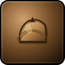
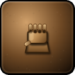
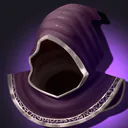

# The Collapsed Reliquary

A replayable **delve** — a short, scalable instance you run solo or in a small group, with a companion, tiers, affixes, and a currency (**Marks**) you spend at the delve vendor.

| | |
|---|---|
| **Theme** | crypt |
| **Minimum level** | 7 |
| **Suggested players** | 2 |
| **Entrance** | overworld portal ~x:-5, z:-52 |
| **Objective** | Defeat the final boss |
| **Final boss** | Deacon Varric |

> You descend into the collapsed reliquary.

## Difficulty tiers

| Tier | Enemy levels | Affixes | Reward | Min level | First-clear XP | Repeat XP |
|---|---|---:|---|---:|---:|---:|
| Normal | +0 | 0 | 1× | 7 | — | — |
| Heroic | +3 | 1 | 1.3× | 9 | 1050 | 650 |

## Affixes

Higher tiers roll random modifiers. Possible affixes for a **crypt** delve:

- **Restless Graves**
- **Bad Air**
- **Candleblind**
- **Grave Tax**
- **Unstable Roof**
- **Cult Remnants**
- **Chapel Candle**

## Companion

You're joined by **Acolyte Tessa** (healer). Companions can be upgraded with Marks:

| Rank | Cost |
|---|---|
| 2 | 3 Marks |
| 3 | 5 Marks |

## Enemies

| Enemy | Level | Tier |
|---|---|---|
| Ledger Wraith | 7–8 | Normal |
| Funeral Ringer | 7–8 | Normal |
| Gravecall Acolyte | 7–8 | Normal |
| Raised Bonewalker | 7–8 | Normal |
| Saintless Effigy | 8 | Elite |
| Deacon Varric | 9 | **Boss** |

## Marks vendor

Spend **Marks** (earned from clears) at the delve vendor:

| Item | Type | Cost | Unlock |
|---|---|---:|---|
|  🟢 Vaultbound Legwraps | armor · 48 armor, +2 Sta | 8 Marks | Available from the start |
|  🟢 Crumbled Spaulders | armor · 36 armor, +2 Sta | 8 Marks | Available from the start |
|  🟢 Bonewarden Grips | armor · 36 armor, +2 Agi, +1 Sta | 8 Marks | Available from the start |
|  🟢 Shroud of the Reliquary | armor · 30 armor, +2 Int, +1 Spi | 10 Marks | Available from the start |
|  🟢 Dustwarden Jerkin | armor · 55 armor, +2 Agi, +1 Sta | 10 Marks | Available from the start |
|  🟢 Reliquary Guard Hauberk | armor · 90 armor, +1 Str, +2 Sta | 10 Marks | Available from the start |
|  🟢 Ossuary Watch Helm | armor · 48 armor, +1 Str, +2 Sta | 12 Marks | Unlocks after 3 clears |
|  🔵 Deacon's Reliquary Helm | armor · 105 armor, +3 Str, +4 Sta | 28 Marks | Unlocks after a Heroic clear |
|  🔵 Varric's Shadow Cowl | armor · 42 armor, +4 Int, +3 Spi | 28 Marks | Unlocks after a Heroic clear |

## Chests & lockpicking — "Tumbler's Path"

Clearing the delve opens a **locked chest** guarded by a lockpicking minigame. The pick advances **one column at a time** through a fogged grid of tumblers — thread the open channel, seat exactly on each gate, dodge the ward-traps, and reach the bolt at the end.

### The five pick actions

Each input moves the pick forward one column; you choose how deep it goes:

| Action | Moves the pick |
|---|---|
| **Hard Set** | up 2 (shallower) |
| **Set** | up 1 (shallower) |
| **Steady** | hold position |
| **Ease** | down 1 (deeper) |
| **Drop** | down 2 (deeper) |

- Only the next few columns are **lit** — the rest is fog, so plan ahead within the window.
- You must land **exactly** on each tumbler **gate** and finish on the bolt.
- **Ward-traps** look like open rows but **jam the lock instantly on contact** — avoid them.
- The forgiveness band is just **one row wide** here, so you must thread the true path precisely.

### Board difficulty (by delve tier)

| Tier | Grid | Gates | Ward-traps | Lit columns |
|---|---|---:|---:|---:|
| Normal | 12×6 | 2 | 3 | 4 |
| Heroic | 16×6 | 3 | 5 | 3 |

### Your ante = your loot tier

Before you start you commit an **ante** (1–3). It fixes the reward, how many lock "pages" you must clear back-to-back **flawlessly**, how many tries you get, and a **per-move timer**. A single slip, bind, or trap jams that try.

| Ante | Loot tier | Pages (flawless) | Tries | Time per move | Reward bonus |
|---:|---|---:|---:|---:|---|
| 3 | Low | 1 | 3 | 9s | base reward |
| 2 | Medium | 2 | 2 | 6s | +1 Marks, 1.5× copper |
| 1 | Premium | 3 | 1 | 3s | +2 Marks, 2× copper |

> **Premium (ante 1)** is the brutal one — a 3-page gauntlet, one try, 3 seconds per move — but pays the most (and a chance at the class signature rare). Just want the gear? **Ante 3** is forgiving: one page, three tries, nine seconds per move, for the base reward.

### Tips

- Plan a couple of moves ahead inside the lit window — the pick only goes forward, so overshooting a gate jams the page.
- Use **Steady** when the channel runs flat; don't over-correct with Hard Set / Drop.
- Heroic locks are wider with more gates, more traps, and heavier fog — drop your ante if you're not confident.
- A **Bountiful Coffer** guarantees your class's signature rare plus a premium green on a solve.

> You climb back to Brother Halven at the reliquary ruin.

[← All delves](README.md)
