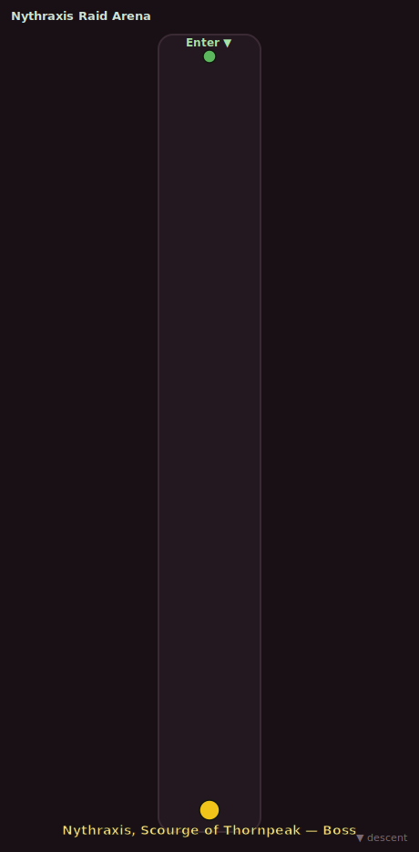

# Nythraxis Raid Arena

| | |
|---|---|
| **Suggested players** | 10 |
| **Enemy levels** | 20–20 |
| **Entrance** | overworld portal ~x:-152, z:610 |
| **Zone** | [the drowned temple](../quests/zones/04-the-drowned-temple/README.md) |

> You pass through the sealed royal door.

_Green = entry · red/crimson = enemy pulls · gold = boss. Top to bottom is the route in._

## Bosses

- [**Nythraxis, Scourge of Thornpeak**](../quests/zones/04-the-drowned-temple/bestiary.md#mob-nythraxis_scourge_of_thornpeak) _(Elite)_ — level 20. See the bestiary for its mechanics and loot.

## Full roster

| Enemy | Count | Level | Tier |
|---|---:|---|---|
| [Nythraxis, Scourge of Thornpeak](../quests/zones/04-the-drowned-temple/bestiary.md#mob-nythraxis_scourge_of_thornpeak) | 1 | 20 | **Boss** |

> You return to the cold air of Thornpeak.

[← All dungeons](README.md)
