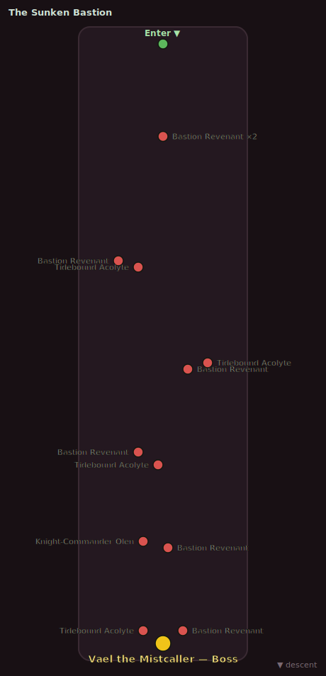

# The Sunken Bastion

| | |
|---|---|
| **Suggested players** | 5 |
| **Enemy levels** | 12–13 |
| **Entrance** | overworld portal ~x:45, z:515 |
| **Zone** | [mirefen marsh](../quests/zones/02-mirefen-marsh/README.md) |

> You wade down into the Sunken Bastion...

_Green = entry · red/crimson = enemy pulls · gold = boss. Top to bottom is the route in._

## Bosses

- [**Vael the Mistcaller**](../quests/zones/02-mirefen-marsh/bestiary.md#mob-vael_the_mistcaller) _(Elite)_ — level 13. See the bestiary for its mechanics and loot.

## Full roster

| Enemy | Count | Level | Tier |
|---|---:|---|---|
| [Bastion Revenant](../quests/zones/02-mirefen-marsh/bestiary.md#mob-bastion_revenant) | 7 | 12–13 | Elite |
| [Tidebound Acolyte](../quests/zones/02-mirefen-marsh/bestiary.md#mob-tidebound_acolyte) | 4 | 12–13 | Elite |
| [Knight-Commander Olen](../quests/zones/02-mirefen-marsh/bestiary.md#mob-knight_commander_olen) | 1 | 13 | Elite |
| [Vael the Mistcaller](../quests/zones/02-mirefen-marsh/bestiary.md#mob-vael_the_mistcaller) | 1 | 13 | **Boss** |

> You climb out of the drowning dark.

[← All dungeons](README.md)
