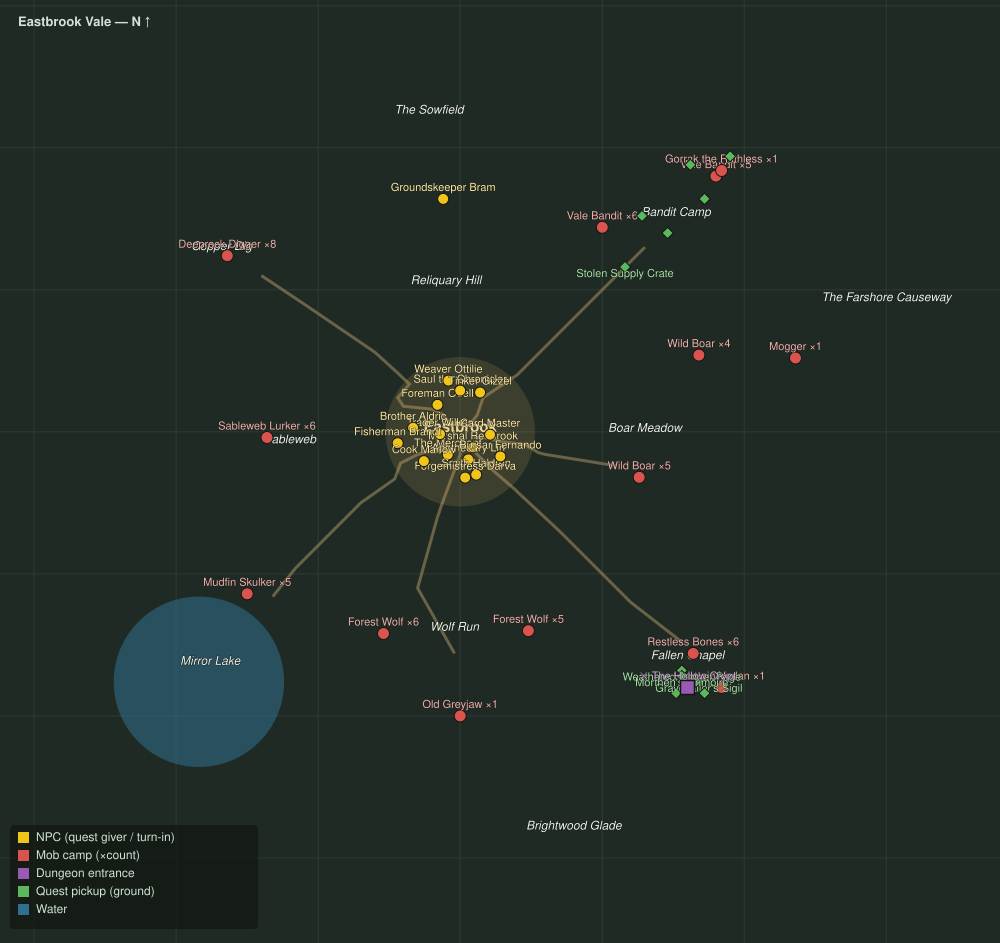

# Zone 1 — Eastbrook Vale

Level range: **1–7** · Hub: Eastbrook · 32 quests

_Gold = NPCs · red = mob camps (×count) · purple = dungeon entrances · green = ground pickups · blue = water._

📖 **[Bestiary for this zone](bestiary.md)** — every mob's health, armor, damage, and how to kill it.

| Lvl | Quest | Giver | Type |
|----:|-------|-------|------|
| 1 | [A Trade for Every Hand](q-prof-intro.md) | Foreman Odell | gather |
| 1 | [Wolves at the Door](q-wolves.md) | Marshal Redbrook | kill |
| 1 | [The Old Wolf](q-greyjaw.md) | Marshal Redbrook | collect |
| 1 | [Bristly Boar Hides](q-boars.md) | Trader Wilkes | collect |
| 1 | [Whispers Below](q-whispers.md) | Brother Aldric | collect |
| 1 | [The Names of the Dead](q-names-of-the-dead.md) | Brother Aldric | collect |
| 1 | [Silence the Call](q-silence-the-call.md) | Brother Aldric | kill |
| 1 | [The Binding Rite](q-rite.md) | Brother Aldric | collect |
| 1 | [Into the Hollow](q-hollow.md) 👥 | Brother Aldric | kill |
| 1 | [The Sexton's Bell](q-sexton.md) 👥 | Brother Aldric | kill |
| 1 | [The Gravecaller's Trail](q-gravecallers-trail.md) | Brother Aldric | collect |
| 1 | [Bandits of the Vale](q-bandits.md) | Marshal Redbrook | kill |
| 1 | [The Ringleader](q-ringleader.md) | Marshal Redbrook | kill |
| 1 | [The Smith's Promise](q-prof-attune-smith.md) | Forgemistress Darva | gather |
| 1 | [The Outfitter's Measure](q-prof-attune-outfitter.md) | Weaver Ottilie | kill |
| 1 | [A Recipe Worth Keeping](q-prof-attune-apothecary.md) | Cook Marlow | kill |
| 1 | [A Volatile Arrangement](q-prof-attune-bombardier.md) | Tinker Gizzel | gather |
| 1 | [Back to the Forge](q-prof-amends-smith.md) | Forgemistress Darva | kill |
| 1 | [Threads Rejoined](q-prof-amends-outfitter.md) | Weaver Ottilie | kill |
| 1 | [Back on the Stove](q-prof-amends-apothecary.md) | Cook Marlow | kill |
| 1 | [The Ledger Grows](q-prof-amends-bombardier.md) | Tinker Gizzel | kill |
| 1 | [Forge Work Order](q-prof-workorder-forge.md) | Forgemistress Darva | collect |
| 1 | [Kitchens Work Order](q-prof-workorder-kitchens.md) | Cook Marlow | collect |
| 1 | [Loom Work Order](q-prof-workorder-loom.md) | Weaver Ottilie | collect |
| 1 | [Toolworks Work Order](q-prof-workorder-toolworks.md) | Tinker Gizzel | collect |
| 1 | [A Different Pastime](q-prof-hobby-switch.md) | Smith Haldren | gather |
| 2 | [Sableweb Menace](q-spiders.md) | Apothecary Lin | kill/collect |
| 3 | [Trouble at the Lake](q-murlocs.md) | Fisherman Brandt | kill |
| 3 | [Stolen Supplies](q-supplies.md) | Trader Wilkes | collect |
| 4 | [Rats in the Mine](q-mine.md) | Foreman Odell | kill |
| 5 | [The Restless Dead](q-bones.md) | Brother Aldric | collect |
| 6 | [Mogger Must Fall](q-mogger.md) 👥 | Marshal Redbrook | kill |
