# Bestiary — Eastbrook Vale

16 creatures you'll fight in this zone. Health/armor/damage are shown across the mob's spawn level range (mobs roll a random level within it). Mitigation % is what a same-level attacker's physical hits lose to armor — spells ignore armor.

> Threat tiers: **Boss** (dungeon, group it) · **Elite** (~2.3× HP, ~1.5× damage) · **Rare** (tough roamer) · normal (everything else).

## Common creatures

### Forest Wolf

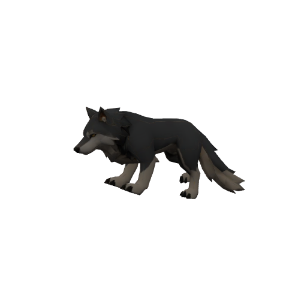

| Stat | Value |
|---|---|
| Level | 1–2 |
| Family | Beast |
| Health | 40–54 HP |
| Armor (physical mitigation) | 0–10 (~0–2% vs a same-level attacker) |
| Melee damage | 2–6 per hit @ 2s swing (~2–3 DPS) |
| Location | Eastbrook Vale · ~x:-15, z:55 · ~x:20, z:70 — [🗺️ show on map](#/map/-15/55) |

**Best way to kill:**

- Frenzies nearby kin (faster swings) when one dies — pull them one at a time.

**Loot:**

- Coins: 8 copper (always drops)

| Item | Type | Drop chance | Notes |
|---|---|---:|---|
| 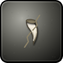 ⚫ Cracked Wolf Fang | Junk | 45% | sells for 4c |
|  🟢 Milepost Boots | Leather armor — Feet · 30 armor, +1 Agi, +1 Sta | 10% |  |
| 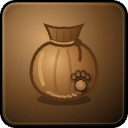 🟢 Wolfhide Satchel | bag | 2% |  |

### Sableweb Lurker

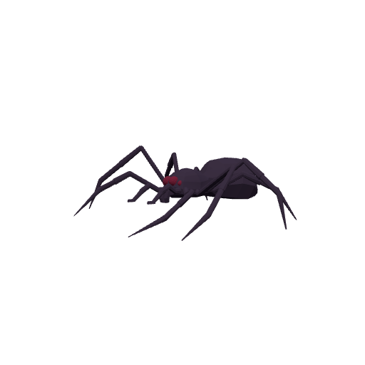

| Stat | Value |
|---|---|
| Level | 2–4 |
| Family | Spider |
| Health | 51–81 HP |
| Armor (physical mitigation) | 8–24 (~1–3% vs a same-level attacker) |
| Melee damage | 5–11 per hit @ 1.8s swing (~3–5 DPS) |
| Location | Eastbrook Vale · ~x:-60, z:5 — [🗺️ show on map](#/map/-60/5) |

**Best way to kill:**

- **Sticky Web:** Roots/snares you — bring a movement break or fight in place.
- **Spider Venom:** Poison DoT on hit — cleanse it or keep heals ticking.

**Loot:**

- Coins: 14 copper (always drops)

| Item | Type | Drop chance | Notes |
|---|---|---:|---|
|   Sableweb Silk Gland | Quest item | 55% | quest item — only drops while on _Sableweb Menace_ |
|  ⚪ Twitching Spider Leg | Junk | 40% | sells for 4c |

### Wild Boar

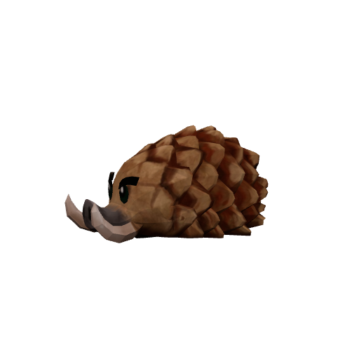

| Stat | Value |
|---|---|
| Level | 2–3 |
| Family | Beast |
| Health | 54–70 HP |
| Armor (physical mitigation) | 14–28 (~2–4% vs a same-level attacker) |
| Melee damage | 5–10 per hit @ 2.2s swing (~3–4 DPS) |
| Location | Eastbrook Vale · ~x:55, z:12 · ~x:80, z:-15 — [🗺️ show on map](#/map/55/12) |

**Best way to kill:**

- **Bristled Hide:** Reflects melee damage back at attackers — prefer ranged/spell damage.

**Loot:**

- Coins: 12 copper (always drops)

| Item | Type | Drop chance | Notes |
|---|---|---:|---|
| 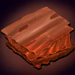  Bristly Boar Hide | Quest item | 60% | quest item — only drops while on _Bristly Boar Hides_ |
|  ⚪ Salted Jerky | Food · restores 61 HP (over time) | 30% |  |
| 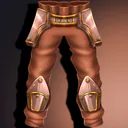 🟢 Trailworn Leggings | Leather armor — Legs · 45 armor, +2 Agi | 10% |  |

### Mudfin Skulker

| Stat | Value |
|---|---|
| Level | 3–5 |
| Family | mudfin |
| Health | 70–104 HP |
| Armor (physical mitigation) | 24–48 (~4–5% vs a same-level attacker) |
| Melee damage | 7–16 per hit @ 1.9s swing (~5–7 DPS) |
| Location | Eastbrook Vale · ~x:-75, z:57 — [🗺️ show on map](#/map/-75/57) |

**Best way to kill:**

- **Mudfin Hex:** Can polymorph you — avoid fighting it alongside other mobs.

**Loot:**

- Coins: 18 copper (always drops)

| Item | Type | Drop chance | Notes |
|---|---|---:|---|
|  ⚫ Slimy Mudfin Scale | Junk | 50% | sells for 5c |
|  ⚪ Linen Scrap | Junk | 20% | sells for 3c |

### Vale Bandit

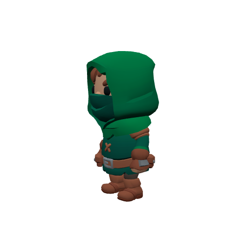

| Stat | Value |
|---|---|
| Level | 3–5 |
| Family | Humanoid |
| Health | 76–112 HP |
| Armor (physical mitigation) | 40–80 (~6–9% vs a same-level attacker) |
| Melee damage | 7–16 per hit @ 2s swing (~5–7 DPS) |
| Location | Eastbrook Vale · ~x:65, z:-65 · ~x:90, z:-90 — [🗺️ show on map](#/map/65/-65) |

**Best way to kill:**

- **Blinding Powder:** Can blind you — pull singles so a blind isn't fatal.

**Loot:**

- Coins: 25 copper (always drops)

| Item | Type | Drop chance | Notes |
|---|---|---:|---|
| 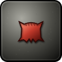 ⚫ Red Bandana | Junk | 50% | sells for 6c |
|  ⚪ Linen Scrap | Junk | 30% | sells for 3c |

### Deeprock Digger

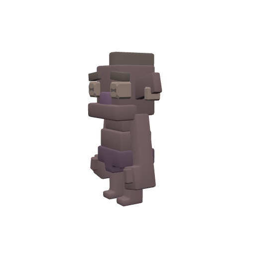

| Stat | Value |
|---|---|
| Level | 4–6 |
| Family | burrower |
| Health | 96–132 HP |
| Armor (physical mitigation) | 48–80 (~6–8% vs a same-level attacker) |
| Melee damage | 10–20 per hit @ 2.1s swing (~6–8 DPS) |
| Location | Eastbrook Vale · ~x:-82, z:-62 — [🗺️ show on map](#/map/-82/-62) |

**Best way to kill:**

- Straightforward melee attacker — tank it, heal as needed, and burn it down. No special tricks.

**Loot:**

- Coins: 22 copper (always drops)

| Item | Type | Drop chance | Notes |
|---|---|---:|---|
|  ⚫ Greasy Tallow Lump | Junk | 60% | sells for 5c |
|   Blessed Tallow | Quest item | 45% | quest item — only drops while on _The Binding Rite_ |
|  ⚪ Linen Scrap | Junk | 25% | sells for 3c |
| 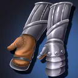 🟢 Mossgrown Handwraps | Cloth armor — Hands · 12 armor, +1 Int, +2 Spi | 15% |  |

### Old Greyjaw — _Rare_

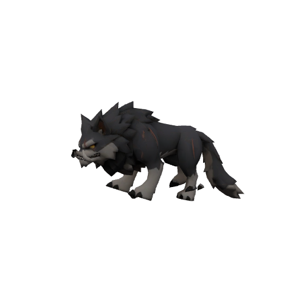

| Stat | Value |
|---|---|
| Level | 4 |
| Family | Beast |
| Health | 170 HP |
| Armor (physical mitigation) | 48 (~6% vs a same-level attacker) |
| Melee damage | 9–14 per hit @ 1.8s swing (~6 DPS) |
| Respawn | ~2 min (rare spawn) |
| Location | Eastbrook Vale · ~x:0, z:95 — [🗺️ show on map](#/map/0/95) |

**Best way to kill:**

- **Rare** — a tougher roaming spawn; worth killing for loot, but pull it solo.
- **Blood Frenzy:** Frenzies when hit/hurt — expect rising damage; burst it.

**Loot:**

- Coins: 60 copper (always drops)

| Item | Type | Drop chance | Notes |
|---|---|---:|---|
| 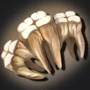  Old Greyjaw's Fang | Quest item | 100% | quest item — only drops while on _The Old Wolf_ |
|  ⚫ Cracked Wolf Fang | Junk | 100% | sells for 4c |
|  🟢 Wolfhide Satchel | bag | 35% |  |

### Restless Bones

| Stat | Value |
|---|---|
| Level | 5–7 |
| Family | Undead |
| Health | 122–160 HP |
| Armor (physical mitigation) | 56–84 (~6–8% vs a same-level attacker) |
| Melee damage | 12–25 per hit @ 2.3s swing (~7–9 DPS) |
| Location | Eastbrook Vale · ~x:80, z:78 — [🗺️ show on map](#/map/80/78) |

**Best way to kill:**

- **Soulrot:** Shadow DoT on hit — cleanse or heal through.
- **Withering Wail:** Lowers your attack power — expect a slower kill.

**Loot:**

- Coins: 30 copper (always drops)

| Item | Type | Drop chance | Notes |
|---|---|---:|---|
|  ⚪ Bone Fragments | Junk | 60% | sells for 7c |
|   Ghostly Essence | Quest item | 55% | quest item — only drops while on _The Binding Rite_ |

## Elites

### Mogger — _Elite · Rare_

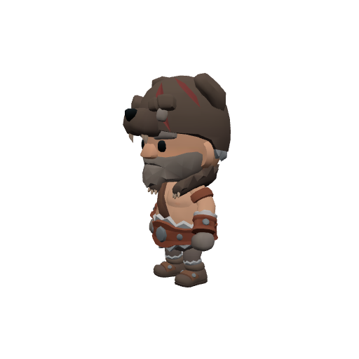

| Stat | Value |
|---|---|
| Level | 6 |
| Family | Humanoid |
| Health | 1357 HP |
| Armor (physical mitigation) | 170 (~16% vs a same-level attacker) |
| Melee damage | 35–55 per hit @ 2.2s swing (~20 DPS) |
| Crowd control | Immune |
| Respawn | ~2 min (rare spawn) |
| Location | Eastbrook Vale · ~x:118, z:-26 — [🗺️ show on map](#/map/118/-26) |

**Best way to kill:**

- **Elite** — ~2.3× the health and ~1.5× the damage of a normal mob; bring a group or out-level it.
- Immune to crowd control — it can't be stunned, feared, or polymorphed; just tank and burn.
- **Bracing Order:** Shields its allies with absorbs — focus it down before it can ward the pack.
- Summons adds at HP thresholds — bring AoE or kill the adds fast; don't let them pile up.
- **Ground Pound:** Pulses AoE damage around itself — healers expect steady raid damage; don't bring extra mobs into it.
- Enrages at low HP (hits much harder) — save burst/defensives for the execute, or kite while enraged.
- Will follow you into the water — no escaping by swimming.

**Loot:**

- Coins: 180 copper (always drops)

| Item | Type | Drop chance | Notes |
|---|---|---:|---|
|  ⚪ Linen Scrap | Junk | 100% | sells for 3c |
|  🟢 Mogger's Stomper Boots | Leather armor — Feet · 32 armor, +2 Agi, +1 Sta | 30% |  |
|  🔵 Mogger's Shiv | Weapon — Main hand · 6–11 dmg @ 1.7s (~5 DPS), +4 Agi, +2 Sta | 25% | exclusive set † |
|  🔵 Gravestalker Jerkin | Leather armor — Chest · 65 armor, +4 Agi, +2 Sta | 25% | exclusive set † |

† The exclusive set is rolled once — at most one of these items drops per kill.

### Captain Verlan — _Elite · Rare_

| Stat | Value |
|---|---|
| Level | 7 |
| Family | Undead |
| Health | 1417 HP |
| Armor (physical mitigation) | 192 (~16% vs a same-level attacker) |
| Melee damage | 39–61 per hit @ 2.6s swing (~19 DPS) |
| Crowd control | Immune |
| Respawn | ~3 min (rare spawn) |
| Location | Eastbrook Vale · ~x:92, z:90 — [🗺️ show on map](#/map/92/90) |

**Best way to kill:**

- **Elite** — ~2.3× the health and ~1.5× the damage of a normal mob; bring a group or out-level it.
- Immune to crowd control — it can't be stunned, feared, or polymorphed; just tank and burn.
- **Hollow Nova:** Pulses AoE damage around itself — healers expect steady raid damage; don't bring extra mobs into it.
- Enrages at low HP (hits much harder) — save burst/defensives for the execute, or kite while enraged.

**Loot:**

- Coins: 160 copper (always drops)

| Item | Type | Drop chance | Notes |
|---|---|---:|---|
|  ⚪ Bone Fragments | Junk | 100% | sells for 7c |
|  🟢 Oathbound Greaves | Mail armor — Legs · 52 armor, +1 Str, +2 Sta | 30% |  |
|  🔵 Verlan's Oathblade | Weapon — Main hand · 10–16 dmg @ 2.5s (~5 DPS), +4 Str, +2 Sta | 25% | exclusive set † |
|  🔵 Staff of the Hollow Vigil | Weapon — Main hand · 11–18 dmg @ 3s (~5 DPS), +5 Int, +2 Spi | 25% | exclusive set † |
|  🔵 Gravewarden's Shiv | Weapon — Main hand · 7–11 dmg @ 1.7s (~5 DPS), +4 Agi, +2 Sta | 25% | exclusive set † |

† The exclusive set is rolled once — at most one of these items drops per kill.

### Crypt Shambler — _Elite_

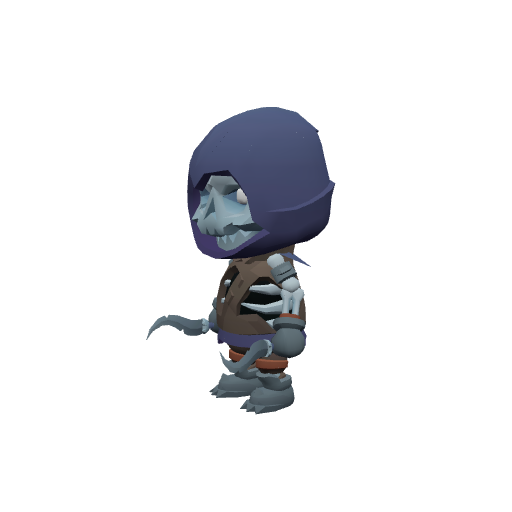

| Stat | Value |
|---|---|
| Level | 7–8 |
| Family | Undead |
| Health | 391–437 HP |
| Armor (physical mitigation) | 108–126 (~10% vs a same-level attacker) |
| Melee damage | 24–42 per hit @ 2.4s swing (~13–14 DPS) |
| Respawn | ~25s |
| Location | The Hollow Crypt (dungeon) — [🏰 view dungeon](#/doc/dungeons%2Fhollow_crypt.md) |

**Best way to kill:**

- **Elite** — ~2.3× the health and ~1.5× the damage of a normal mob; bring a group or out-level it.
- Straightforward melee attacker — tank it, heal as needed, and burn it down. No special tricks.

**Loot:**

- Coins: 90 copper (always drops)

| Item | Type | Drop chance | Notes |
|---|---|---:|---|
|  ⚪ Bone Fragments | Junk | 80% | sells for 7c |

### Bonechill Widow — _Elite_

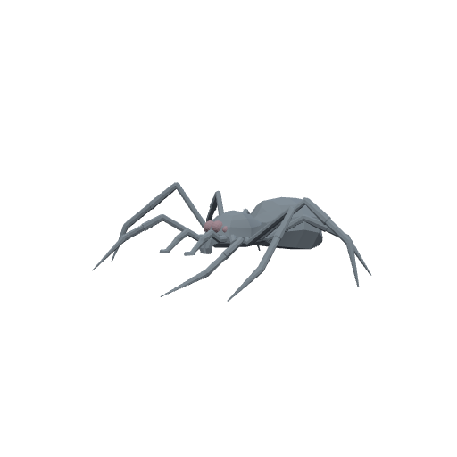

| Stat | Value |
|---|---|
| Level | 8–9 |
| Family | Spider |
| Health | 416–460 HP |
| Armor (physical mitigation) | 84–96 (~7–8% vs a same-level attacker) |
| Melee damage | 30–51 per hit @ 1.8s swing (~21–23 DPS) |
| Respawn | ~25s |
| Location | The Hollow Crypt (dungeon) — [🏰 view dungeon](#/doc/dungeons%2Fhollow_crypt.md) |

**Best way to kill:**

- **Elite** — ~2.3× the health and ~1.5× the damage of a normal mob; bring a group or out-level it.
- Straightforward melee attacker — tank it, heal as needed, and burn it down. No special tricks.

**Loot:**

- Coins: 120 copper (always drops)

| Item | Type | Drop chance | Notes |
|---|---|---:|---|
|  ⚪ Twitching Spider Leg | Junk | 70% | sells for 4c |

### Hollow Acolyte — _Elite_

| Stat | Value |
|---|---|
| Level | 8 |
| Family | Undead |
| Health | 391 HP |
| Armor (physical mitigation) | 98 (~8% vs a same-level attacker) |
| Melee damage | 29–45 per hit @ 2s swing (~19 DPS) |
| Respawn | ~25s |
| Location | The Hollow Crypt (dungeon) — [🏰 view dungeon](#/doc/dungeons%2Fhollow_crypt.md) |

**Best way to kill:**

- **Elite** — ~2.3× the health and ~1.5× the damage of a normal mob; bring a group or out-level it.
- Straightforward melee attacker — tank it, heal as needed, and burn it down. No special tricks.

**Loot:**

- Coins: 110 copper (always drops)

| Item | Type | Drop chance | Notes |
|---|---|---:|---|
|  ⚪ Linen Scrap | Junk | 60% | sells for 3c |

### Sexton Marrow — _Elite_

| Stat | Value |
|---|---|
| Level | 9 |
| Family | Undead |
| Health | 695 HP |
| Armor (physical mitigation) | 176 (~13% vs a same-level attacker) |
| Melee damage | 35–54 per hit @ 2.2s swing (~20 DPS) |
| Respawn | ~25s |
| Location | The Hollow Crypt (dungeon) — [🏰 view dungeon](#/doc/dungeons%2Fhollow_crypt.md) |

**Best way to kill:**

- **Elite** — ~2.3× the health and ~1.5× the damage of a normal mob; bring a group or out-level it.
- Straightforward melee attacker — tank it, heal as needed, and burn it down. No special tricks.

**Loot:**

- Coins: 400 copper (always drops)

| Item | Type | Drop chance | Notes |
|---|---|---:|---|
| 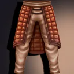 🟢 Quilted Trousers | Cloth armor — Legs · 30 armor, +2 Sta | 40% |  |
|  🟢 Oiled Leather Boots | Leather armor — Feet · 25 armor, +1 Agi | 40% |  |

## Bosses

### Gorrak the Ruthless — _Boss_

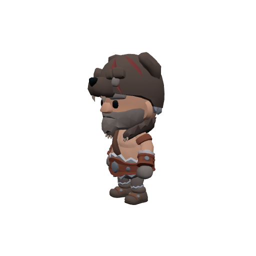

| Stat | Value |
|---|---|
| Level | 6 |
| Family | Humanoid |
| Health | 310 HP |
| Armor (physical mitigation) | 150 (~14% vs a same-level attacker) |
| Melee damage | 16–25 per hit @ 2.4s swing (~9 DPS) |
| Respawn | ~25s |
| Location | Eastbrook Vale · ~x:92, z:-92 — [🗺️ show on map](#/map/92/-92) |

**Best way to kill:**

- **Boss** — fight it as a group in its dungeon; assign a tank and watch its mechanics below.
- Straightforward melee attacker — tank it, heal as needed, and burn it down. No special tricks.

**Loot:**

- Coins: 250 copper (always drops)

| Item | Type | Drop chance | Notes |
|---|---|---:|---|
|  ⚫ Red Bandana | Junk | 100% | sells for 6c |
|  🟢 Oiled Leather Boots | Leather armor — Feet · 25 armor, +1 Agi | 50% |  |
|  🟢 Quilted Trousers | Cloth armor — Legs · 30 armor, +2 Sta | 50% |  |
| 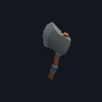 🟢 Gorrak's Cleaver | Weapon — Main hand · 8–14 dmg @ 2.5s (~4 DPS), +3 Str | 30% |  |
| 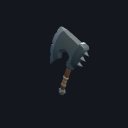 🟢 Gorrak's Cruel Chopper | Weapon — Main hand · 8–13 dmg @ 2.4s (~4 DPS), +2 Str, +1 Sta | 25% |  |

### Morthen the Gravecaller — _Boss · Elite_

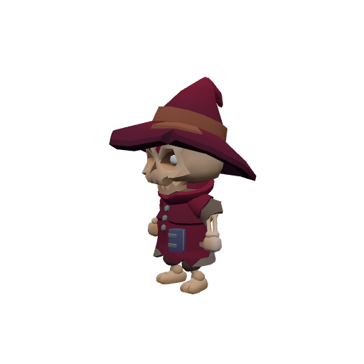

| Stat | Value |
|---|---|
| Level | 10 |
| Family | Undead |
| Health | 1191 HP |
| Armor (physical mitigation) | 234 (~16% vs a same-level attacker) |
| Melee damage | 41–65 per hit @ 2.6s swing (~20 DPS) |
| Respawn | ~25s |
| Location | The Hollow Crypt (dungeon) — [🏰 view dungeon](#/doc/dungeons%2Fhollow_crypt.md) |

**Best way to kill:**

- **Boss** — fight it as a group in its dungeon; assign a tank and watch its mechanics below.
- **Shadow Pulse:** Pulses AoE damage around itself — healers expect steady raid damage; don't bring extra mobs into it.

**Loot:**

- Coins: 2500 copper (always drops)

| Item | Type | Drop chance | Notes |
|---|---|---:|---|
| 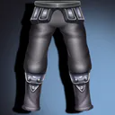 🟢 Cryptbone Greaves | Mail armor — Legs · 48 armor, +2 Sta | 34% | exclusive set 1 † |
|  🟢 Quilted Trousers | Cloth armor — Legs · 30 armor, +2 Sta | 33% | exclusive set 1 † |
|  🟢 Oiled Leather Boots | Leather armor — Feet · 25 armor, +1 Agi | 33% | exclusive set 1 † |
|  🟢 Greyjaw Hide Boots | Leather armor — Feet · 28 armor, +1 Agi, +1 Sta | 25% | exclusive set 2 † |
| 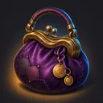 🔵 Gravewoven Bag | bag | 20% | exclusive set 2 † |
| 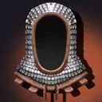 🟢 Cryptbone Helm | Mail armor — Head · 48 armor, +3 Sta | 18% | exclusive set 2 † |
|  🟢 Cryptbone Pauldrons | Mail armor — Shoulder · 36 armor, +2 Sta | 18% | exclusive set 2 † |

† Each exclusive set is rolled separately — at most one item from each set drops per kill.

---

[← Back to Eastbrook Vale quests](README.md) · [Zone map](map.svg)
