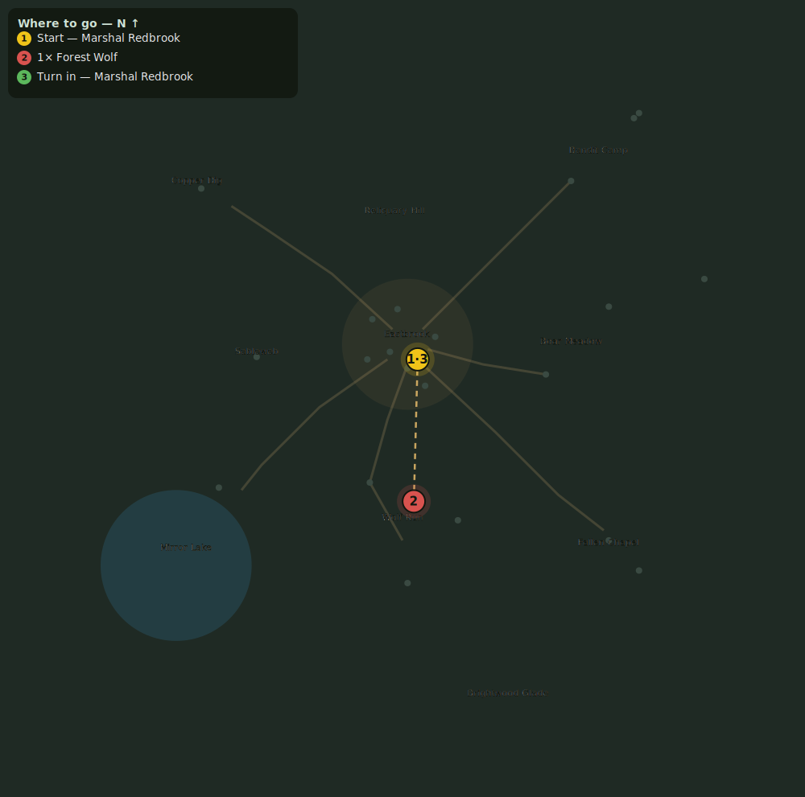

# A Craft to Call Your Own

> Quest ID: `q_archetype_acceptance` · Zone 1 — Eastbrook Vale

| | |
|---|---|
| **Recommended level** | 1+ (zone range 1–7) |
| **Quest giver** | **Smith Haldren**, Armorer & Weaponsmith _(at ~x:7, z:17)_ |
| **Turn in to** | **Smith Haldren**, Armorer & Weaponsmith _(at ~x:7, z:17)_ |
| **Requires** | A Trade for Every Hand (`q_prof_intro`) |

## Story

> Skill is knowledge, <your name>, but attunement is a promise. Choose two neighboring crafts whose methods you will carry as your majors, then bring me ore worked from the Vale with your own hands.

## How to complete

  - _Tracker: Ore vein harvested_

Then return to **Smith Haldren**, Armorer & Weaponsmith _(at ~x:7, z:17)_ to turn in.

## Rewards

- **XP:** 150

## On completion

> The promise holds. These two crafts are now your majors, and the knowledge opposite them becomes your hobby.

## Where to go

**[🧭 Open this route in 3D →](#/questroute/q_archetype_acceptance)**

_Numbered route: ① start → objectives → 3 turn in. Faint dots are the rest of the zone for context — see the [full zone map](README.md). Mob names above link to the [bestiary](bestiary.md)._
