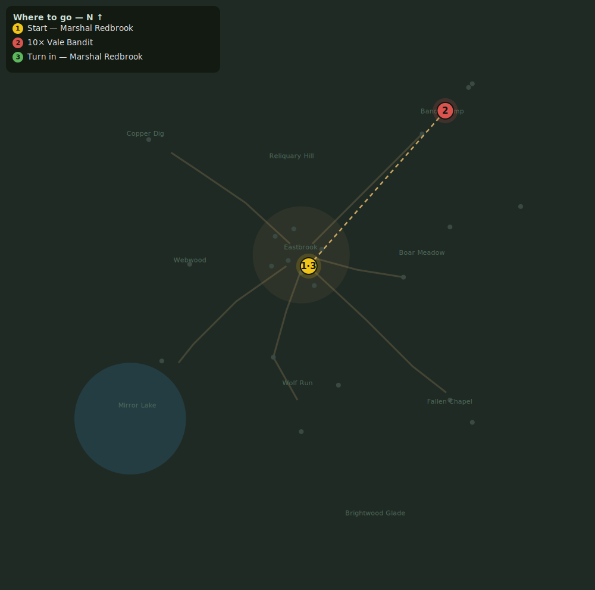

# Bandits of the Vale

> Quest ID: `q_bandits` · Zone 1 — Eastbrook Vale

| | |
|---|---|
| **Recommended level** | 1+ (zone range 1–7) |
| **Quest giver** | **Marshal Redbrook**, Town Marshal _(at ~x:4, z:6)_ |
| **Turn in to** | **Marshal Redbrook**, Town Marshal _(at ~x:4, z:6)_ |
| **Requires** | Wolves at the Door (`q_wolves`) |

## Story

> A pack of cutthroats has made camp in the southwest hills. They have robbed three wagons this week. Drive them out — slay 10 Vale Bandits.

## How to complete

- **Kill 10× [Vale Bandit](bestiary.md#mob-vale_bandit)** (level 3–5)
  - Found in the open world at ~x:65, z:-65 (7 mobs, radius 24)
  - Found in the open world at ~x:90, z:-90 (5 mobs, radius 16)
  - _Tracker: Vale Bandit slain_

Then return to **Marshal Redbrook**, Town Marshal _(at ~x:4, z:6)_ to turn in.

## Rewards

- **XP:** 550
- **Money:** 200 copper
- **Item reward (by class):**
  -  🟢 Redbrook Militia Blade — _warrior_ · 6–11 dmg @ 2.2s (~4 DPS), +2 Str
  -  🟢 Vale Apprentice Staff — _mage_ · 7–12 dmg @ 3s (~3 DPS), +1 Sta, +3 Int
  -  🟢 Keen Dirk — _rogue_ · 4–8 dmg @ 1.7s (~4 DPS), +2 Agi

## On completion

> Ten fewer knives in the dark. Take this — you have earned it.

## Leads to

- The Ringleader (`q_ringleader`)

## Where to go

_Numbered route: ① start → objectives → 3 turn in. Faint dots are the rest of the zone for context — see the [full zone map](README.md). Mob names above link to the [bestiary](bestiary.md)._
