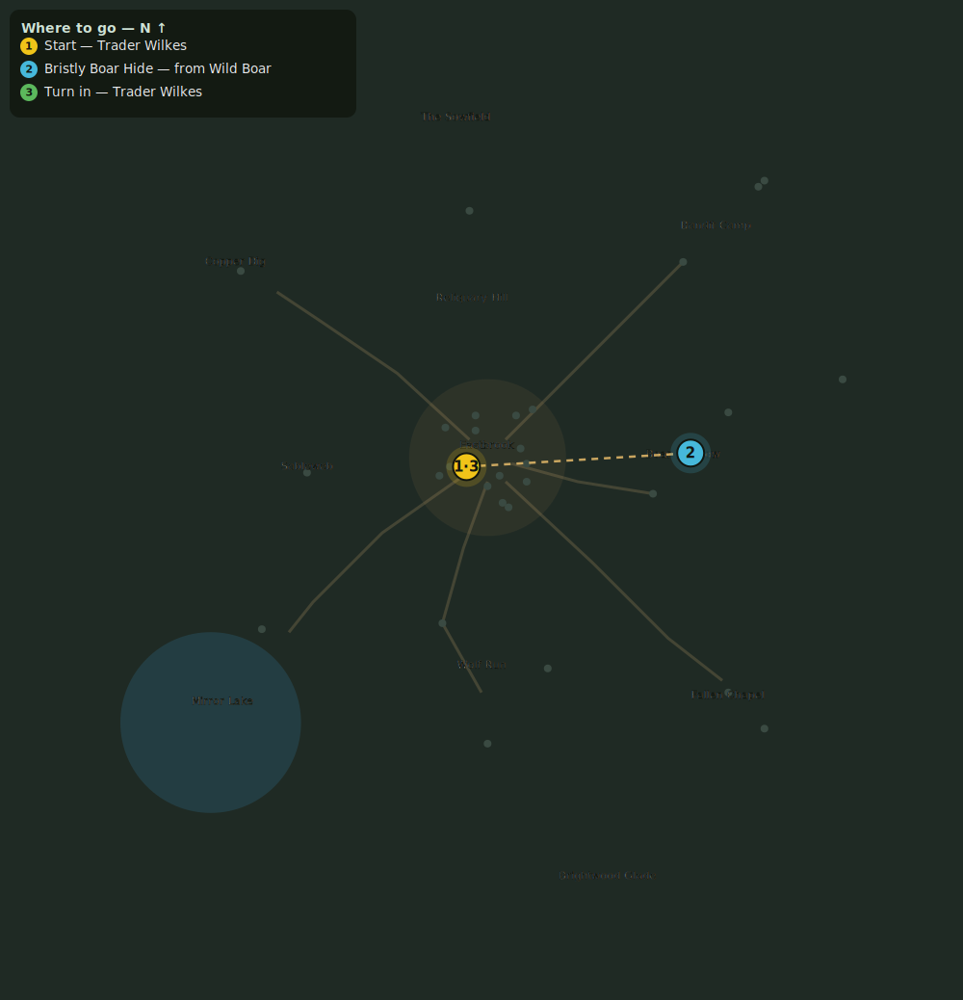

# Bristly Boar Hides

> Quest ID: `q_boars` · Zone 1 — Eastbrook Vale

| | |
|---|---|
| **Recommended level** | 1+ (zone range 1–7) |
| **Quest giver** | **Trader Wilkes**, Provisioner _(at ~x:-7, z:3)_ |
| **Turn in to** | **Trader Wilkes**, Provisioner _(at ~x:-7, z:3)_ |

## Story

> Boar hide makes the finest travel packs, and the meadows west of town are crawling with the beasts. Bring me 5 Bristly Boar Hides and I will make it worth your time.

## How to complete

- **Collect 5× Bristly Boar Hide**
  - Drops from [**Wild Boar**](bestiary.md#mob-wild_boar) (60% chance) — Found in the open world at ~x:55, z:12 (6 mobs, radius 22); Found in the open world at ~x:80, z:-15 (5 mobs, radius 18)
  - _Tracker: Bristly Boar Hide_

Then return to **Trader Wilkes**, Provisioner _(at ~x:-7, z:3)_ to turn in.

## Rewards

- **XP:** 350
- **Money:** 120 copper

## On completion

> Ah, fine bristly hides! These will fetch a good price.

## Where to go

**[🧭 Open this route in 3D →](#/questroute/q_boars)**

_Numbered route: ① start → objectives → 3 turn in. Faint dots are the rest of the zone for context — see the [full zone map](README.md). Mob names above link to the [bestiary](bestiary.md)._
