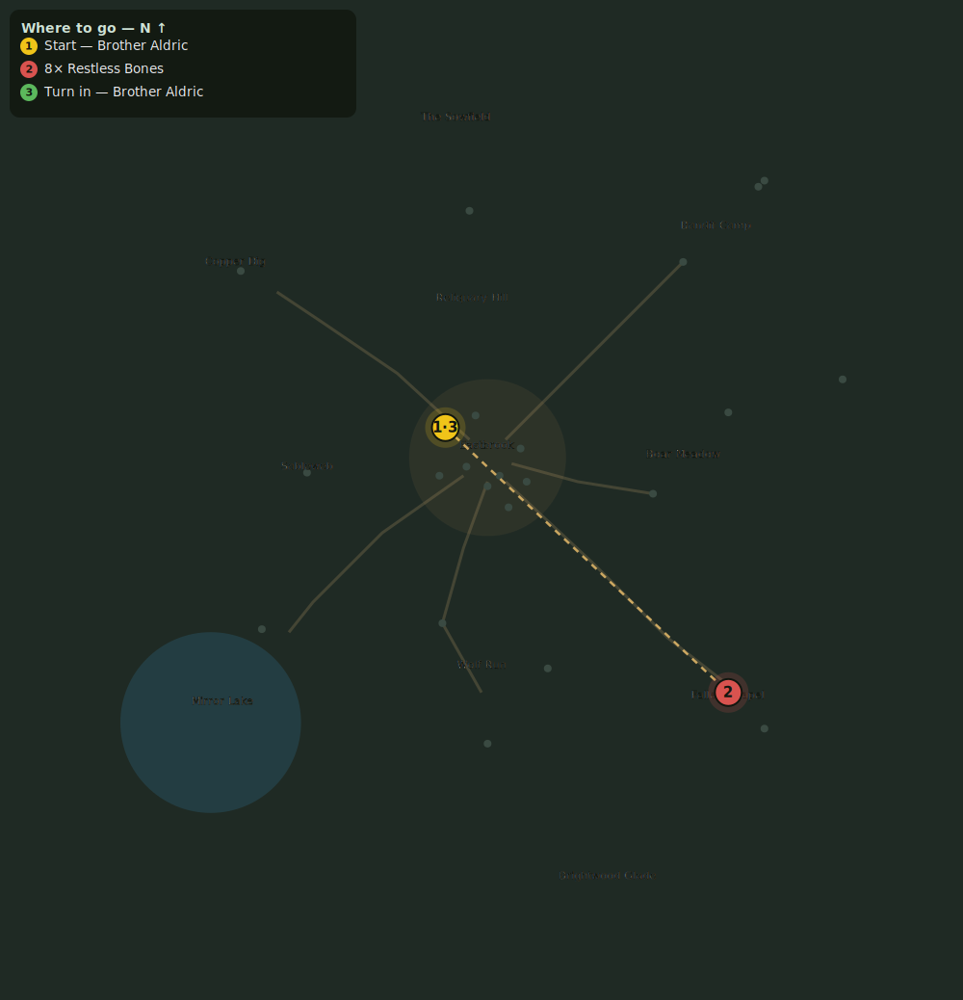

# The Restless Dead

> Quest ID: `q_bones` · Zone 1 — Eastbrook Vale

| | |
|---|---|
| **Recommended level** | 5+ |
| **Quest giver** | **Brother Aldric**, Priest of the Vale _(at ~x:-14, z:-10)_ |
| **Turn in to** | **Brother Aldric**, Priest of the Vale _(at ~x:-14, z:-10)_ |

## Story

> The old ruin on the northwest hill was a chapel once, and its yard a resting place. Something has stirred the dead from their sleep. Grant them peace, <your name> — return 8 Restless Bones to the earth.

## How to complete

- **Kill 8× [Restless Bones](bestiary.md#mob-restless_bones)** (level 5–7)
  - Found in the open world at ~x:80, z:78 (8 mobs, radius 18)
  - Found in the open world at ~x:88, z:90 (2 mobs, radius 6)
  - _Tracker: Restless Bones laid to rest_

Then return to **Brother Aldric**, Priest of the Vale _(at ~x:-14, z:-10)_ to turn in.

## Rewards

- **XP:** 700
- **Money:** 260 copper

## On completion

> May they rest now, and may the Light forgive whatever woke them.

## Leads to

- Whispers Below (`q_whispers`)

## Where to go

_Numbered route: ① start → objectives → 3 turn in. Faint dots are the rest of the zone for context — see the [full zone map](README.md). Mob names above link to the [bestiary](bestiary.md)._
