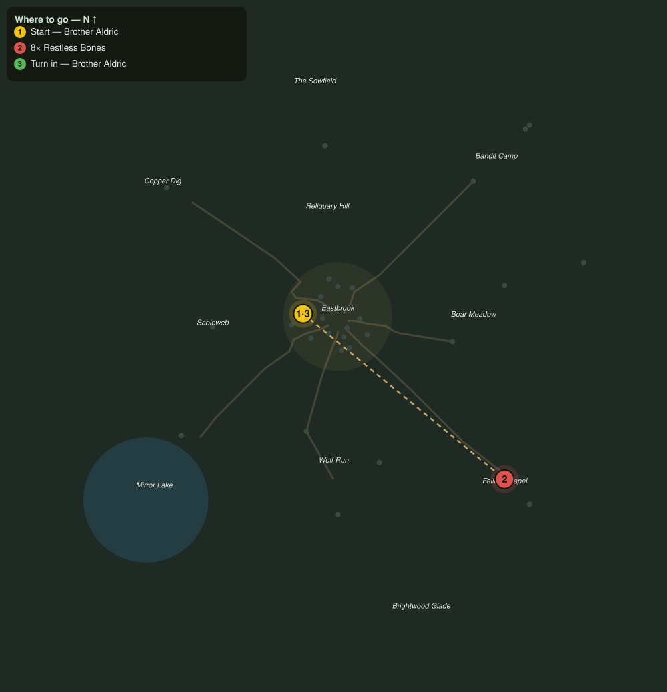

# The Restless Dead

> Quest ID: `q_bones` · Zone 1 — Eastbrook Vale

| | |
|---|---|
| **Recommended level** | 5+ |
| **Quest giver** | **Brother Aldric**, Priest of the Vale _(at ~x:-17, z:-1)_ |
| **Turn in to** | **Brother Aldric**, Priest of the Vale _(at ~x:-17, z:-1)_ |

## Story

> The old ruin on the northwest hill was a chapel once, and its yard a resting place. Something has stirred the dead from their sleep. Put them down and bring me a skull from each you lay to rest, <your name>, eight in all, so I may speak the rites over them and grant the peace they were denied.

## How to complete

- **Collect 8× Restless Skull**
  - Drops from [**Restless Bones**](bestiary.md#mob-restless_bones) (100% chance) — Found in the open world at ~x:82, z:78 (6 mobs, radius 28.5); Found in the open world at ~x:88, z:90 (2 mobs, radius 6)
  - _Tracker: Restless Skulls recovered_

Then return to **Brother Aldric**, Priest of the Vale _(at ~x:-17, z:-1)_ to turn in.

## Rewards

- **XP:** 700
- **Money:** 260 copper

## On completion

> May they rest now, and may the Light forgive whatever woke them.

## Leads to

- Whispers Below (`q_whispers`)

## Where to go

**[🧭 Open this route in 3D →](#/questroute/q_bones)**

_Numbered route: ① start → objectives → 3 turn in. Faint dots are the rest of the zone for context — see the [full zone map](README.md). Mob names above link to the [bestiary](bestiary.md)._
