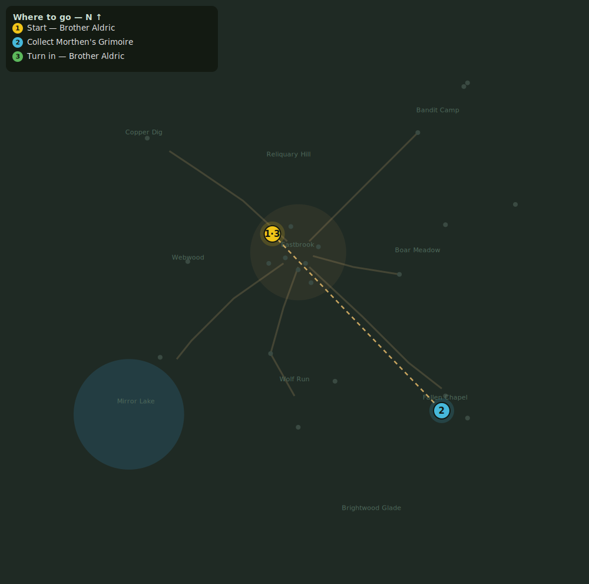

# The Gravecaller's Trail

> Quest ID: `q_gravecallers_trail` · Zone 1 — Eastbrook Vale

| | |
|---|---|
| **Recommended level** | 1+ (zone range 1–7) |
| **Quest giver** | **Brother Aldric**, Priest of the Vale _(at ~x:-14, z:-10)_ |
| **Turn in to** | **Brother Aldric**, Priest of the Vale _(at ~x:-14, z:-10)_ |
| **Requires** | Into the Hollow (`q_hollow`) |

## Story

> Morthen is dead, yet a question gnaws at me: a sect that hid for a century does not spend itself on one village chapel. He kept a grimoire — his rites, his correspondence. If anything of it survives, it lies in the vestry of the ruined chapel above the crypt. Search the ruin and bring me whatever remains of his writings, <your name>.

## How to complete

- **Collect 1× Morthen's Grimoire**
  - Pick up from the ground (sparkle objects) at: ~x:78, z:86
  - _Tracker: Morthen's Grimoire_

Then return to **Brother Aldric**, Priest of the Vale _(at ~x:-14, z:-10)_ to turn in.

## Rewards

- **XP:** 900
- **Money:** 400 copper

## On completion

> Morthen wrote to a 'Mistcaller' in the northern fen. The sect is not dead, $N — it has merely been patient.

## Leads to

- Mogger Must Fall (`q_mogger`)

## Where to go

**[🧭 Open this route in 3D →](#/questroute/q_gravecallers_trail)**

_Numbered route: ① start → objectives → 3 turn in. Faint dots are the rest of the zone for context — see the [full zone map](README.md). Mob names above link to the [bestiary](bestiary.md)._
