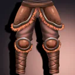
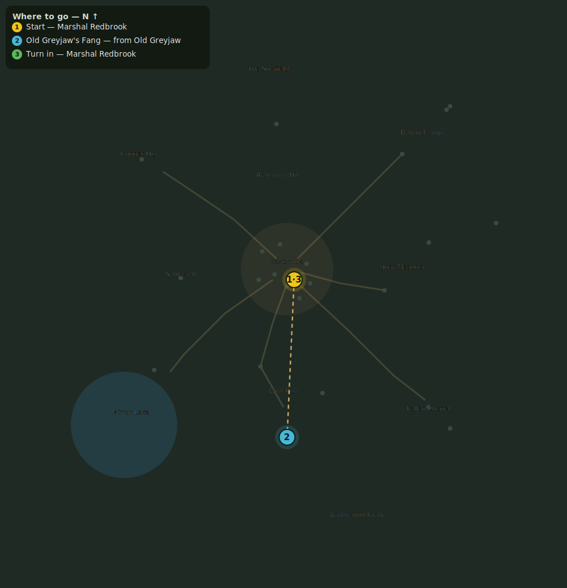

# The Old Wolf

> Quest ID: `q_greyjaw` · Zone 1 — Eastbrook Vale

| | |
|---|---|
| **Recommended level** | 1+ (zone range 1–7) |
| **Quest giver** | **Marshal Redbrook**, Town Marshal _(at ~x:4, z:6)_ |
| **Turn in to** | **Marshal Redbrook**, Town Marshal _(at ~x:4, z:6)_ |
| **Requires** | Wolves at the Door (`q_wolves`) |

## Story

> There is one wolf no trap has held: Old Greyjaw. He has taken three hounds and a stable boy's arm. He prowls the deep woods north of the wolf runs. Bring me his fang.

## How to complete

- **Collect 1× Old Greyjaw's Fang**
  - Drops from [**Old Greyjaw**](bestiary.md#mob-old_greyjaw) (100% chance) — Found in the open world at ~x:0, z:95 (1 mob, radius 8)
  - _Tracker: Old Greyjaw's Fang_

Then return to **Marshal Redbrook**, Town Marshal _(at ~x:4, z:6)_ to turn in.

## Rewards

- **XP:** 450
- **Money:** 150 copper
- **Item reward (by class):**
  -  🟢 Greyjaw's Pelt Leggings — _warrior, mage, rogue_ · 35 armor, +1 Agi, +1 Sta

## On completion

> So the old devil is dead at last. The stable boy will sleep easier — and so will I.

## Where to go

_Numbered route: ① start → objectives → 3 turn in. Faint dots are the rest of the zone for context — see the [full zone map](README.md). Mob names above link to the [bestiary](bestiary.md)._
