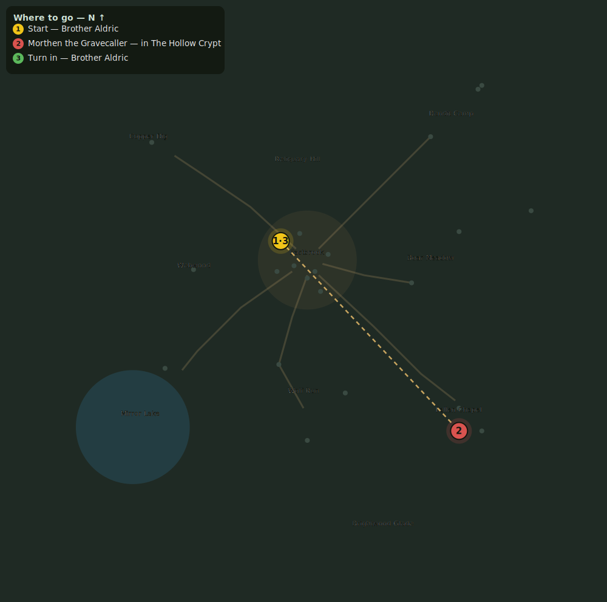

# Into the Hollow

> Quest ID: `q_hollow` · Zone 1 — Eastbrook Vale

| | |
|---|---|
| **Recommended level** | 1+ (zone range 1–7) |
| **Quest giver** | **Brother Aldric**, Priest of the Vale _(at ~x:-14, z:-10)_ |
| **Turn in to** | **Brother Aldric**, Priest of the Vale _(at ~x:-14, z:-10)_ |
| **Requires** | The Binding Rite (`q_rite`) |
| **Group quest** | 👥 Suggested players: 5 |

## Story

> Morthen the Gravecaller waits at the bottom of the Hollow Crypt, ringed by the elite dead he has raised. He is far beyond any one hero — take four companions, no fewer. End him, and the Vale's dead will finally sleep.

## How to complete

- **Kill 1× [Morthen the Gravecaller](bestiary.md#mob-morthen)** (level 10–10, **Boss**, **Elite**)
  - Inside dungeon [**The Hollow Crypt**](../../../dungeons/hollow_crypt.md) (entrance portal ~x:80, z:90)
  - _Tracker: Morthen the Gravecaller slain_

Then return to **Brother Aldric**, Priest of the Vale _(at ~x:-14, z:-10)_ to turn in.

## Rewards

- **XP:** 1500
- **Money:** 10000 copper
- **Item reward (by class):**
  -  🔵 Gravecaller's Broadblade — _warrior_ · 9–16 dmg @ 2.4s (~5 DPS), +3 Str, +2 Sta
  -  🔵 Widowfang Dirk — _rogue_ · 6–10 dmg @ 1.7s (~5 DPS), +3 Agi, +2 Sta
  -  🔵 Staff of the Hollow — _mage_ · 10–17 dmg @ 3s (~5 DPS), +4 Int, +2 Spi

## On completion

> The whispering has stopped. You have done what the whole Vale could not, $N — the dead sleep, and Eastbrook owes you everything it has.

## Leads to

- The Gravecaller's Trail (`q_gravecallers_trail`)

## Where to go

**[🧭 Open this route in 3D →](#/questroute/q_hollow)**

_Numbered route: ① start → objectives → 3 turn in. Faint dots are the rest of the zone for context — see the [full zone map](README.md). Mob names above link to the [bestiary](bestiary.md)._
