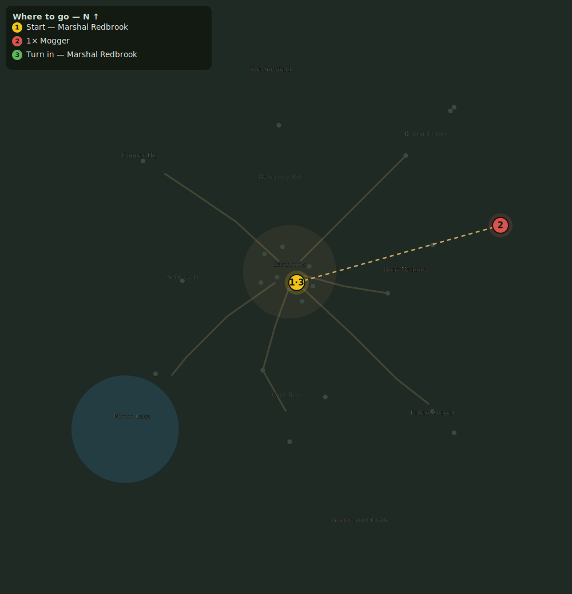

# Mogger Must Fall

> Quest ID: `q_mogger` · Zone 1 — Eastbrook Vale

| | |
|---|---|
| **Recommended level** | 6+ |
| **Quest giver** | **Marshal Redbrook**, Town Marshal _(at ~x:4, z:6)_ |
| **Turn in to** | **Marshal Redbrook**, Town Marshal _(at ~x:4, z:6)_ |
| **Requires** | The Gravecaller's Trail (`q_gravecallers_trail`) |
| **Group quest** | 👥 Suggested players: 3 |

## Story

> Mogger has split carts, flattened fences, and killed enough livestock to empty half the Vale. Do not face him alone. Take two strong companions into the eastern meadow and put the brute down for good.

## How to complete

- **Kill 1× [Mogger](bestiary.md#mob-mogger)** (level 6–6, **Elite**, Rare)
  - Found in the open world at ~x:118, z:-26 (1 mob, radius 5)
  - _Tracker: Mogger slain_

Then return to **Marshal Redbrook**, Town Marshal _(at ~x:4, z:6)_ to turn in.

## Rewards

- **XP:** 1200
- **Money:** 900 copper
- **Item reward (by class):**
  -  🟢 Bristleback Maul — _warrior_ · 7–12 dmg @ 2.8s (~3 DPS), +2 Str, +1 Sta
  -  🟢 Sableweb Slippers — _mage_ · 18 armor, +2 Int, +1 Spi
  -  🟢 Mogger's Stomper Boots — _rogue_ · 32 armor, +2 Agi, +1 Sta

## On completion

> Mogger dead at last. Eastbrook's fields are safer, and you leave the Vale with one more tale worth retelling.

## Where to go

_Numbered route: ① start → objectives → 3 turn in. Faint dots are the rest of the zone for context — see the [full zone map](README.md). Mob names above link to the [bestiary](bestiary.md)._
