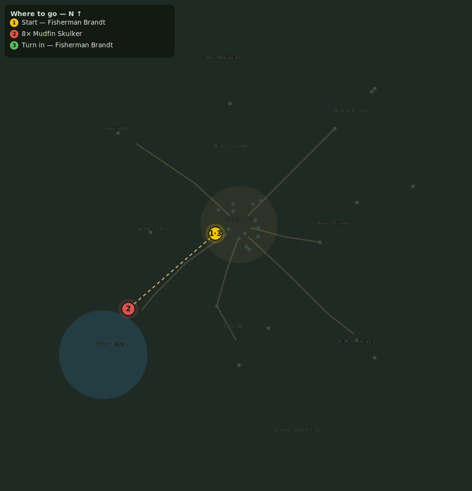

# Trouble at the Lake

> Quest ID: `q_murlocs` · Zone 1 — Eastbrook Vale

| | |
|---|---|
| **Recommended level** | 3+ |
| **Quest giver** | **Fisherman Brandt**, Old Salt _(at ~x:-16, z:6)_ |
| **Turn in to** | **Fisherman Brandt**, Old Salt _(at ~x:-16, z:6)_ |

## Story

> Twenty years I have fished Mirror Lake, and never lost a net until those gurgling fish-men crawled out of the shallows. Drive the Mudfin back — slay 8 of them. And watch yourself: where there is one murloc, there are five.

## How to complete

- **Kill 8× [Mudfin Skulker](bestiary.md#mob-mudfin_murloc)** (level 3–5)
  - Found in the open world at ~x:-75, z:57 (8 mobs, radius 14)
  - _Tracker: Mudfin Skulker slain_

Then return to **Fisherman Brandt**, Old Salt _(at ~x:-16, z:6)_ to turn in.

## Rewards

- **XP:** 520
- **Money:** 180 copper

## On completion

> Hah! That will teach them to mind their own mudholes.

## Where to go

**[🧭 Open this route in 3D →](#/questroute/q_murlocs)**

_Numbered route: ① start → objectives → 3 turn in. Faint dots are the rest of the zone for context — see the [full zone map](README.md). Mob names above link to the [bestiary](bestiary.md)._
