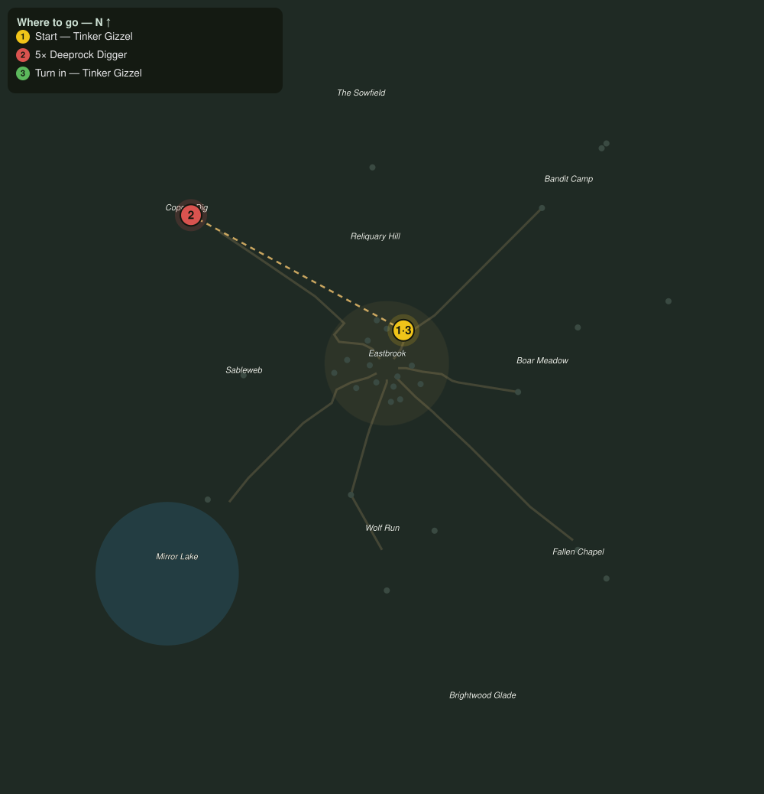

# The Ledger Grows

> Quest ID: `q_prof_amends_bombardier` · Zone 1 — Eastbrook Vale

| | |
|---|---|
| **Recommended level** | 1+ (zone range 1–7) |
| **Quest giver** | **Tinker Gizzel**, Master of the Toolworks _(at ~x:7, z:-14)_ |
| **Turn in to** | **Tinker Gizzel**, Master of the Toolworks _(at ~x:7, z:-14)_ |

## Story

> You came BACK, ha, they always come back, the loud stuff has a pull, yes? No sulking from me, <your name>, but the ledger, oh the ledger, it grows every time you skip out, more each return, that is only fair. Go clear the tunnel rats out of the dig for me, sweat first, sparks later, that is the rule I just made up.

## How to complete

- **Kill 5× [Deeprock Digger](bestiary.md#mob-tunnel_rat)** (level 4–6)
  - Found in the open world at ~x:-82, z:-62 (9 mobs, radius 20)
  - _Tracker: Tunnel Rat exterminated_

Then return to **Tinker Gizzel**, Master of the Toolworks _(at ~x:7, z:-14)_ to turn in.

## Rewards

- **XP:** 100

## On completion

> THERE it is, the itch is back in your hands. Engineering and Alchemy, majors again, go on, go make a bang. Try to stay put this time, eh?

## Where to go

**[🧭 Open this route in 3D →](#/questroute/q_prof_amends_bombardier)**

_Numbered route: ① start → objectives → 3 turn in. Faint dots are the rest of the zone for context — see the [full zone map](README.md). Mob names above link to the [bestiary](bestiary.md)._
