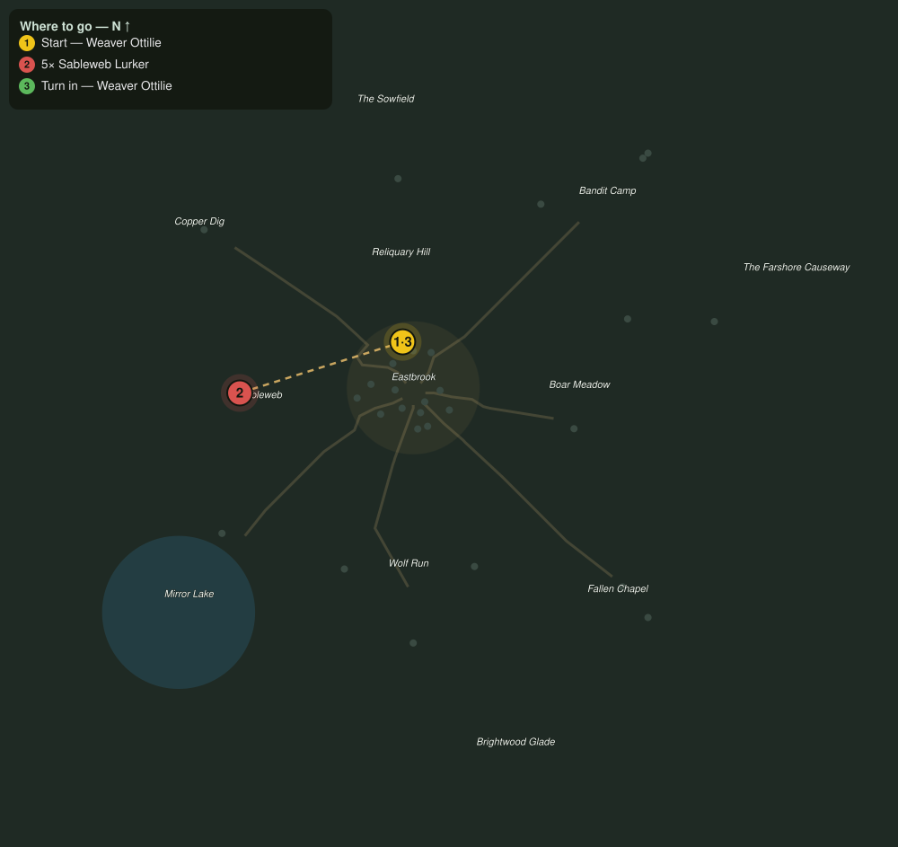

# Threads Rejoined

> Quest ID: `q_prof_amends_outfitter` · Zone 1 — Eastbrook Vale

| | |
|---|---|
| **Recommended level** | 1+ (zone range 1–7) |
| **Quest giver** | **Weaver Ottilie**, Master of the Loom _(at ~x:-4, z:-18)_ |
| **Turn in to** | **Weaver Ottilie**, Master of the Loom _(at ~x:-4, z:-18)_ |

## Story

> Back at my loom after all. I hold no grudge, <your name>, but the thread remembers a hand that let it go, and the cost of taking it up again is measured out longer each time. Cull the webwood spiders crowding the western woods, and the labor will settle your hands before they touch good silk again.

## How to complete

- **Kill 5× [Sableweb Lurker](bestiary.md#mob-webwood_spider)** (level 2–4)
  - Found in the open world at ~x:-60, z:5 (7 mobs, radius 22)
  - _Tracker: Webwood Spider culled_

Then return to **Weaver Ottilie**, Master of the Loom _(at ~x:-4, z:-18)_ to turn in.

## Rewards

- **XP:** 100

## On completion

> Steady again. Leatherworking and Tailoring return to your hands as majors. Measure twice this time before you wander.

## Where to go

**[🧭 Open this route in 3D →](#/questroute/q_prof_amends_outfitter)**

_Numbered route: ① start → objectives → 3 turn in. Faint dots are the rest of the zone for context — see the [full zone map](README.md). Mob names above link to the [bestiary](bestiary.md)._
