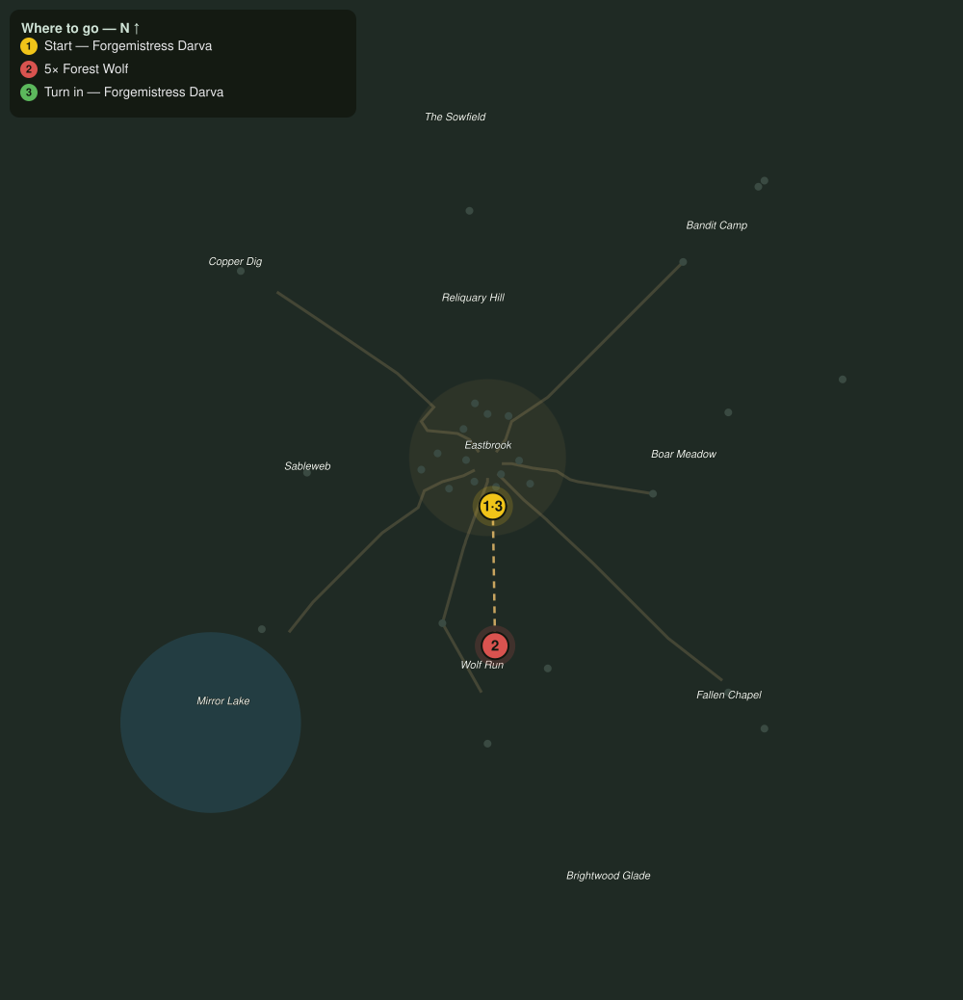

# Back to the Forge

> Quest ID: `q_prof_amends_smith` · Zone 1 — Eastbrook Vale

| | |
|---|---|
| **Recommended level** | 1+ (zone range 1–7) |
| **Quest giver** | **Forgemistress Darva**, Master of the Forge _(at ~x:2, z:16)_ |
| **Turn in to** | **Forgemistress Darva**, Master of the Forge _(at ~x:2, z:16)_ |

## Story

> So you have come back to the forge. I will not pretend it does not sting, <your name>, but I am a fair hand and the work is fair too. You know the price of returning: labor, and more of it each time you have strayed. Put down the wolves harrying the north road, and the swing of it will remind your arms what this pair once asked of them.

## How to complete

- **Kill 5× [Forest Wolf](bestiary.md#mob-forest_wolf)** (level 1–2)
  - Found in the open world at ~x:-27, z:71 (6 mobs, radius 28.5)
  - Found in the open world at ~x:24, z:70 (5 mobs, radius 26)
  - _Tracker: Forest Wolf slain_

Then return to **Forgemistress Darva**, Master of the Forge _(at ~x:2, z:16)_ to turn in.

## Rewards

- **XP:** 100

## On completion

> The rhythm is back in your hands. Weaponcrafting and Armorcrafting are your majors once more. Do not make a habit of leaving.

## Where to go

**[🧭 Open this route in 3D →](#/questroute/q_prof_amends_smith)**

_Numbered route: ① start → objectives → 3 turn in. Faint dots are the rest of the zone for context — see the [full zone map](README.md). Mob names above link to the [bestiary](bestiary.md)._
