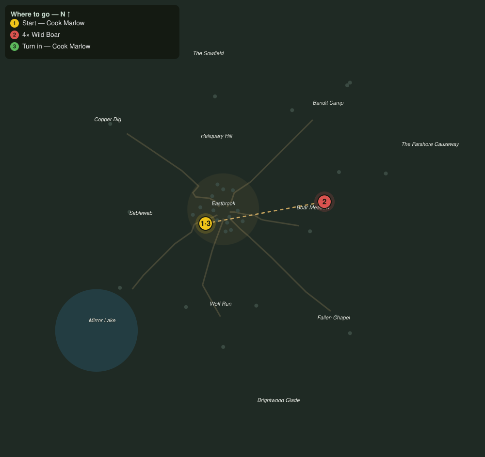

# A Recipe Worth Keeping

> Quest ID: `q_prof_attune_apothecary` · Zone 1 — Eastbrook Vale

| | |
|---|---|
| **Recommended level** | 1+ (zone range 1–7) |
| **Quest giver** | **Cook Marlow**, Master of the Kitchens _(at ~x:-13, z:10)_ |
| **Turn in to** | **Cook Marlow**, Master of the Kitchens _(at ~x:-13, z:10)_ |

## Story

> Every good dish is two flavors that belong together, and so is a good craft, <your name>. Sit with me and Alchemy and Cooking become your two majors, the two you may simmer past rare work; the craft on the far side of the wheel is your hobby, seasoned up to rare and no hotter. The rest of your trades keep in the pantry, dormant, not spoiled, ready whenever you fetch them back. Fair warning while the pot is still cold: wander off to another pair and coming home is a chore that grows, five beasts seen to the first time, eight the next, eleven the time after, heavier with every helping. Still hungry for it? Then hunt me four wild boars, because a kitchen worth its salt starts with good meat.

## How to complete

- **Kill 4× [Wild Boar](bestiary.md#mob-wild_boar)** (level 2–3)
  - Found in the open world at ~x:55, z:12 (6 mobs, radius 22)
  - Found in the open world at ~x:80, z:-15 (5 mobs, radius 18)
  - _Tracker: Wild Boar hunted_

Then return to **Cook Marlow**, Master of the Kitchens _(at ~x:-13, z:10)_ to turn in.

## Rewards

- **XP:** 150

## On completion

> Now that is a start with some meat on it. Alchemy and Cooking are yours to cook as high as you like. Come back hungry.

## Where to go

**[🧭 Open this route in 3D →](#/questroute/q_prof_attune_apothecary)**

_Numbered route: ① start → objectives → 3 turn in. Faint dots are the rest of the zone for context — see the [full zone map](README.md). Mob names above link to the [bestiary](bestiary.md)._
