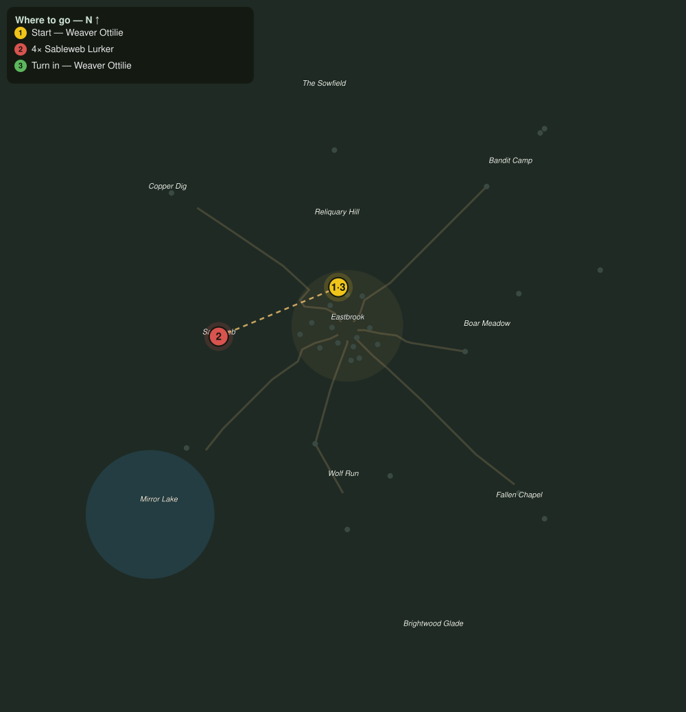

# The Outfitter's Measure

> Quest ID: `q_prof_attune_outfitter` · Zone 1 — Eastbrook Vale

| | |
|---|---|
| **Recommended level** | 1+ (zone range 1–7) |
| **Quest giver** | **Weaver Ottilie**, Master of the Loom _(at ~x:-4, z:-18)_ |
| **Turn in to** | **Weaver Ottilie**, Master of the Loom _(at ~x:-4, z:-18)_ |

## Story

> Measure the cost before you cut, that is the first rule at my loom. Choose me and Leatherworking and Tailoring become your two majors, the pair you may carry beyond rare work; the craft opposite them settles in as your hobby, taken to rare and left there. The trades you set aside are not unravelled, <your name>, only folded away, dormant until you take them up again. Be certain, though: should you leave this pair and later want it back, the way home is paid in labor that lengthens each time, five culled at first, then eight, then eleven, always a little more. If your mind is made, cull four Sableweb Lurkers and bring their silk to the loom, for good thread starts every good garment.

## How to complete

- **Kill 4× [Sableweb Lurker](bestiary.md#mob-webwood_spider)** (level 2–4)
  - Found in the open world at ~x:-68, z:2 (6 mobs, radius 28.5)
  - _Tracker: Sableweb Lurker culled_

Then return to **Weaver Ottilie**, Master of the Loom _(at ~x:-4, z:-18)_ to turn in.

## Rewards

- **XP:** 150

## On completion

> Even thread, even hand. Leatherworking and Tailoring are yours to carry as far as your skill will reach. Measure twice, and they will not fail you.

## Where to go

**[🧭 Open this route in 3D →](#/questroute/q_prof_attune_outfitter)**

_Numbered route: ① start → objectives → 3 turn in. Faint dots are the rest of the zone for context — see the [full zone map](README.md). Mob names above link to the [bestiary](bestiary.md)._
