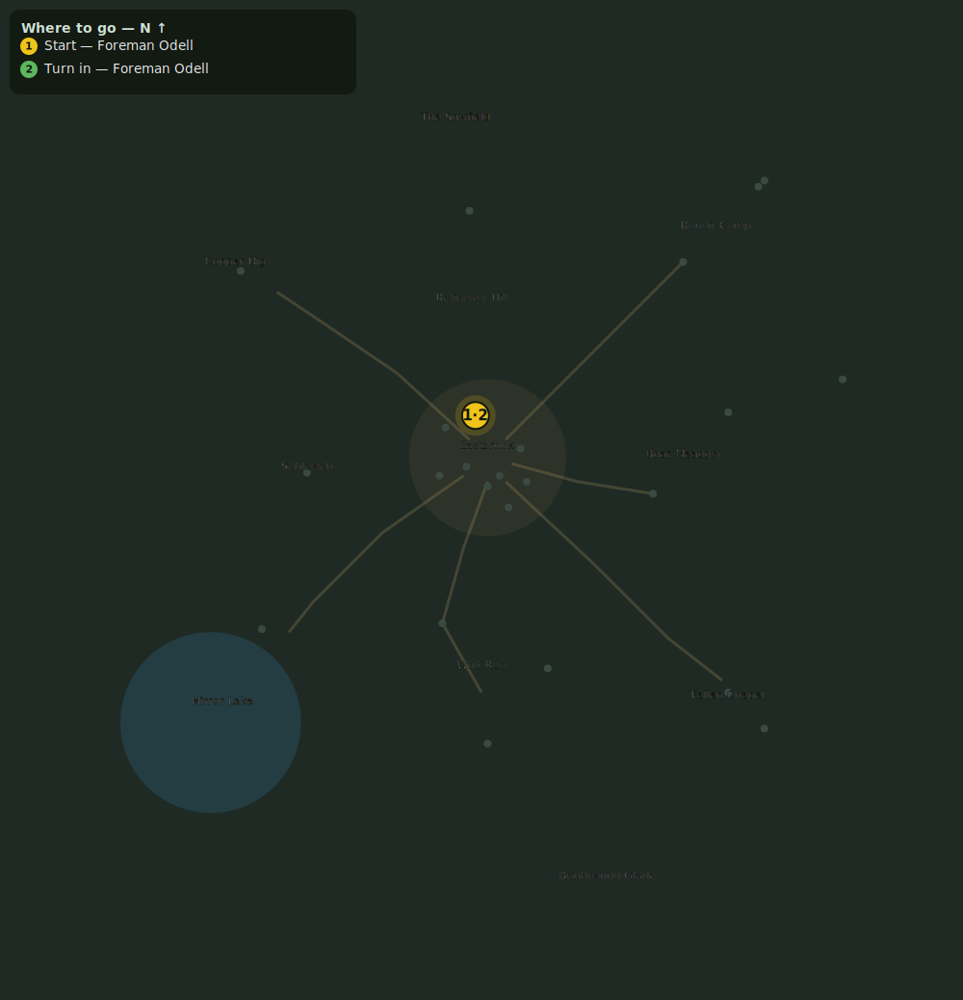

# A Trade for Every Hand

> Quest ID: `q_prof_intro` · Zone 1 — Eastbrook Vale

| | |
|---|---|
| **Recommended level** | 1+ (zone range 1–7) |
| **Quest giver** | **Foreman Odell**, Mine Foreman _(at ~x:-4, z:-14)_ |
| **Turn in to** | **Foreman Odell**, Mine Foreman _(at ~x:-4, z:-14)_ |

## Story

> Every soul in Eastbrook works a trade besides the sword, <your name>. There are ore veins in the rocks around the Copper Dig, southwest of town. Go swing a pick and work 5 of them yourself, mind; I'll know the difference.

## How to complete

  - _Tracker: Ore vein harvested_

Then return to **Foreman Odell**, Mine Foreman _(at ~x:-4, z:-14)_ to turn in.

## Rewards

- **XP:** 150
- **Money:** 50 copper

## On completion

> See? Ore gathered and callus on your hands. Keep at the mining, logging, and herb-picking as you travel the roads, and when you're back in town, mind the Town Focus board by the market and the crafting bench nearby. There's a fair trade waiting in all of it, if you want it.

## Leads to

- A Craft to Call Your Own (`q_archetype_acceptance`)
- Making Amends (`q_prof_make_amends`)
- A Different Pastime (`q_prof_hobby_switch`)

## Where to go

**[🧭 Open this route in 3D →](#/questroute/q_prof_intro)**

_Numbered route: ① start → objectives → 3 turn in. Faint dots are the rest of the zone for context — see the [full zone map](README.md). Mob names above link to the [bestiary](bestiary.md)._
