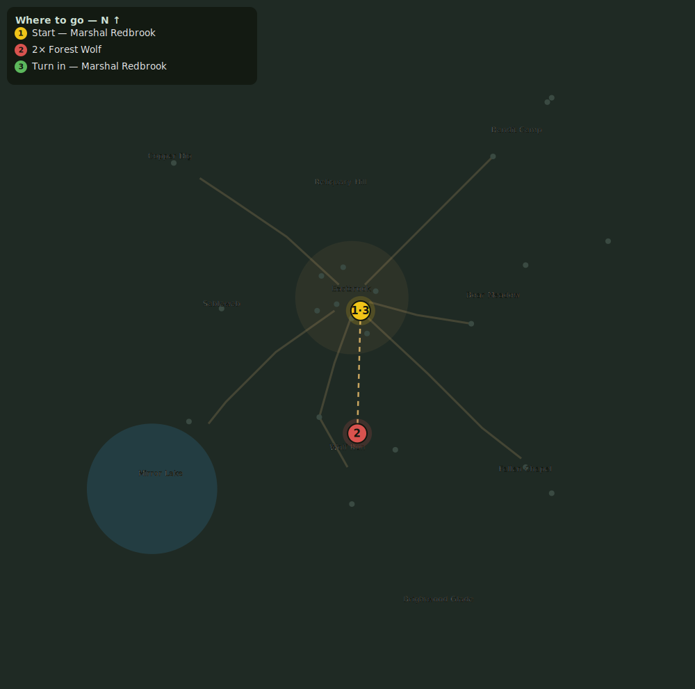

# Making Amends

> Quest ID: `q_prof_make_amends` · Zone 1 — Eastbrook Vale

| | |
|---|---|
| **Recommended level** | 1+ (zone range 1–7) |
| **Quest giver** | **Marshal Redbrook**, Town Marshal _(at ~x:4, z:6)_ |
| **Turn in to** | **Marshal Redbrook**, Town Marshal _(at ~x:4, z:6)_ |
| **Status** | Retired (finishable only if already accepted) |

## Story

> To set aside one craft for another, an artisan must first make amends for the path not walked, <your name>.

## How to complete

- **Kill 2× [Forest Wolf](bestiary.md#mob-forest_wolf)** (level 1–2)
  - Found in the open world at ~x:-15, z:55 (7 mobs, radius 22)
  - Found in the open world at ~x:20, z:70 (6 mobs, radius 20)
  - _Tracker: Forest Wolf slain_

Then return to **Marshal Redbrook**, Town Marshal _(at ~x:4, z:6)_ to turn in.

## Rewards

- **XP:** 50

## On completion

> Amends made; a new path is open to you.

## Where to go

**[🧭 Open this route in 3D →](#/questroute/q_prof_make_amends)**

_Numbered route: ① start → objectives → 3 turn in. Faint dots are the rest of the zone for context — see the [full zone map](README.md). Mob names above link to the [bestiary](bestiary.md)._
