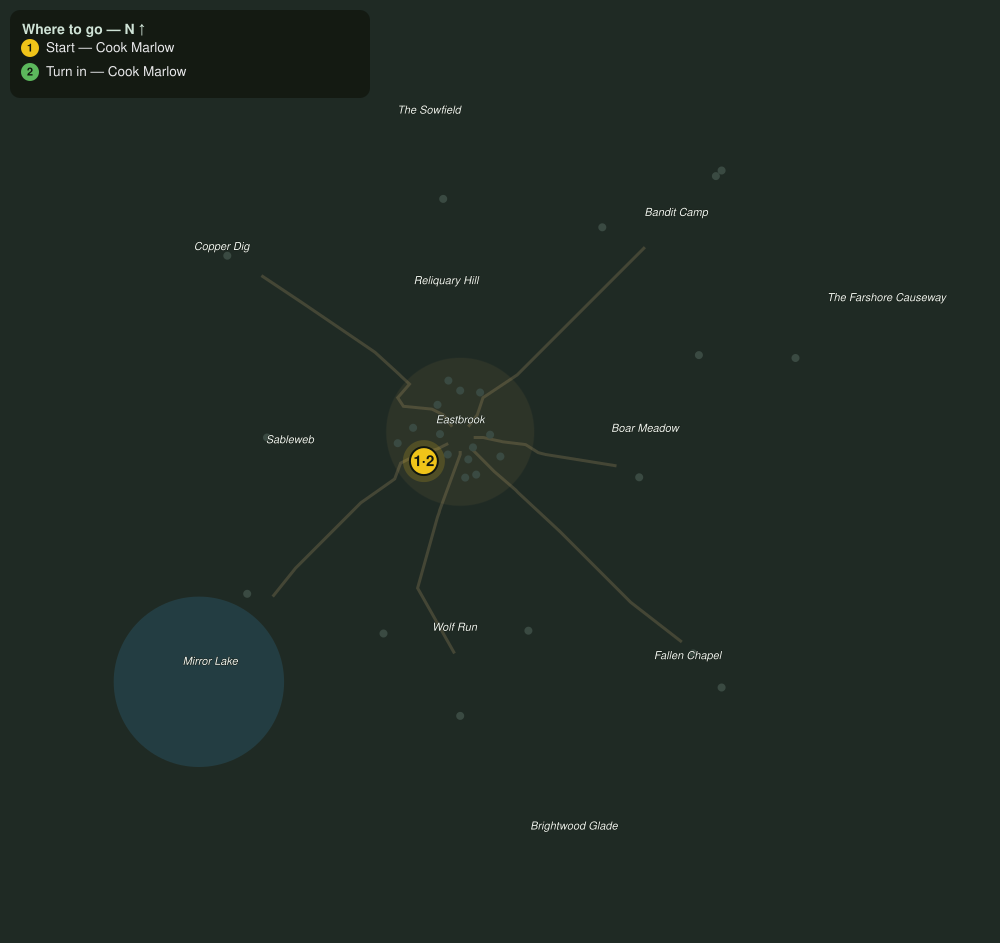

# Kitchens Work Order

> Quest ID: `q_prof_workorder_kitchens` · Zone 1 — Eastbrook Vale

| | |
|---|---|
| **Recommended level** | 1+ (zone range 1–7) |
| **Quest giver** | **Cook Marlow**, Master of the Kitchens _(at ~x:-13, z:10)_ |
| **Turn in to** | **Cook Marlow**, Master of the Kitchens _(at ~x:-13, z:10)_ |

## Story

> My larder is looking thin, <your name>, and thin larders make grumpy cooks. Fetch me eight cuts of game meat and there is coin in it for you, plus my undying gratitude, which is worth less but tastes better.

## How to complete

- **Collect 8× Game Meat**
  - _Granted by a prerequisite quest or special encounter_
  - _Tracker: Game Meat delivered_

Then return to **Cook Marlow**, Master of the Kitchens _(at ~x:-13, z:10)_ to turn in.

## Rewards

- **XP:** 100
- **Money:** 16 copper

## On completion

> Now that is a full pantry. Here is your pay. Come back when your bags are heavy again.

## Where to go

**[🧭 Open this route in 3D →](#/questroute/q_prof_workorder_kitchens)**

_Numbered route: ① start → objectives → 3 turn in. Faint dots are the rest of the zone for context — see the [full zone map](README.md). Mob names above link to the [bestiary](bestiary.md)._
