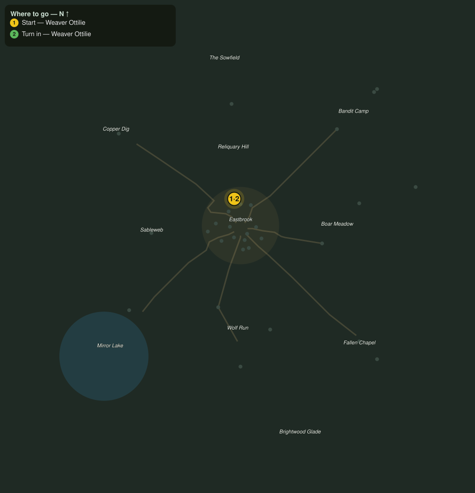

# Loom Work Order

> Quest ID: `q_prof_workorder_loom` · Zone 1 — Eastbrook Vale

| | |
|---|---|
| **Recommended level** | 1+ (zone range 1–7) |
| **Quest giver** | **Weaver Ottilie**, Master of the Loom _(at ~x:-4, z:-18)_ |
| **Turn in to** | **Weaver Ottilie**, Master of the Loom _(at ~x:-4, z:-18)_ |

## Story

> The loom runs dry and idle hands waste daylight, <your name>. Bring me six skeins of spider silk and I will pay you a fair rate, counted out to the copper.

## How to complete

- **Collect 6× Spider Silk**
  - _Granted by a prerequisite quest or special encounter_
  - _Tracker: Spider Silk delivered_

Then return to **Weaver Ottilie**, Master of the Loom _(at ~x:-4, z:-18)_ to turn in.

## Rewards

- **XP:** 100
- **Money:** 15 copper

## On completion

> Fine silk, evenly spun. Your coin, exactly measured. The loom thanks you, and so do I.

## Where to go

**[🧭 Open this route in 3D →](#/questroute/q_prof_workorder_loom)**

_Numbered route: ① start → objectives → 3 turn in. Faint dots are the rest of the zone for context — see the [full zone map](README.md). Mob names above link to the [bestiary](bestiary.md)._
