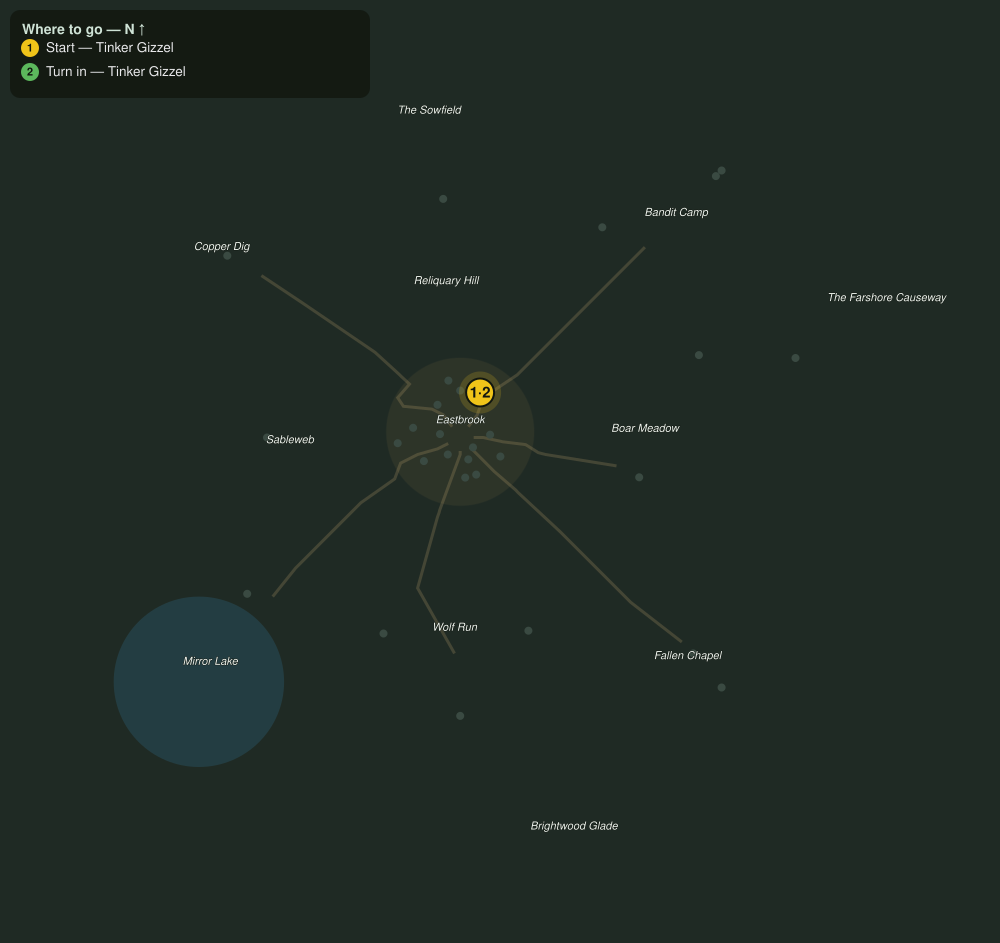

# Toolworks Work Order

> Quest ID: `q_prof_workorder_toolworks` · Zone 1 — Eastbrook Vale

| | |
|---|---|
| **Recommended level** | 1+ (zone range 1–7) |
| **Quest giver** | **Tinker Gizzel**, Master of the Toolworks _(at ~x:7, z:-14)_ |
| **Turn in to** | **Tinker Gizzel**, Master of the Toolworks _(at ~x:7, z:-14)_ |

## Story

> Hafts, handles, stocks, I go through wood like it is going out of style, which it is NOT, wood is eternal, <your name>. Haul me eight ironbark logs and I will pay you, coin, real coin, not a favor, I promise, mostly.

## How to complete

- **Collect 8× Ironbark Log**
  - _Granted by a prerequisite quest or special encounter_
  - _Tracker: Ironbark Log delivered_

Then return to **Tinker Gizzel**, Master of the Toolworks _(at ~x:7, z:-14)_ to turn in.

## Rewards

- **XP:** 100
- **Money:** 16 copper

## On completion

> Perfect, perfect, straight grain, no rot. Here, your coin, see, I keep my word (mostly). Bring more when you trip over a tree.

## Where to go

**[🧭 Open this route in 3D →](#/questroute/q_prof_workorder_toolworks)**

_Numbered route: ① start → objectives → 3 turn in. Faint dots are the rest of the zone for context — see the [full zone map](README.md). Mob names above link to the [bestiary](bestiary.md)._
