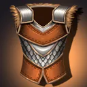
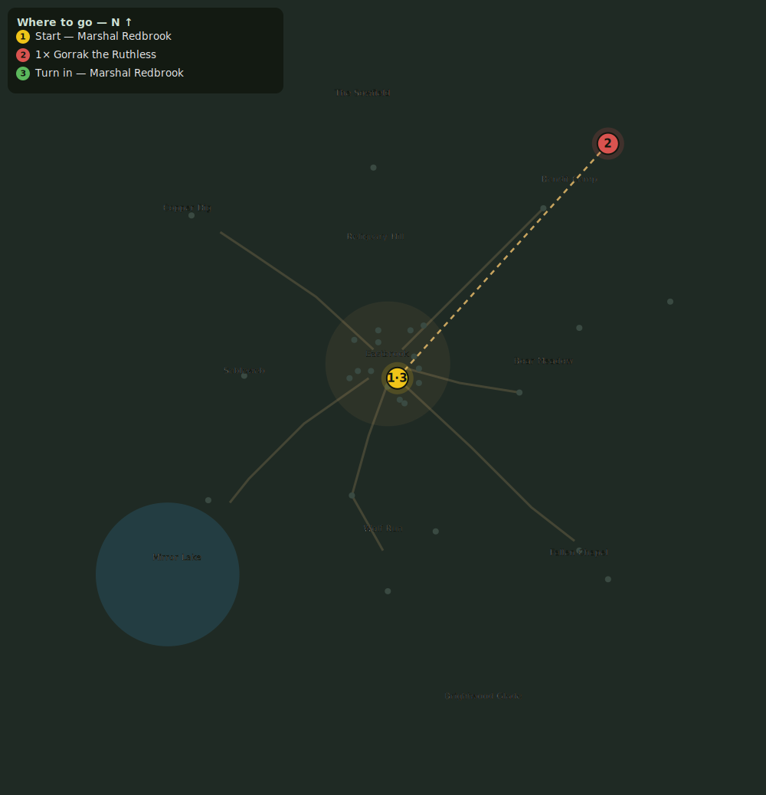

# The Ringleader

> Quest ID: `q_ringleader` · Zone 1 — Eastbrook Vale

| | |
|---|---|
| **Recommended level** | 1+ (zone range 1–7) |
| **Quest giver** | **Marshal Redbrook**, Town Marshal _(at ~x:4, z:6)_ |
| **Turn in to** | **Marshal Redbrook**, Town Marshal _(at ~x:4, z:6)_ |
| **Requires** | Bandits of the Vale (`q_bandits`) |

## Story

> The bandits answer to one man: Gorrak the Ruthless. Cut off the head and the body will scatter. He skulks at the heart of their camp. End him, <your name>.

## How to complete

- **Kill 1× [Gorrak the Ruthless](bestiary.md#mob-gorrak)** (level 6–6, **Boss**)
  - Found in the open world at ~x:92, z:-92 (1 mob, radius 2)
  - _Tracker: Gorrak the Ruthless slain_

Then return to **Marshal Redbrook**, Town Marshal _(at ~x:4, z:6)_ to turn in.

## Rewards

- **XP:** 800
- **Money:** 500 copper
- **Item reward (by class):**
  -  🟢 Militia Chainvest — _warrior_ · 90 armor, +2 Sta
  -  🟢 Valewoven Robe — _mage_ · 30 armor, +3 Int, +2 Spi
  -  🟢 Shadowstitch Jerkin — _rogue_ · 55 armor, +3 Agi

## On completion

> Gorrak is dead? Then the Vale is free of his shadow. You have done Eastbrook a great service.

## Where to go

_Numbered route: ① start → objectives → 3 turn in. Faint dots are the rest of the zone for context — see the [full zone map](README.md). Mob names above link to the [bestiary](bestiary.md)._
