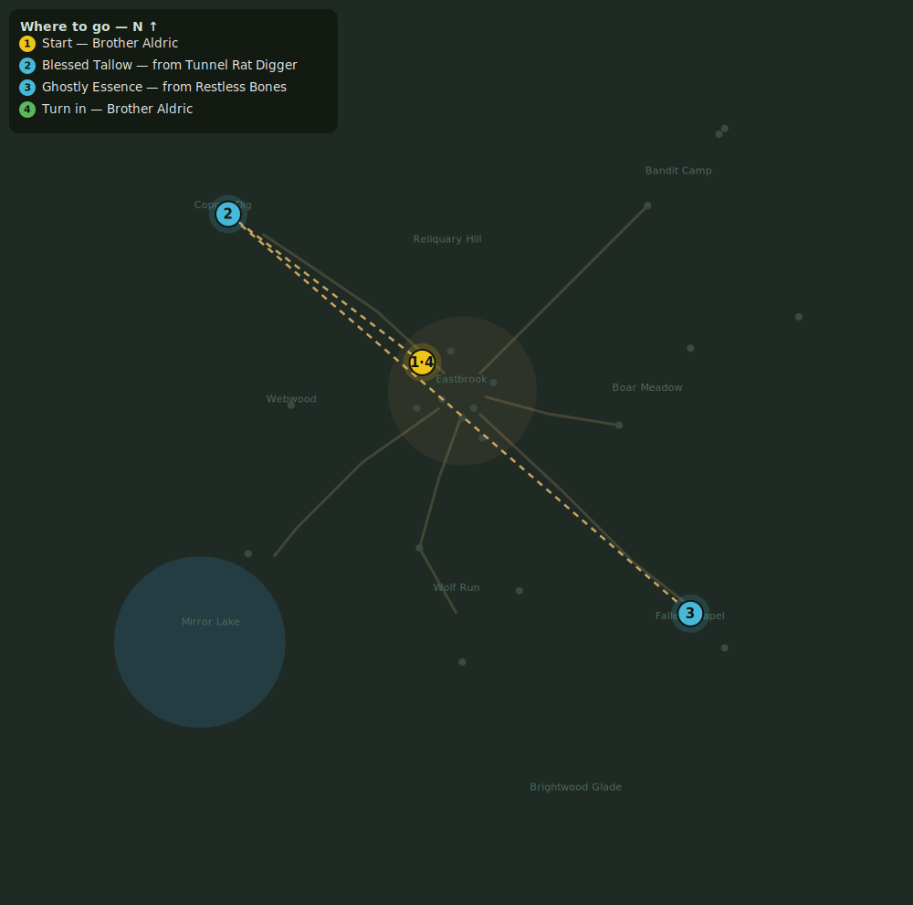

# The Binding Rite

> Quest ID: `q_rite` · Zone 1 — Eastbrook Vale

| | |
|---|---|
| **Recommended level** | 1+ (zone range 1–7) |
| **Quest giver** | **Brother Aldric**, Priest of the Vale _(at ~x:-14, z:-10)_ |
| **Turn in to** | **Brother Aldric**, Priest of the Vale _(at ~x:-14, z:-10)_ |
| **Requires** | Whispers Below (`q_whispers`) |

## Story

> The crypt beneath the chapel must be unsealed if we are to stop the Gravecaller — but only a binding rite will let the living pass. I need 4 lumps of Blessed Tallow — the kobold diggers hoard candles by the crate — and 6 Ghostly Essences from the restless dead.

## How to complete

- **Collect 4× Blessed Tallow**
  - Drops from [**Tunnel Rat Digger**](bestiary.md#mob-tunnel_rat) (45% chance) — Found in the open world at ~x:-82, z:-62 (9 mobs, radius 20)
  - _Tracker: Blessed Tallow_
- **Collect 6× Ghostly Essence**
  - Drops from [**Restless Bones**](bestiary.md#mob-restless_bones) (55% chance) — Found in the open world at ~x:80, z:78 (8 mobs, radius 18); Found in the open world at ~x:88, z:90 (2 mobs, radius 6)
  - _Tracker: Ghostly Essence_

Then return to **Brother Aldric**, Priest of the Vale _(at ~x:-14, z:-10)_ to turn in.

## Rewards

- **XP:** 700
- **Money:** 500 copper

## On completion

> It is done. The way below stands open... and may the Light forgive me for opening it. Gather your strongest companions before you descend, $N. No one should face the Hollow alone.

## Leads to

- Into the Hollow (`q_hollow`)
- The Sexton's Bell (`q_sexton`)

## Where to go

**[🧭 Open this route in 3D →](#/questroute/q_rite)**

_Numbered route: ① start → objectives → 4 turn in. Faint dots are the rest of the zone for context — see the [full zone map](README.md). Mob names above link to the [bestiary](bestiary.md)._
