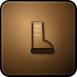
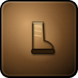

# The Sexton's Bell

> Quest ID: `q_sexton` · Zone 1 — Eastbrook Vale

| | |
|---|---|
| **Recommended level** | 1+ (zone range 1–7) |
| **Quest giver** | **Brother Aldric**, Priest of the Vale _(at ~x:-14, z:-10)_ |
| **Turn in to** | **Brother Aldric**, Priest of the Vale _(at ~x:-14, z:-10)_ |
| **Requires** | The Binding Rite (`q_rite`) |
| **Group quest** | 👥 Suggested players: 5 |

## Story

> The ledger named him and the crypt holds him: Sexton Marrow, the chapel's caretaker, the first man Morthen raised — guarding his master's door in death as faithfully as he kept the chapel in life. Take four companions into the Hollow Crypt and grant the old sexton the rest he was robbed of, <your name>.

## How to complete

- **Kill 1× [Sexton Marrow](bestiary.md#mob-sexton_marrow)** (level 9–9, **Elite**)
  - Inside dungeon **The Hollow Crypt** (entrance portal ~x:80, z:90)
  - _Tracker: Sexton Marrow laid to rest_

Then return to **Brother Aldric**, Priest of the Vale _(at ~x:-14, z:-10)_ to turn in.

## Rewards

- **XP:** 1000
- **Money:** 600 copper
- **Item reward (by class):**
  -  🔵 Marrowtread Boots — _warrior_ · 45 armor, +1 Str, +2 Sta
  -  🔵 Sexton's Slippers — _mage_ · 20 armor, +2 Int, +2 Spi
  -  🔵 Gravewalker Softboots — _rogue_ · 32 armor, +3 Agi

## On completion

> So Marrow is free at last. Ring no bell for him — he heard enough of them in life.

## Zone map

_Gold = NPCs · red = mob camps · purple = dungeons · green = ground pickups. Match the names above to the markers._

See the **[zone bestiary](bestiary.md)** for the health, armor, and kill tactics of every mob named above.
