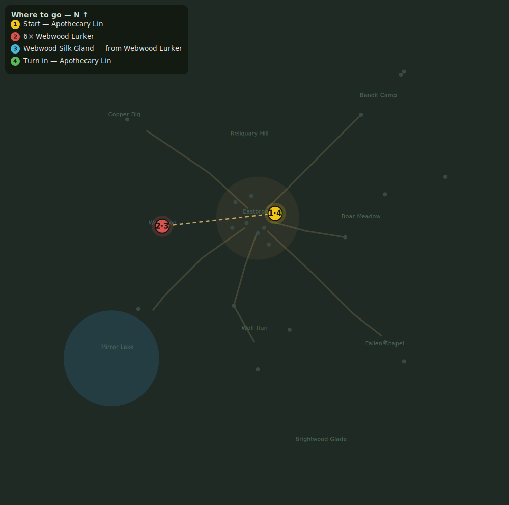

# Webwood Menace

> Quest ID: `q_spiders` · Zone 1 — Eastbrook Vale

| | |
|---|---|
| **Recommended level** | 2+ |
| **Quest giver** | **Apothecary Lin**, Herbalist _(at ~x:11, z:-3)_ |
| **Turn in to** | **Apothecary Lin**, Herbalist _(at ~x:11, z:-3)_ |

## Story

> The lurkers in the eastern woods spin a silk I need for my poultices — and they have grown far too numerous besides. Cull 6 Webwood Lurkers and cut 4 silk glands from their bellies.

## How to complete

- **Kill 6× [Webwood Lurker](bestiary.md#mob-webwood_spider)** (level 2–4)
  - Found in the open world at ~x:-60, z:5 (7 mobs, radius 22)
  - _Tracker: Webwood Lurker slain_
- **Collect 4× Webwood Silk Gland**
  - Drops from [**Webwood Lurker**](bestiary.md#mob-webwood_spider) (55% chance) — Found in the open world at ~x:-60, z:5 (7 mobs, radius 22)
  - _Tracker: Webwood Silk Gland_

Then return to **Apothecary Lin**, Herbalist _(at ~x:11, z:-3)_ to turn in.

## Rewards

- **XP:** 420
- **Money:** 140 copper

## On completion

> Ugh, still twitching. Perfect. Here, you've earned this.

## Where to go

**[🧭 Open this route in 3D →](#/questroute/q_spiders)**

_Numbered route: ① start → objectives → 4 turn in. Faint dots are the rest of the zone for context — see the [full zone map](README.md). Mob names above link to the [bestiary](bestiary.md)._
