# Bestiary — Mirefen Marsh

19 creatures you'll fight in this zone. Health/armor/damage are shown across the mob's spawn level range (mobs roll a random level within it). Mitigation % is what a same-level attacker's physical hits lose to armor — spells ignore armor.

> Threat tiers: **Boss** (dungeon, group it) · **Elite** (~2.3× HP, ~1.5× damage) · **Rare** (tough roamer) · normal (everything else).

## Common creatures

### Mire Prowler

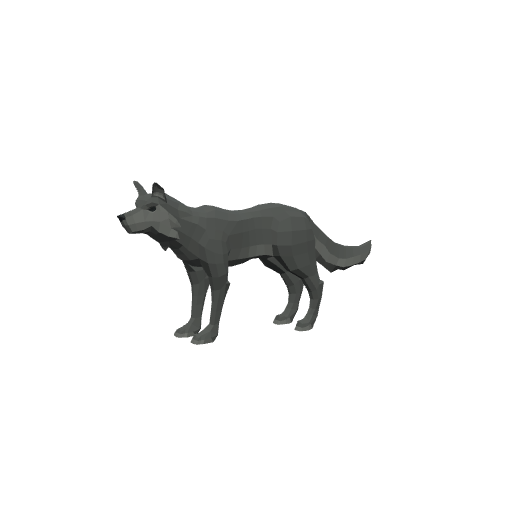

| Stat | Value |
|---|---|
| Level | 7–8 |
| Family | Beast |
| Health | 160–179 HP |
| Armor (physical mitigation) | 72–84 (~7% vs a same-level attacker) |
| Melee damage | 16–27 per hit @ 2s swing (~10–11 DPS) |
| Location | Mirefen Marsh · ~x:-40, z:230 · ~x:35, z:225 — [🗺️ show on map](#/map/-40/230) |

**Best way to kill:**

- **Miring Pounce:** Slows your attack speed on hit — expect a longer fight.

**Loot:**

- Coins: 30 copper (always drops)

| Item | Type | Drop chance | Notes |
|---|---|---:|---|
| 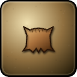  Mire Prowler Pelt | Quest item | 60% | quest item — only drops while on _Pelts for the Causeway_ |
|  ⚫ Soggy Moccasin | Junk | 30% | sells for 9c |
|  ⚪ Lesser Healing Potion | Potion · restores 150 HP | 8% |  |

### Deepfen Snapper

| Stat | Value |
|---|---|
| Level | 8–9 |
| Family | Murloc |
| Health | 181–200 HP |
| Armor (physical mitigation) | 84–96 (~7–8% vs a same-level attacker) |
| Melee damage | 18–31 per hit @ 1.9s swing (~12–13 DPS) |
| Location | Mirefen Marsh · ~x:-82, z:273 · ~x:-120, z:350 — [🗺️ show on map](#/map/-82/273) |

**Best way to kill:**

- **Tide Cadence:** Hastes allies' swings — kill this one first.
- **Acid Spit:** Corrodes your armor — physical mitigation drops; finish it quickly.

**Loot:**

- Coins: 35 copper (always drops)

| Item | Type | Drop chance | Notes |
|---|---|---:|---|
|   Waterlogged Idol | Quest item | 50% | quest item — only drops while on _Idols of the Deep_ |
| 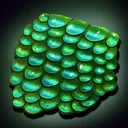 ⚫ Slimy Murloc Scale | Junk | 40% | sells for 5c |

### Mirefen Widow

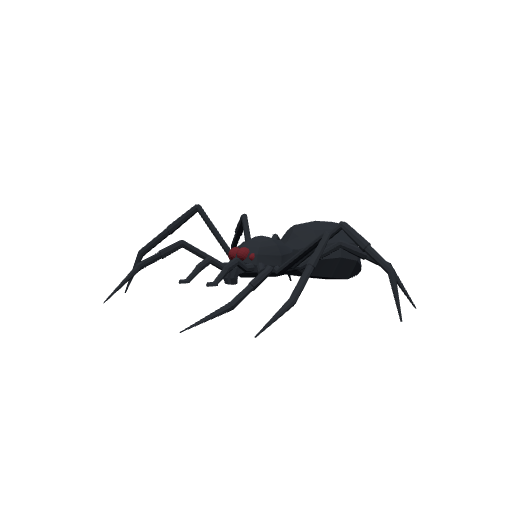

| Stat | Value |
|---|---|
| Level | 8–10 |
| Family | Spider |
| Health | 181–219 HP |
| Armor (physical mitigation) | 70–90 (~6–7% vs a same-level attacker) |
| Melee damage | 19–35 per hit @ 1.8s swing (~13–16 DPS) |
| Location | Mirefen Marsh · ~x:70, z:300 · ~x:95, z:340 — [🗺️ show on map](#/map/70/300) |

**Best way to kill:**

- **Exposed Wound:** Makes you take more crits — bursty fight; keep HP topped.

**Loot:**

- Coins: 38 copper (always drops)

| Item | Type | Drop chance | Notes |
|---|---|---:|---|
|   Widow Venom Sac | Quest item | 65% | quest item — only drops while on _Silk and Venom_ |
| 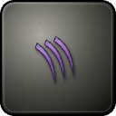 ⚫ Twitching Spider Leg | Junk | 40% | sells for 4c |

### Bog Bloat

| Stat | Value |
|---|---|
| Level | 9–11 |
| Family | Beast |
| Health | 180–214 HP |
| Armor (physical mitigation) | 72–90 (~6% vs a same-level attacker) |
| Melee damage | 18–34 per hit @ 2.6s swing (~9–11 DPS) |
| Location | Mirefen Marsh · ~x:72, z:428 · ~x:110, z:440 — [🗺️ show on map](#/map/72/428) |

**Best way to kill:**

- **Caustic Spores:** Explodes when it dies — clear its blast radius the moment it drops.

**Loot:**

- Coins: 40 copper (always drops)

| Item | Type | Drop chance | Notes |
|---|---|---:|---|
| 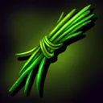 ⚫ Tangled Weed | Junk | 50% | sells for 1c |

### Drowned Dead

| Stat | Value |
|---|---|
| Level | 9–11 |
| Family | Undead |
| Health | 212–252 HP |
| Armor (physical mitigation) | 112–140 (~9% vs a same-level attacker) |
| Melee damage | 21–39 per hit @ 2.3s swing (~12–14 DPS) |
| Location | Mirefen Marsh · ~x:90, z:420 · ~x:115, z:450 — [🗺️ show on map](#/map/90/420) |

**Best way to kill:**

- **Drowning Grasp:** Heals from the damage it deals — out-DPS its self-healing.
- **Bog Rot:** Disease DoT — cleanse disease or heal through.

**Loot:**

- Coins: 42 copper (always drops)

| Item | Type | Drop chance | Notes |
|---|---|---:|---|
| 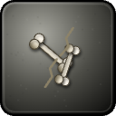 ⚫ Bone Fragments | Junk | 50% | sells for 7c |
|  ⚫ Cracked Fetish | Junk | 30% | sells for 14c |

### Gravecaller Cultist

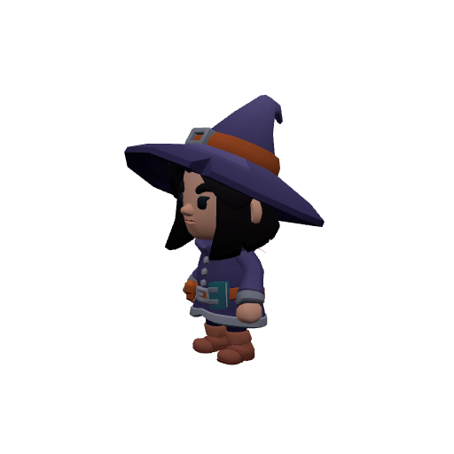

| Stat | Value |
|---|---|
| Level | 10–12 |
| Family | Humanoid |
| Health | 230–270 HP |
| Armor (physical mitigation) | 180–220 (~13% vs a same-level attacker) |
| Melee damage | 24–44 per hit @ 2s swing (~16–18 DPS) |
| Location | Mirefen Marsh · ~x:15, z:470 · ~x:-25, z:490 — [🗺️ show on map](#/map/15/470) |

**Best way to kill:**

- **Weakening Hex:** Can hex/transform you — kill it fast or fight with a partner.
- **Curse of Frailty:** Increases your damage taken — fight it with support.

**Loot:**

- Coins: 55 copper (always drops)

| Item | Type | Drop chance | Notes |
|---|---|---:|---|
| 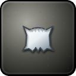 ⚫ Linen Scrap | Junk | 30% | sells for 3c |
|  ⚫ Tallow Candle | Junk | 30% | sells for 5c |

### Mirefen Troll

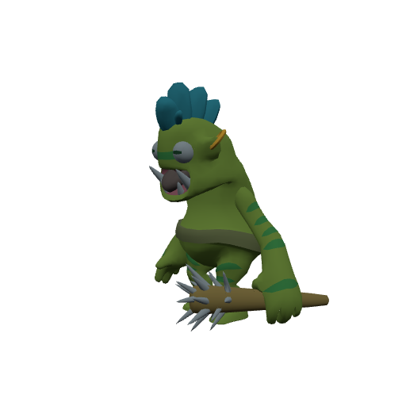

| Stat | Value |
|---|---|
| Level | 10–12 |
| Family | Troll |
| Health | 245–287 HP |
| Armor (physical mitigation) | 162–198 (~11–12% vs a same-level attacker) |
| Melee damage | 24–44 per hit @ 2.2s swing (~14–16 DPS) |
| Location | Mirefen Marsh · ~x:-80, z:420 · ~x:-105, z:455 — [🗺️ show on map](#/map/-80/420) |

**Best way to kill:**

- **Withering Rot:** Withers your stats over time — kill it before the debuff piles up.

**Loot:**

- Coins: 50 copper (always drops)

| Item | Type | Drop chance | Notes |
|---|---|---:|---|
|   Mirefen Troll Fetish | Quest item | 60% | quest item — only drops while on _Fetish and Bone_ |
| 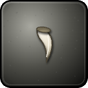 ⚫ Chipped Tusk | Junk | 40% | sells for 15c |
|  ⚫ Bogiron Nugget | Junk | 30% | sells for 12c |
|  🟢 Elixir of the Bear | Elixir · Might of the Bear: +12 Stamina (~+120 HP) for 15 min | 7% |  |

### Gravecaller Mender

| Stat | Value |
|---|---|
| Level | 11–12 |
| Family | Humanoid |
| Health | 224–242 HP |
| Armor (physical mitigation) | 160–176 (~11% vs a same-level attacker) |
| Melee damage | 24–40 per hit @ 2.1s swing (~15–16 DPS) |
| Location | Mirefen Marsh · ~x:18, z:472 — [🗺️ show on map](#/map/18/472) |

**Best way to kill:**

- **Grave Mending:** Heals its wounded allies on a timer — **kill it first** or burst the group together.
- **Draining Litany:** Taxes your ability costs — don't let the fight drag.

**Loot:**

- Coins: 58 copper (always drops)

| Item | Type | Drop chance | Notes |
|---|---|---:|---|
|   Gravecaller Cipher | Quest item | 40% | quest item — only drops while on _Stopping the Summoning_ |
|  ⚫ Tallow Candle | Junk | 30% | sells for 5c |

### Gravecaller Summoner

| Stat | Value |
|---|---|
| Level | 11–12 |
| Family | Humanoid |
| Health | 236–255 HP |
| Armor (physical mitigation) | 160–176 (~11% vs a same-level attacker) |
| Melee damage | 28–47 per hit @ 2s swing (~18–19 DPS) |
| Location | Mirefen Marsh · ~x:-5, z:500 — [🗺️ show on map](#/map/-5/500) |

**Best way to kill:**

- **Grave Blight:** Can blanket you in a heal-absorb — burst-heal through it or wait it out.
- **Silencing Shriek:** Silences casters — melee/wand it down, or LoS the cast.
- **Wail of the Grave:** Stacks a fear/dread debuff — don't let the fight drag.

**Loot:**

- Coins: 60 copper (always drops)

| Item | Type | Drop chance | Notes |
|---|---|---:|---|
|   Gravecaller Cipher | Quest item | 60% | quest item — only drops while on _Stopping the Summoning_ |

### Grubjaw the Glutton — _Rare_

| Stat | Value |
|---|---|
| Level | 12 |
| Family | Troll |
| Health | 416 HP |
| Armor (physical mitigation) | 220 (~13% vs a same-level attacker) |
| Melee damage | 30–47 per hit @ 2.2s swing (~18 DPS) |
| Respawn | ~2 min (rare spawn) |
| Location | Mirefen Marsh · ~x:-120, z:480 — [🗺️ show on map](#/map/-120/480) |

**Best way to kill:**

- **Rare** — a tougher roaming spawn; worth killing for loot, but pull it solo.
- **Devour Magic:** Strips your buffs on hit — re-up key buffs or burst it down.

**Loot:**

- Coins: 200 copper (always drops)

| Item | Type | Drop chance | Notes |
|---|---|---:|---|
| 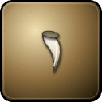  Grubjaw's Tusk | Quest item | 100% | quest item — only drops while on _The Glutton_ |
|  ⚫ Chipped Tusk | Junk | 100% | sells for 15c |

## Elites

### Mirejaw the Ravenous — _Elite · Rare_

| Stat | Value |
|---|---|
| Level | 10 |
| Family | Murloc |
| Health | 1937 HP |
| Armor (physical mitigation) | 234 (~16% vs a same-level attacker) |
| Melee damage | 58–91 per hit @ 1.8s swing (~41 DPS) |
| Crowd control | Immune |
| Respawn | ~4.5 hours (rare spawn) |
| Location | Mirefen Marsh · ~x:-132, z:333 — [🗺️ show on map](#/map/-132/333) |

**Best way to kill:**

- **Elite** — ~2.3× the health and ~1.5× the damage of a normal mob; bring a group or out-level it.
- Immune to crowd control — it can't be stunned, feared, or polymorphed; just tank and burn.
- Summons adds at HP thresholds — bring AoE or kill the adds fast; don't let them pile up.
- **Ravenous Frenzy:** Pulses AoE damage around itself — healers expect steady raid damage; don't bring extra mobs into it.
- **Sapping Bite:** Saps your resources — keep fights short.
- Will follow you into the water — no escaping by swimming.

**Loot:**

- Coins: 260 copper (always drops)

| Item | Type | Drop chance | Notes |
|---|---|---:|---|
|  ⚫ Slimy Murloc Scale | Junk | 100% | sells for 5c |
|  🟢 Mirejaw Biteblade | Weapon — Main hand · 8–14 dmg @ 1.7s (~6 DPS), +5 Agi, +2 Sta | 25% |  |
| 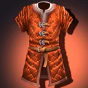 🟢 Mirejaw Scale Vest | Armor — Chest · 115 armor, +2 Str, +3 Sta | 25% |  |
| 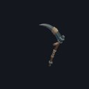 🔵 Fen Reaver Glaive | Weapon — Main hand · 16–26 dmg @ 2.4s (~9 DPS), +5 Str, +3 Sta | 25% | exclusive set † |
| 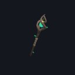 🔵 Mirejaw Oracle Staff | Weapon — Main hand · 16–27 dmg @ 3s (~7 DPS), +6 Int, +3 Spi | 25% | exclusive set † |

† The exclusive set is rolled once — at most one of these items drops per kill.

### Sloomtooth the Drowned — _Elite · Rare_

| Stat | Value |
|---|---|
| Level | 11 |
| Family | Murloc |
| Health | 2162 HP |
| Armor (physical mitigation) | 280 (~17% vs a same-level attacker) |
| Melee damage | 65–101 per hit @ 1.9s swing (~44 DPS) |
| Crowd control | Immune |
| Respawn | ~4.5 hours (rare spawn) |
| Location | Mirefen Marsh · ~x:118, z:455 — [🗺️ show on map](#/map/118/455) |

**Best way to kill:**

- **Elite** — ~2.3× the health and ~1.5× the damage of a normal mob; bring a group or out-level it.
- Immune to crowd control — it can't be stunned, feared, or polymorphed; just tank and burn.
- Heals itself once when low — stun/interrupt the cast or burst straight past it.
- **Tidal Sweep:** Cleaves its frontal arc — keep everyone but the tank out of its face.
- Will follow you into the water — no escaping by swimming.

**Loot:**

- Coins: 280 copper (always drops)

| Item | Type | Drop chance | Notes |
|---|---|---:|---|
|  ⚫ Slimy Murloc Scale | Junk | 100% | sells for 5c |
| 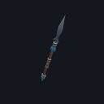 🔵 Tidereaver Gaff | Weapon — Main hand · 17–28 dmg @ 2.5s (~9 DPS), +5 Str, +4 Sta | 25% | exclusive set † |
| 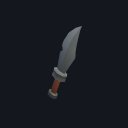 🔵 Sloomtooth's Tidefang | Weapon — Main hand · 10–17 dmg @ 1.7s (~8 DPS), +6 Agi, +3 Sta | 25% | exclusive set † |
| 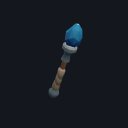 🔵 Drowned Tide Scepter | Weapon — Main hand · 16–28 dmg @ 3s (~7 DPS), +6 Int, +3 Spi | 25% | exclusive set † |

† The exclusive set is rolled once — at most one of these items drops per kill.

### Bastion Revenant — _Elite_

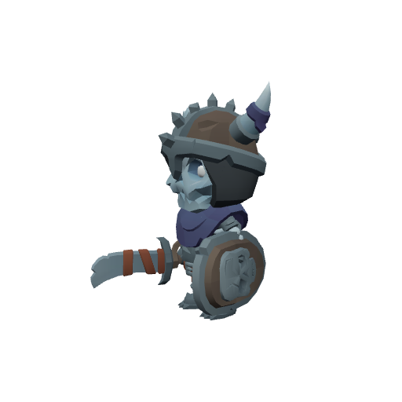

| Stat | Value |
|---|---|
| Level | 12–13 |
| Family | Undead |
| Health | 656–704 HP |
| Armor (physical mitigation) | 198–216 (~12–13% vs a same-level attacker) |
| Melee damage | 42–71 per hit @ 2.3s swing (~23–25 DPS) |
| Respawn | ~25s |
| Location | The Sunken Bastion (dungeon) — [🏰 view dungeon](#/doc/dungeons%2Fsunken_bastion.md) |

**Best way to kill:**

- **Elite** — ~2.3× the health and ~1.5× the damage of a normal mob; bring a group or out-level it.
- **Mortal Strike:** Cuts the healing you receive — kill it before the debuff stacks matter.

**Loot:**

- Coins: 150 copper (always drops)

| Item | Type | Drop chance | Notes |
|---|---|---:|---|
|  ⚫ Bone Fragments | Junk | 70% | sells for 7c |
|  🟢 Mistveil Cord | Armor — Waist · 30 armor, +1 Agi, +2 Sta | 6% | exclusive set † |

† The exclusive set is rolled once — at most one of these items drops per kill.

### Sister Nhalia — _Elite · Rare_

| Stat | Value |
|---|---|
| Level | 12 |
| Family | Humanoid |
| Health | 2277 HP |
| Armor (physical mitigation) | 330 (~19% vs a same-level attacker) |
| Melee damage | 69–108 per hit @ 2s swing (~44 DPS) |
| Crowd control | Immune |
| Respawn | ~4.5 hours (rare spawn) |
| Location | Mirefen Marsh · ~x:24, z:492 — [🗺️ show on map](#/map/24/492) |

**Best way to kill:**

- **Elite** — ~2.3× the health and ~1.5× the damage of a normal mob; bring a group or out-level it.
- Immune to crowd control — it can't be stunned, feared, or polymorphed; just tank and burn.
- Summons adds at HP thresholds — bring AoE or kill the adds fast; don't let them pile up.
- **Dirge of Nhalia:** Pulses AoE damage around itself — healers expect steady raid damage; don't bring extra mobs into it.
- **Banshee's Wail:** Fears nearby players — fight with your back to a wall or bring fear protection.
- **Spirit Siphon:** Drains life to heal itself — burst it before it tops up.
- Will follow you into the water — no escaping by swimming.

**Loot:**

- Coins: 350 copper (always drops)

| Item | Type | Drop chance | Notes |
|---|---|---:|---|
|  ⚫ Tallow Candle | Junk | 100% | sells for 5c |
| 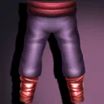 🟢 Nhalia's Funeral Wraps | Armor — Legs · 48 armor, +5 Int, +2 Spi | 25% |  |
|  🔵 Nhalia's Dirgeblade | Weapon — Main hand · 10–16 dmg @ 1.7s (~8 DPS), +6 Agi, +3 Sta | 25% | exclusive set † |

† The exclusive set is rolled once — at most one of these items drops per kill.

### Tidebound Acolyte — _Elite_

| Stat | Value |
|---|---|
| Level | 12–13 |
| Family | Humanoid |
| Health | 621–667 HP |
| Armor (physical mitigation) | 154–168 (~10% vs a same-level attacker) |
| Melee damage | 45–75 per hit @ 2s swing (~29–31 DPS) |
| Respawn | ~25s |
| Location | The Sunken Bastion (dungeon) — [🏰 view dungeon](#/doc/dungeons%2Fsunken_bastion.md) |

**Best way to kill:**

- **Elite** — ~2.3× the health and ~1.5× the damage of a normal mob; bring a group or out-level it.
- Heals itself once when low — stun/interrupt the cast or burst straight past it.

**Loot:**

- Coins: 170 copper (always drops)

| Item | Type | Drop chance | Notes |
|---|---|---:|---|
|  ⚫ Linen Scrap | Junk | 50% | sells for 3c |
|  🟢 Mistveil Grips | Armor — Hands · 36 armor, +2 Agi, +1 Sta | 6% | exclusive set † |

† The exclusive set is rolled once — at most one of these items drops per kill.

### Knight-Commander Olen — _Elite_

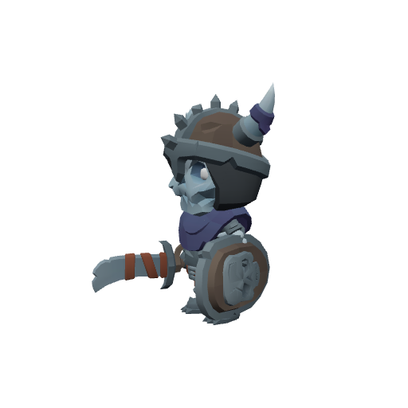

| Stat | Value |
|---|---|
| Level | 13 |
| Family | Undead |
| Health | 994 HP |
| Armor (physical mitigation) | 288 (~16% vs a same-level attacker) |
| Melee damage | 51–79 per hit @ 2.2s swing (~30 DPS) |
| Respawn | ~25s |
| Location | The Sunken Bastion (dungeon) — [🏰 view dungeon](#/doc/dungeons%2Fsunken_bastion.md) |

**Best way to kill:**

- **Elite** — ~2.3× the health and ~1.5× the damage of a normal mob; bring a group or out-level it.
- **Cleave:** Cleaves its frontal arc — keep everyone but the tank out of its face.

**Loot:**

- Coins: 800 copper (always drops)

| Item | Type | Drop chance | Notes |
|---|---|---:|---|
|  🟢 Trollhide Leggings | Armor — Legs · 55 armor, +2 Str, +3 Sta | 50% | exclusive set 1 † |
|  🟢 Marshstrider Boots | Armor — Feet · 40 armor, +2 Agi, +2 Sta | 50% | exclusive set 1 † |
| 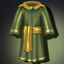 🟢 Fenmist Robe | Armor — Chest · 45 armor, +5 Int, +3 Spi | 25% | exclusive set 2 † |
| 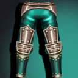 🔵 Tideguard Greaves | Armor — Legs · 125 armor, +3 Str, +5 Sta | 10% | exclusive set 2 † |
| 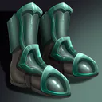 🔵 Tideguard Sabatons | Armor — Feet · 105 armor, +2 Str, +4 Sta | 10% | exclusive set 2 † |
|  🔵 Eelscale Leggings | Armor — Legs · 86 armor, +6 Agi, +3 Sta | 10% | exclusive set 2 † |

† Each exclusive set is rolled separately — at most one item from each set drops per kill.

## Bosses

### The Broodmother — _Boss_

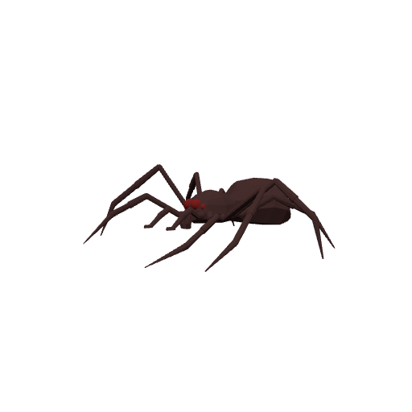

| Stat | Value |
|---|---|
| Level | 10 |
| Family | Spider |
| Health | 384 HP |
| Armor (physical mitigation) | 144 (~10% vs a same-level attacker) |
| Melee damage | 24–38 per hit @ 1.8s swing (~17 DPS) |
| Respawn | ~25s |
| Location | Mirefen Marsh · ~x:98, z:348 — [🗺️ show on map](#/map/98/348) |

**Best way to kill:**

- **Boss** — fight it as a group in its dungeon; assign a tank and watch its mechanics below.
- **Brood Venom:** Stacking poison — the longer it's on you the harder it bites; kill it before stacks ramp.

**Loot:**

- Coins: 300 copper (always drops)

| Item | Type | Drop chance | Notes |
|---|---|---:|---|
|  ⚫ Twitching Spider Leg | Junk | 100% | sells for 4c |
|  🟢 Marshstrider Boots | Armor — Feet · 40 armor, +2 Agi, +2 Sta | 40% |  |
| 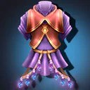 🟢 Broodmother's Silk Robe | Armor — Chest · 42 armor, +4 Int, +2 Spi | 25% |  |

### Deacon Voss — _Boss_

| Stat | Value |
|---|---|
| Level | 12 |
| Family | Humanoid |
| Health | 530 HP |
| Armor (physical mitigation) | 286 (~17% vs a same-level attacker) |
| Melee damage | 31–48 per hit @ 2.4s swing (~16 DPS) |
| Respawn | ~25s |
| Location | Mirefen Marsh · ~x:0, z:510 — [🗺️ show on map](#/map/0/510) |

**Best way to kill:**

- **Boss** — fight it as a group in its dungeon; assign a tank and watch its mechanics below.
- **Drowning Hymn:** Pulses AoE damage around itself — healers expect steady raid damage; don't bring extra mobs into it.
- **Profane Rune:** Arcane DoT on hit — cleanse or heal through.

**Loot:**

- Coins: 600 copper (always drops)

| Item | Type | Drop chance | Notes |
|---|---|---:|---|
|  ⚫ Tallow Candle | Junk | 100% | sells for 5c |
| 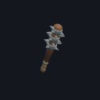 🟢 Voss's Sanctified Mace | Weapon — Main hand · 12–20 dmg @ 2.6s (~6 DPS), +3 Int, +2 Spi | 25% |  |

### Vael the Mistcaller — _Boss · Elite_

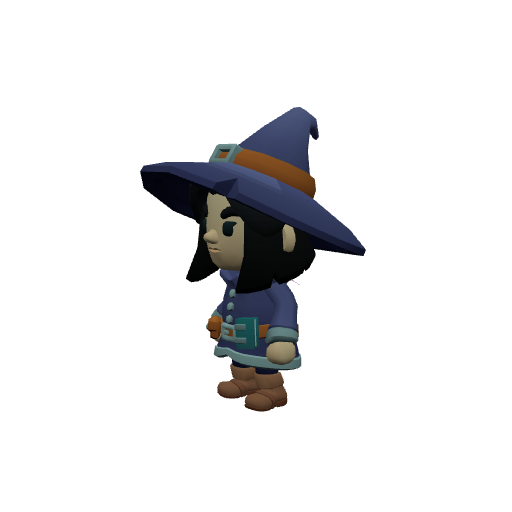

| Stat | Value |
|---|---|
| Level | 13 |
| Family | Humanoid |
| Health | 1490 HP |
| Armor (physical mitigation) | 312 (~17% vs a same-level attacker) |
| Melee damage | 52–81 per hit @ 2.4s swing (~28 DPS) |
| Respawn | ~25s |
| Location | The Sunken Bastion (dungeon) — [🏰 view dungeon](#/doc/dungeons%2Fsunken_bastion.md) |

**Best way to kill:**

- **Boss** — fight it as a group in its dungeon; assign a tank and watch its mechanics below.
- Summons adds at HP thresholds — bring AoE or kill the adds fast; don't let them pile up.
- **Mist Surge:** Pulses AoE damage around itself — healers expect steady raid damage; don't bring extra mobs into it.

**Loot:**

- Coins: 5000 copper (always drops)

| Item | Type | Drop chance | Notes |
|---|---|---:|---|
|  ⚫ Deepfen Pearl | Junk | 100% | sells for 600c |
|  🟢 Trollhide Leggings | Armor — Legs · 55 armor, +2 Str, +3 Sta | 34% | exclusive set 1 † |
|  🟢 Marshstrider Boots | Armor — Feet · 40 armor, +2 Agi, +2 Sta | 33% | exclusive set 1 † |
|  🟢 Fenmist Robe | Armor — Chest · 45 armor, +5 Int, +3 Spi | 33% | exclusive set 1 † |
|  🟢 Eelskin Tunic | Armor — Chest · 80 armor, +5 Agi | 20% | exclusive set 2 † |
|  🟢 Mistveil Cord | Armor — Waist · 30 armor, +1 Agi, +2 Sta | 12% | exclusive set 2 † |
|  🟢 Mistveil Grips | Armor — Hands · 36 armor, +2 Agi, +1 Sta | 12% | exclusive set 2 † |
| 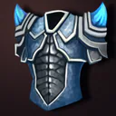 🔵 Tidescale Vest | Armor — Chest · 90 armor, +2 Agi, +3 Sta | 10% | exclusive set 2 † |
|  🔵 Drowned Prayer Leggings | Armor — Legs · 48 armor, +6 Int, +4 Spi | 10% | exclusive set 2 † |
|  🔵 Drowned Prayer Sandals | Armor — Feet · 42 armor, +5 Int, +3 Spi | 10% | exclusive set 2 † |
|  🔵 Eelscale Treads | Armor — Feet · 72 armor, +5 Agi, +3 Sta | 10% | exclusive set 2 † |

† Each exclusive set is rolled separately — at most one item from each set drops per kill.

---

[← Back to Mirefen Marsh quests](README.md) · [Zone map](map.svg)
