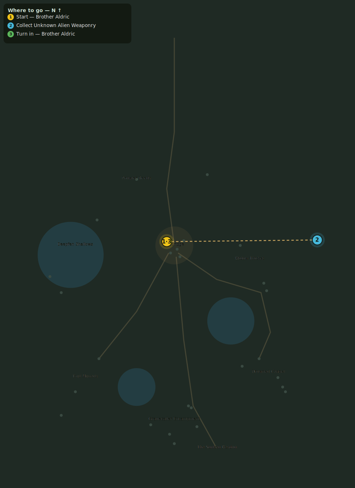

# Aldric's Fallen Star

> Quest ID: `q_aldrics_fallen_star` · Zone 2 — Mirefen Marsh

| | |
|---|---|
| **Recommended level** | 5+ |
| **Quest giver** | **Brother Aldric**, Priest of the Vale _(at ~x:-8, z:296)_ |
| **Turn in to** | **Brother Aldric**, Priest of the Vale _(at ~x:-8, z:296)_ |
| **Status** | Retired (finishable only if already accepted) |

## Story

> I saw a rock fall out of the western sky, <your name>. It struck the marsh wall and burst like a forge, far beyond the widow thicket. Go west, find what survived the explosion, and bring me anything that does not belong to this world.

## How to complete

- **Collect 1× Unknown Alien Weaponry**
  - Pick up from the ground (sparkle objects) at: ~x:152, z:294
  - _Tracker: Unknown Alien Weaponry_

Then return to **Brother Aldric**, Priest of the Vale _(at ~x:-8, z:296)_ to turn in.

## Rewards

- **XP:** 900
- **Money:** 300 copper
- **Item reward (by class):**
  -  🔵 Alien Armor Plate — _warrior, mage, rogue_

## On completion

> This is no weapon I know. Look at how the plates fold. It may be a rare piece of armor, if it can be worn at all. Take it and try it on, $N, but be careful.

## Where to go

_Numbered route: ① start → objectives → 3 turn in. Faint dots are the rest of the zone for context — see the [full zone map](README.md). Mob names above link to the [bestiary](bestiary.md)._
