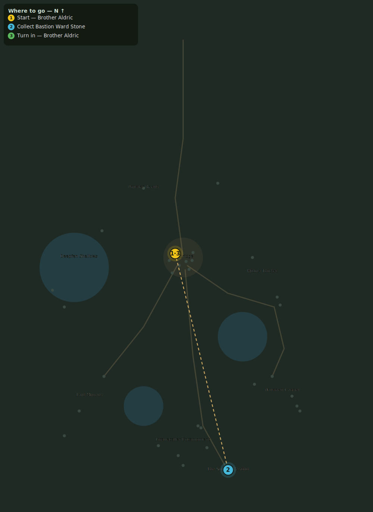

# The Sunken Bastion

> Quest ID: `q_bastion_door` · Zone 2 — Mirefen Marsh

| | |
|---|---|
| **Recommended level** | 12+ |
| **Quest giver** | **Brother Aldric**, Priest of the Vale _(at ~x:-8, z:296)_ |
| **Turn in to** | **Brother Aldric**, Priest of the Vale _(at ~x:-8, z:296)_ |
| **Requires** | The Deacon of the Mire (`q_deacon`) |

## Story

> The Sunken Bastion — a knight's hold that drowned in the fen a century ago — is where Voss's letters point, and where this Mistcaller sings his drowning hymns. The cult has warded its door with grave-stones. Bring me one of the ward stones, <your name>, and I will unweave the seal.

## How to complete

- **Collect 1× Bastion Ward Stone**
  - Pick up from the ground (sparkle objects) at: ~x:43, z:512 · ~x:48, z:517
  - _Tracker: Bastion Ward Stone_

Then return to **Brother Aldric**, Priest of the Vale _(at ~x:-8, z:296)_ to turn in.

## Rewards

- **XP:** 1200
- **Money:** 500 copper

## On completion

> The ward parts like rotten rope. The door stands open... and the dark below it is listening.

## Leads to

- The Knight-Commander's Shame (`q_olen`)
- The Mistcaller (`q_mistcaller`)

## Where to go

_Numbered route: ① start → objectives → 3 turn in. Faint dots are the rest of the zone for context — see the [full zone map](README.md). Mob names above link to the [bestiary](bestiary.md)._
