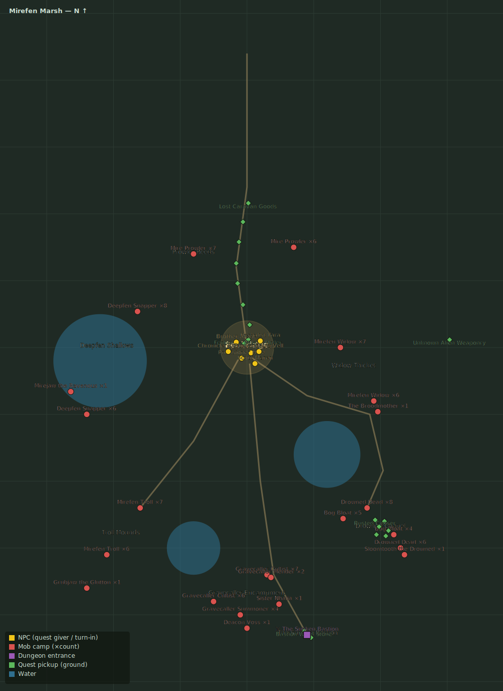

# The Broodmother

> Quest ID: `q_broodmother` · Zone 2 — Mirefen Marsh

| | |
|---|---|
| **Recommended level** | 6+ (zone range 6–13) |
| **Quest giver** | **Herbalist Yara**, Herbalist _(at ~x:10, z:295)_ |
| **Turn in to** | **Herbalist Yara**, Herbalist _(at ~x:10, z:295)_ |
| **Requires** | Silk and Venom (`q_widows`) |

## Story

> You have seen the webs — now ask yourself what spins cables thick as a man's wrist. The wardens call her the Broodmother, and her clutch hangs over Widow Thicket like a second canopy. Burn through 8 more widows and put the old mother down before that clutch opens.

## How to complete

- **Kill 8× Mirefen Widow** (level 8–10)
  - Found in the open world at ~x:70, z:300 (7 mobs, radius 20)
  - Found in the open world at ~x:95, z:340 (6 mobs, radius 16)
  - _Tracker: Mirefen Widow slain_
- **Kill 1× The Broodmother** (level 10–10, **Boss**)
  - Found in the open world at ~x:98, z:348 (1 mob, radius 3)
  - _Tracker: The Broodmother slain_

Then return to **Herbalist Yara**, Herbalist _(at ~x:10, z:295)_ to turn in.

## Rewards

- **XP:** 1250
- **Money:** 500 copper

## On completion

> Dead? Truly dead? Then the thicket is just trees again. The Light bless your blade, $N.

## Zone map

_Gold = NPCs · red = mob camps · purple = dungeons · green = ground pickups. Match the names above to the markers._
