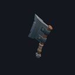
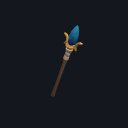
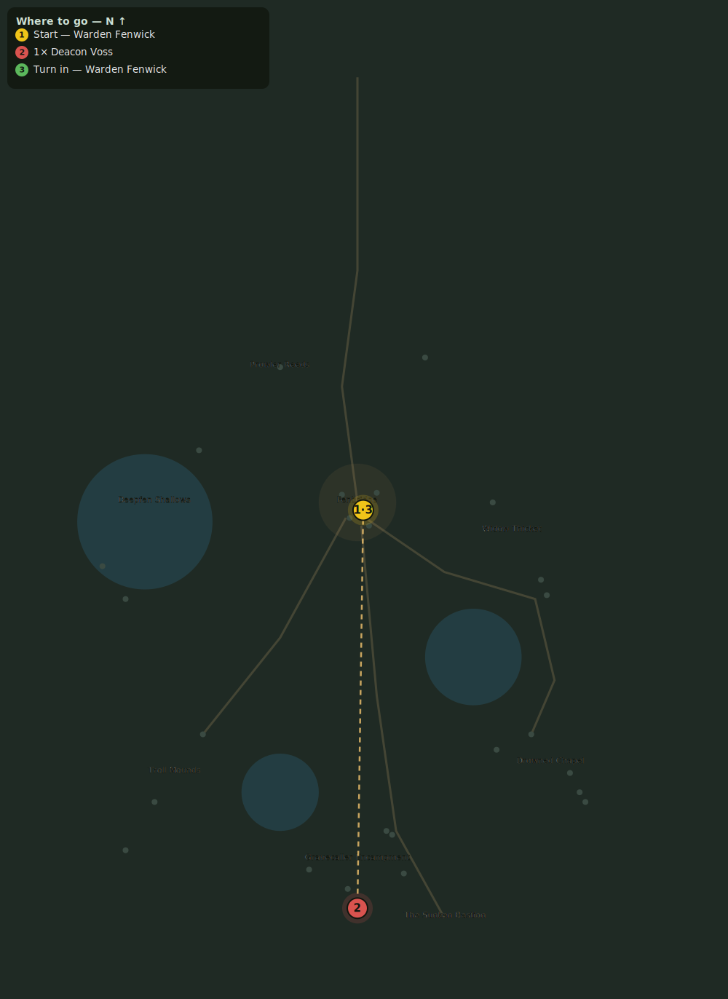

# The Deacon of the Mire

> Quest ID: `q_deacon` · Zone 2 — Mirefen Marsh

| | |
|---|---|
| **Recommended level** | 6+ (zone range 6–13) |
| **Quest giver** | **Warden Fenwick**, Warden of Fenbridge _(at ~x:3, z:304)_ |
| **Turn in to** | **Warden Fenwick**, Warden of Fenbridge _(at ~x:3, z:304)_ |
| **Requires** | Stopping the Summoning (`q_summoners`) |

## Story

> So a deacon of the Gravecallers stands at the heart of that camp, singing my drowned wardens up out of the lakes to serve him. His hymn ends today. Take the camp road north, <your name>, and put Deacon Voss in the ground — deep enough that nobody sings HIM back up.

## How to complete

- **Kill 1× [Deacon Voss](bestiary.md#mob-deacon_voss)** (level 12–12, **Boss**)
  - Found in the open world at ~x:0, z:510 (1 mob, radius 2)
  - _Tracker: Deacon Voss slain_

Then return to **Warden Fenwick**, Warden of Fenbridge _(at ~x:3, z:304)_ to turn in.

## Rewards

- **XP:** 2200
- **Money:** 1000 copper
- **Item reward (by class):**
  -  🟢 Deacon's Cleaver — _warrior_ · 11–18 dmg @ 2.4s (~6 DPS), +4 Str
  -  🟢 Staff of Drowned Prayers — _mage_ · 12–20 dmg @ 3s (~5 DPS), +5 Int, +2 Spi
  -  🟢 Mistbinder Kris — _rogue_ · 7–12 dmg @ 1.7s (~6 DPS), +4 Agi

## On completion

> Voss is dead and the mist over the camp is already thinning. You have broken their voice in the fen — now only the Bastion remains.

## Leads to

- The Sunken Bastion (`q_bastion_door`)

## Where to go

**[🧭 Open this route in 3D →](#/questroute/q_deacon)**

_Numbered route: ① start → objectives → 3 turn in. Faint dots are the rest of the zone for context — see the [full zone map](README.md). Mob names above link to the [bestiary](bestiary.md)._
