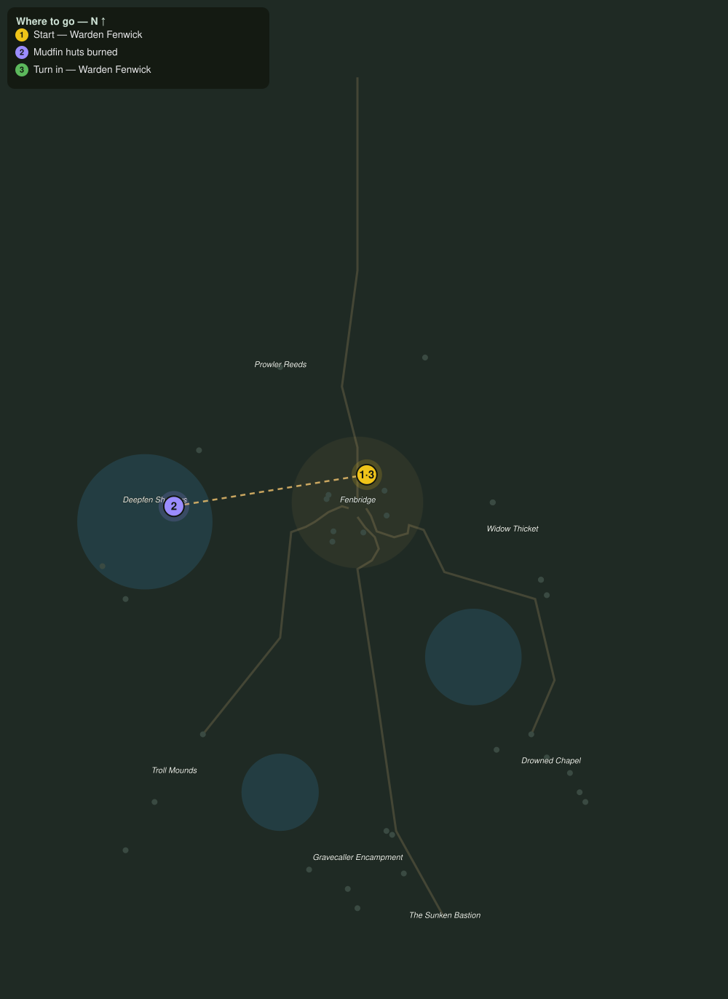

# Back to the Shallows

> Quest ID: `q_deepfen_purge` · Zone 2 — Mirefen Marsh

| | |
|---|---|
| **Recommended level** | 6+ (zone range 6–13) |
| **Quest giver** | **Warden Fenwick**, Warden of Fenbridge _(at ~x:5, z:286)_ |
| **Turn in to** | **Warden Fenwick**, Warden of Fenbridge _(at ~x:5, z:286)_ |
| **Requires** | Idols of the Deep (`q_idols`) |

## Story

> Aldric says those idols are cult-make, which means the mudfins are hauling the marsh's old evil up one armful at a time, and it all funnels through their reed-huts on the shallows. I will not have it washing onto my causeway. Take this firebottle, get right up against each hut, and burn the lot. Five should break their dredging for good.

## How to complete

- **Interact 5× with Mudfin Hut**
  - Locations: ~x:-78, z:269 · ~x:-83, z:266 · ~x:-74, z:275 · ~x:-117, z:346 · ~x:-123, z:354
  - _Tracker: Mudfin huts burned_

Then return to **Warden Fenwick**, Warden of Fenbridge _(at ~x:5, z:286)_ to turn in.

## Rewards

- **XP:** 1100
- **Money:** 450 copper

## On completion

> Ruthless and thorough. If this marsh ever dries out, there's warden's work waiting for you.

## Where to go

**[🧭 Open this route in 3D →](#/questroute/q_deepfen_purge)**

_Numbered route: ① start → objectives → 3 turn in. Faint dots are the rest of the zone for context — see the [full zone map](README.md). Mob names above link to the [bestiary](bestiary.md)._
