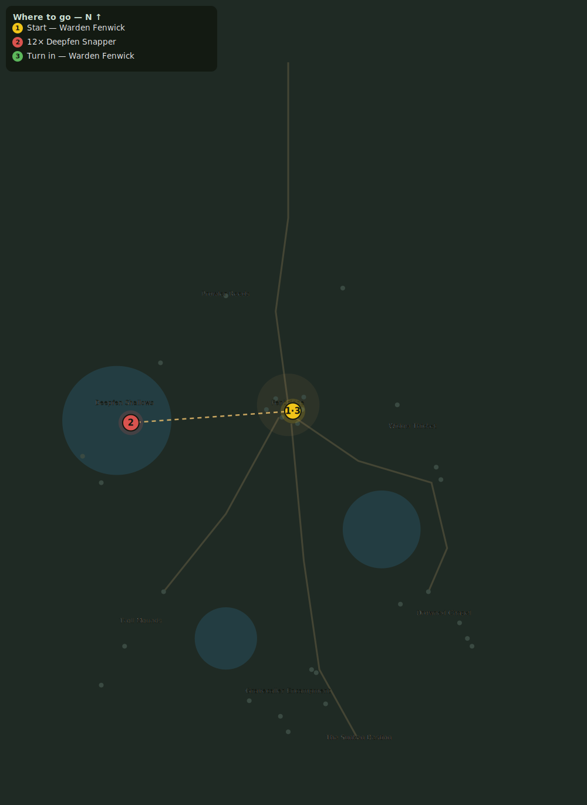

# The Deepfen Stirs

> Quest ID: `q_deepfen` · Zone 2 — Mirefen Marsh

| | |
|---|---|
| **Recommended level** | 7+ |
| **Quest giver** | **Warden Fenwick**, Warden of Fenbridge _(at ~x:3, z:304)_ |
| **Turn in to** | **Warden Fenwick**, Warden of Fenbridge _(at ~x:3, z:304)_ |

## Story

> The Deepfen murlocs kept to their shallows for twenty years. Now they swarm the east bank like flies on a carcass — and my wardens say they are dragging things up from the lake bed. Whatever has them stirred, I want it stopped. Cull 12 of the snappers.

## How to complete

- **Kill 12× [Deepfen Snapper](bestiary.md#mob-deepfen_murloc)** (level 8–9)
  - Found in the open world at ~x:-82, z:273 (8 mobs, radius 15)
  - Found in the open world at ~x:-120, z:350 (6 mobs, radius 13)
  - _Tracker: Deepfen Snapper slain_

Then return to **Warden Fenwick**, Warden of Fenbridge _(at ~x:3, z:304)_ to turn in.

## Rewards

- **XP:** 1000
- **Money:** 400 copper

## On completion

> That will push them back to the mud for a while. But something set them digging, and I mean to learn what.

## Leads to

- Idols of the Deep (`q_idols`)

## Where to go

_Numbered route: ① start → objectives → 3 turn in. Faint dots are the rest of the zone for context — see the [full zone map](README.md). Mob names above link to the [bestiary](bestiary.md)._
