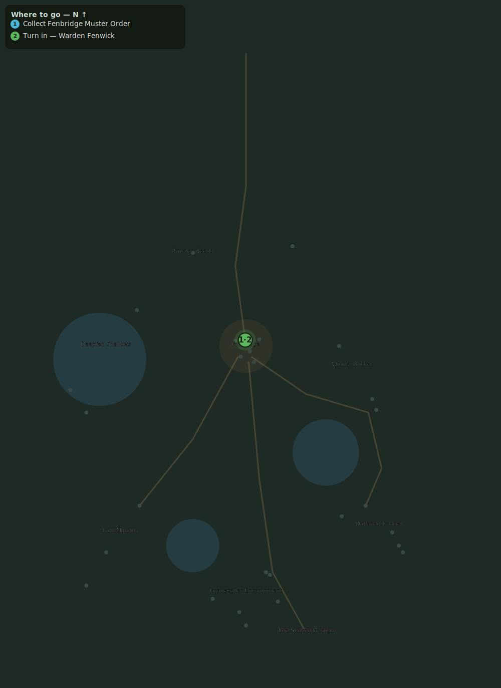

# Muster at Fenbridge

> Quest ID: `q_fenbridge_muster` · Zone 2 — Mirefen Marsh

| | |
|---|---|
| **Recommended level** | 6+ |
| **Quest giver** | **Brother Aldric**, Priest of the Vale _(at ~x:-14, z:-10)_ |
| **Turn in to** | **Warden Fenwick**, Warden of Fenbridge _(at ~x:3, z:304)_ |

## Story

> Morthen's writings named a master in the northern marsh — a 'Mistcaller.' Now Warden Fenwick has sounded the muster horn at Fenbridge, and I do not believe in coincidence, <your name>. Take the causeway north, pull the muster order from the gatepost, and present it to the Warden.

## How to complete

- **Collect 1× Fenbridge Muster Order**
  - Pick up from the ground (sparkle objects) at: ~x:1, z:294 · ~x:-2, z:297
  - _Tracker: Fenbridge Muster Order_

Then return to **Warden Fenwick**, Warden of Fenbridge _(at ~x:3, z:304)_ to turn in.

## Rewards

- **XP:** 300
- **Money:** 200 copper

## On completion

> Aldric's seal, is it? Then you'll do. The fen has been swallowing my patrols whole, and I need every blade that floats.

## Where to go

_Numbered route: ① start → objectives → 3 turn in. Faint dots are the rest of the zone for context — see the [full zone map](README.md). Mob names above link to the [bestiary](bestiary.md)._
