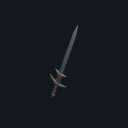
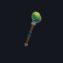
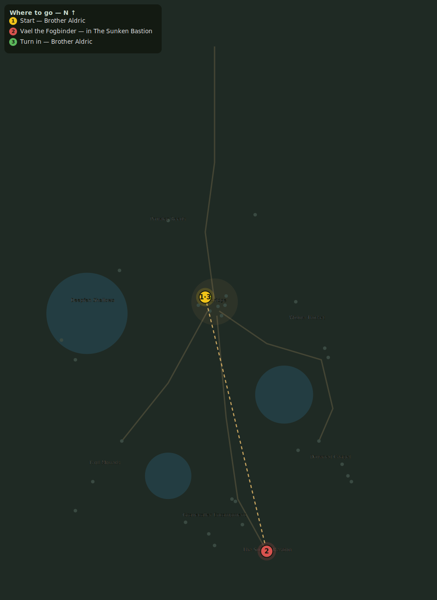

# The Mistcaller

> Quest ID: `q_mistcaller` · Zone 2 — Mirefen Marsh

| | |
|---|---|
| **Recommended level** | 12+ |
| **Quest giver** | **Brother Aldric**, Priest of the Vale _(at ~x:-8, z:296)_ |
| **Turn in to** | **Brother Aldric**, Priest of the Vale _(at ~x:-8, z:296)_ |
| **Requires** | The Sunken Bastion (`q_bastion_door`) |
| **Group quest** | 👥 Suggested players: 5 |

## Story

> At the bottom of the Bastion waits Vael the Mistcaller — Morthen's master, Voss's master, the voice that has drowned a hundred travelers to raise itself an army. He is far beyond any one hero: take four companions, no fewer. End him, <your name>, and the fen's dead may finally lie still.

## How to complete

- **Kill 1× [Vael the Mistcaller](bestiary.md#mob-vael_the_mistcaller)** (level 13–13, **Boss**, **Elite**)
  - Inside dungeon [**The Sunken Bastion**](../../../dungeons/sunken_bastion.md) (entrance portal ~x:45, z:515)
  - _Tracker: Vael the Mistcaller slain_

Then return to **Brother Aldric**, Priest of the Vale _(at ~x:-8, z:296)_ to turn in.

## Rewards

- **XP:** 2800
- **Money:** 2500 copper
- **Item reward (by class):**
  -  🔵 Mistcaller's Edge — _warrior_ · 14–23 dmg @ 2.3s (~8 DPS), +4 Str, +3 Sta
  -  🔵 Vael's Mist-Staff — _mage_ · 15–26 dmg @ 3s (~7 DPS), +6 Int, +3 Spi
  -  🔵 Riptide Dirk — _rogue_ · 9–15 dmg @ 1.7s (~7 DPS), +5 Agi, +2 Sta

## On completion

> Vael is dead, and the mist is lifting for the first time in years. But Maren heard his last words, and they freeze my blood: 'The Wyrm stirs beneath the peaks.' The sect serves something older than we ever guessed, $N. Rest while you can — the mountains are next.

## Where to go

_Numbered route: ① start → objectives → 3 turn in. Faint dots are the rest of the zone for context — see the [full zone map](README.md). Mob names above link to the [bestiary](bestiary.md)._
