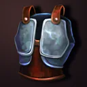
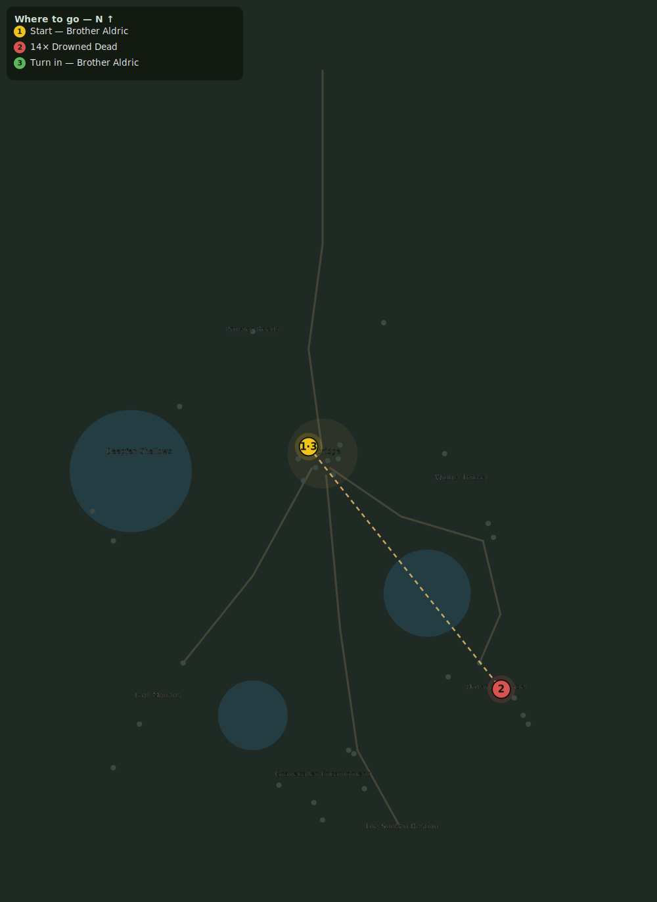

# No Rest in the Reeds

> Quest ID: `q_no_rest` · Zone 2 — Mirefen Marsh

| | |
|---|---|
| **Recommended level** | 6+ (zone range 6–13) |
| **Quest giver** | **Brother Aldric**, Priest of the Vale _(at ~x:-8, z:296)_ |
| **Turn in to** | **Brother Aldric**, Priest of the Vale _(at ~x:-8, z:296)_ |
| **Requires** | Censers from the Deep (`q_drowned_censers`) |

## Story

> The rite on those censers binds the drowned to rise wherever the marsh touches them — and the marsh touches everything. There will be no rest in these reeds until the dead outnumber the living. We cannot unmake the rite yet, but we can empty it of soldiers. Lay 14 more of the Drowned Dead to rest.

## How to complete

- **Kill 14× [Drowned Dead](bestiary.md#mob-drowned_dead)** (level 9–11)
  - Found in the open world at ~x:90, z:420 (8 mobs, radius 20)
  - Found in the open world at ~x:115, z:450 (6 mobs, radius 16)
  - _Tracker: Drowned Dead laid to rest_

Then return to **Brother Aldric**, Priest of the Vale _(at ~x:-8, z:296)_ to turn in.

## Rewards

- **XP:** 1500
- **Money:** 550 copper
- **Item reward (by class):**
  -  🟢 Drownedguard Breastplate — _warrior_ · 130 armor, +4 Sta
  -  🟢 Fenmist Robe — _mage_ · 45 armor, +5 Int, +3 Spi
  -  🟢 Eelskin Tunic — _rogue_ · 80 armor, +5 Agi

## On completion

> You give the dead more mercy than their masters ever did. Take this — you have more than earned it.

## Where to go

**[🧭 Open this route in 3D →](#/questroute/q_no_rest)**

_Numbered route: ① start → objectives → 3 turn in. Faint dots are the rest of the zone for context — see the [full zone map](README.md). Mob names above link to the [bestiary](bestiary.md)._
