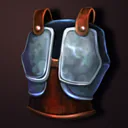
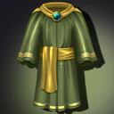
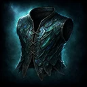
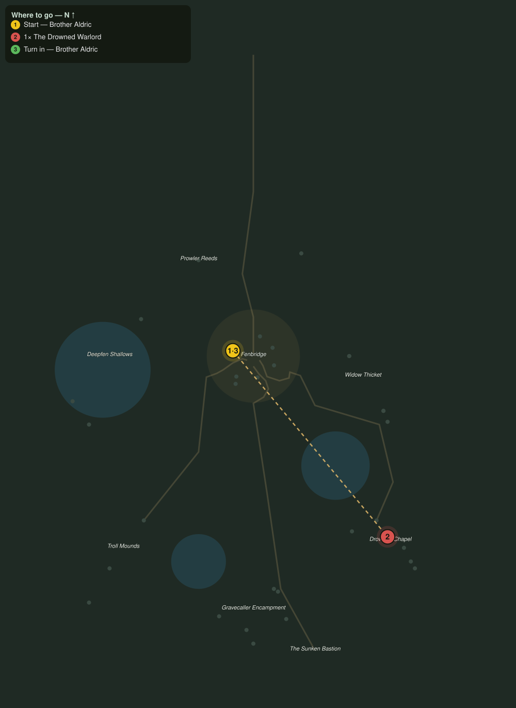

# No Rest in the Reeds

> Quest ID: `q_no_rest` · Zone 2 — Mirefen Marsh

| | |
|---|---|
| **Recommended level** | 6+ (zone range 6–13) |
| **Quest giver** | **Brother Aldric**, Priest of the Vale _(at ~x:-15, z:296)_ |
| **Turn in to** | **Brother Aldric**, Priest of the Vale _(at ~x:-15, z:296)_ |
| **Requires** | Censers from the Deep (`q_drowned_censers`) |

## Story

> The rite on those censers binds the drowned to rise, and now it has raised one strong enough to lead them. The wardens call him the Drowned Warlord, and while he holds the Drowned Chapel the dead keep their ranks. Break him, <your name>, and the rest will scatter back into the mire.

## How to complete

- **Kill 1× [The Drowned Warlord](bestiary.md#mob-drowned_warlord)** (level 12–12, **Elite**)
  - Found in the open world at ~x:98, z:432 (1 mob, radius 3)
  - _Tracker: The Drowned Warlord slain_

Then return to **Brother Aldric**, Priest of the Vale _(at ~x:-15, z:296)_ to turn in.

## Rewards

- **XP:** 1500
- **Money:** 550 copper
- **Item reward (by class):**
  -  🟢 Drownedguard Breastplate — _warrior_ · 130 armor, +4 Sta
  -  🟢 Fenmist Robe — _mage_ · 45 armor, +5 Int, +3 Spi
  -  🟢 Eelskin Tunic — _rogue_ · 80 armor, +5 Agi

## On completion

> You give the dead more mercy than their masters ever did. Take this, you have more than earned it.

## Where to go

**[🧭 Open this route in 3D →](#/questroute/q_no_rest)**

_Numbered route: ① start → objectives → 3 turn in. Faint dots are the rest of the zone for context — see the [full zone map](README.md). Mob names above link to the [bestiary](bestiary.md)._
