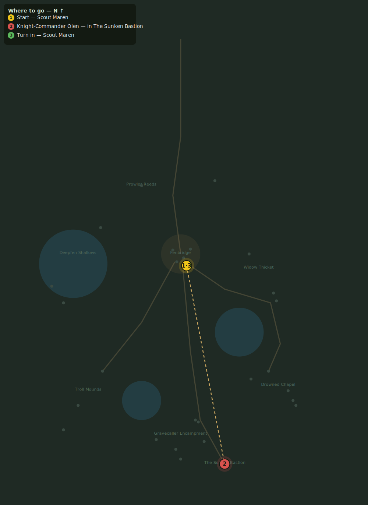

# The Knight-Commander's Shame

> Quest ID: `q_olen` · Zone 2 — Mirefen Marsh

| | |
|---|---|
| **Recommended level** | 12+ |
| **Quest giver** | **Scout Maren**, Marshal's Scout _(at ~x:6, z:312)_ |
| **Turn in to** | **Scout Maren**, Marshal's Scout _(at ~x:6, z:312)_ |
| **Requires** | The Sunken Bastion (`q_bastion_door`) |
| **Group quest** | 👥 Suggested players: 5 |

## Story

> Knight-Commander Olen held the Bastion when it sank — drowned at his post rather than abandon it. Every warden learns his name with pride. Now the Fogbinder has raised him as a puppet to guard the very door he died defending. That shame ends, <your name>. Take four companions below and grant Olen the rest he earned.

## How to complete

- **Kill 1× [Knight-Commander Olen](bestiary.md#mob-knight_commander_olen)** (level 13–13, **Elite**)
  - Inside dungeon [**The Sunken Bastion**](../../../dungeons/sunken_bastion.md) (entrance portal ~x:45, z:515)
  - _Tracker: Knight-Commander Olen laid to rest_

Then return to **Scout Maren**, Marshal's Scout _(at ~x:6, z:312)_ to turn in.

## Rewards

- **XP:** 1800
- **Money:** 800 copper
- **Item reward (by class):**
  -  🔵 Knight-Commander's Greaves — _warrior, mage, rogue_ · 95 armor, +4 Sta

## On completion

> Then his watch is finally over. I'll see his name cut into the gate myself. Thank you, $N.

## Where to go

**[🧭 Open this route in 3D →](#/questroute/q_olen)**

_Numbered route: ① start → objectives → 3 turn in. Faint dots are the rest of the zone for context — see the [full zone map](README.md). Mob names above link to the [bestiary](bestiary.md)._
