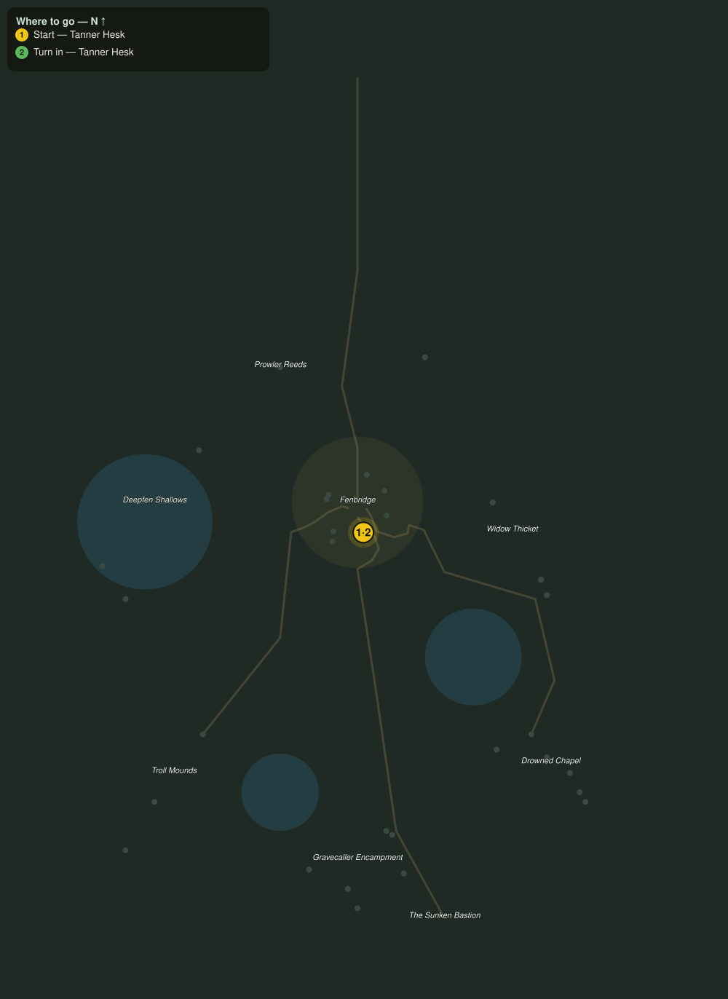

# Tannery Work Order

> Quest ID: `q_prof_workorder_tannery` · Zone 2 — Mirefen Marsh

| | |
|---|---|
| **Recommended level** | 6+ (zone range 6–13) |
| **Quest giver** | **Tanner Hesk**, Master of the Tannery _(at ~x:-11, z:316)_ |
| **Turn in to** | **Tanner Hesk**, Master of the Tannery _(at ~x:-11, z:316)_ |

## Story

> Vats are empty. Bring eight rough hides. Coin when you do.

## How to complete

- **Collect 8× Rough Hide**
  - _Granted by a prerequisite quest or special encounter_
  - _Tracker: Rough Hide delivered_

Then return to **Tanner Hesk**, Master of the Tannery _(at ~x:-11, z:316)_ to turn in.

## Rewards

- **XP:** 100
- **Money:** 20 copper

## On completion

> Good hides. Fair pay. Again when you have more.

## Where to go

**[🧭 Open this route in 3D →](#/questroute/q_prof_workorder_tannery)**

_Numbered route: ① start → objectives → 3 turn in. Faint dots are the rest of the zone for context — see the [full zone map](README.md). Mob names above link to the [bestiary](bestiary.md)._
