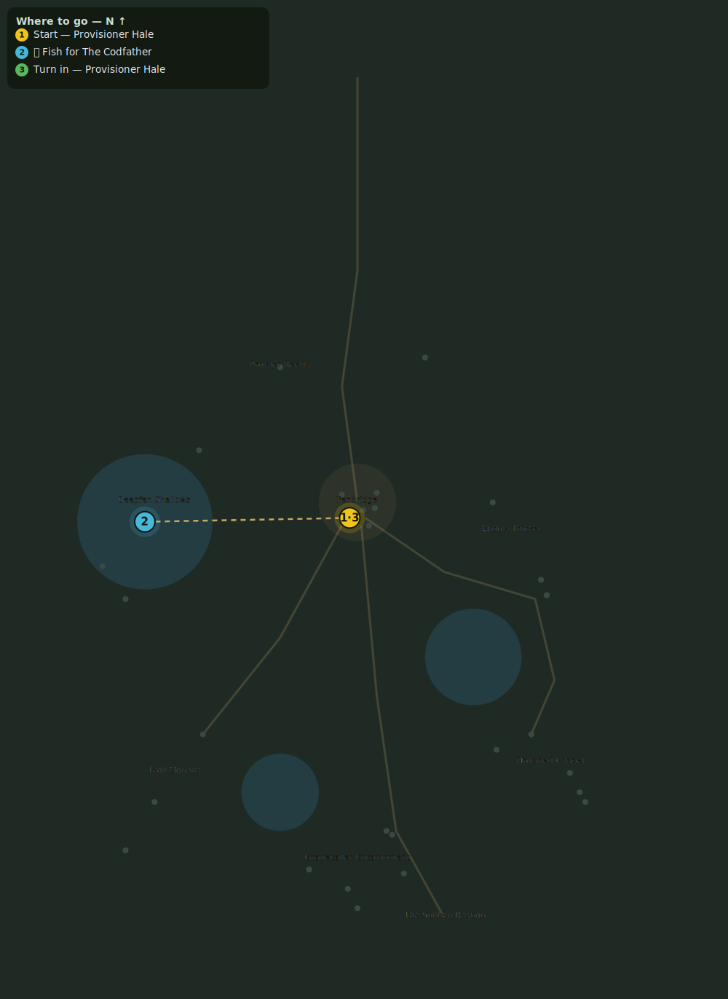

# The Codfather

> Quest ID: `q_the_codfather` · Zone 2 — Mirefen Marsh

| | |
|---|---|
| **Recommended level** | 6+ |
| **Quest giver** | **Provisioner Hale**, Provisioner _(at ~x:-4, z:308)_ |
| **Turn in to** | **Provisioner Hale**, Provisioner _(at ~x:-4, z:308)_ |

## Story

> The Codfather isn't just a fish, <your name>, he's a cold-blooded killer. Old-timers swear he eats Mire Prowlers for breakfast, and even the Mirefen Widows won't spin their webs near the Deepfen Shallows out of sheer terror. He rules those waters. Grab a fishing pole, drag that old devil out of his waters, and I will admit you have joined the family.

## How to complete

- **Collect 1× The Codfather**
  - 🎣 **Caught by fishing — not dropped.** First buy a **Simple Fishing Pole** (~20c) from **Fisherman Brandt** in Eastbrook _(at ~x:-16, z:6)_, then equip it and **fish** in the Mirefen Marsh waters the quest describes (cast from the shoreline).
  - _Tracker: The Codfather_

Then return to **Provisioner Hale**, Provisioner _(at ~x:-4, z:308)_ to turn in.

## Rewards

- **XP:** 950
- **Money:** 450 copper

## On completion

> By the damp saints... The Codfather himself. Look at those whiskers. Fenbridge will eat stories off this catch for a year, $N.

## Where to go

**[🧭 Open this route in 3D →](#/questroute/q_the_codfather)**

_Numbered route: ① start → objectives → 3 turn in. Faint dots are the rest of the zone for context — see the [full zone map](README.md). Mob names above link to the [bestiary](bestiary.md)._
