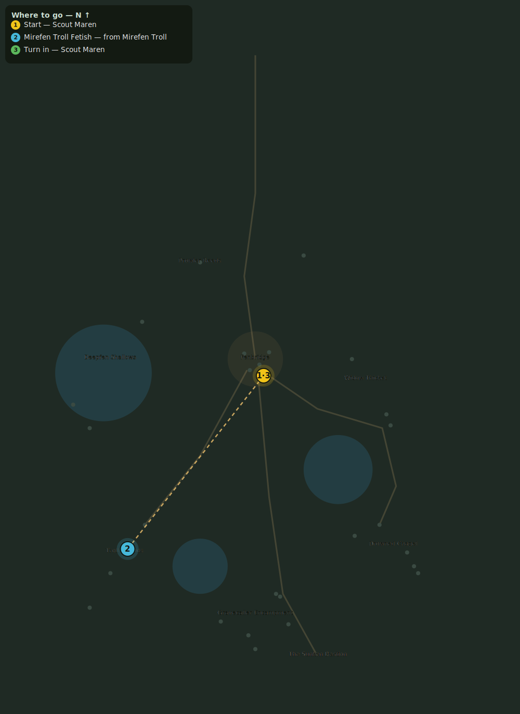

# Fetish and Bone

> Quest ID: `q_troll_fetishes` · Zone 2 — Mirefen Marsh

| | |
|---|---|
| **Recommended level** | 6+ (zone range 6–13) |
| **Quest giver** | **Scout Maren**, Marshal's Scout _(at ~x:6, z:312)_ |
| **Turn in to** | **Scout Maren**, Marshal's Scout _(at ~x:6, z:312)_ |
| **Requires** | Mounds of the Mirefen (`q_trolls`) |

## Story

> I crawled the troll mounds two nights past. Those fetishes they plant are not troll-craft — the knots are wrong, the bones are man-bones, and every one points at the open barrows like a signpost. Bring me 8 of them and I will prove to Fenwick who is really paying for this dig.

## How to complete

- **Collect 8× Mirefen Troll Fetish**
  - Drops from [**Mirefen Troll**](bestiary.md#mob-fen_troll) (60% chance) — Found in the open world at ~x:-80, z:420 (7 mobs, radius 22); Found in the open world at ~x:-105, z:455 (6 mobs, radius 18)
  - _Tracker: Mirefen Troll Fetish_

Then return to **Scout Maren**, Marshal's Scout _(at ~x:6, z:312)_ to turn in.

## Rewards

- **XP:** 1650
- **Money:** 600 copper
- **Item reward (by class):**
  -  🟢 Trollhide Leggings — _warrior, mage, rogue_ · 55 armor, +2 Str, +3 Sta

## On completion

> Same maker as the banners in the cult camp. The trolls are hired shovels, nothing more. Good work, $N.

## Where to go

**[🧭 Open this route in 3D →](#/questroute/q_troll_fetishes)**

_Numbered route: ① start → objectives → 3 turn in. Faint dots are the rest of the zone for context — see the [full zone map](README.md). Mob names above link to the [bestiary](bestiary.md)._
