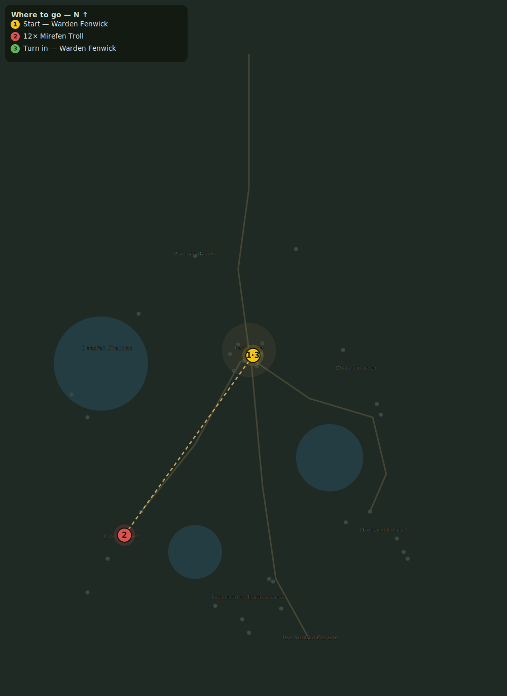

# Mounds of the Mirefen

> Quest ID: `q_trolls` · Zone 2 — Mirefen Marsh

| | |
|---|---|
| **Recommended level** | 10+ |
| **Quest giver** | **Warden Fenwick**, Warden of Fenbridge _(at ~x:3, z:304)_ |
| **Turn in to** | **Warden Fenwick**, Warden of Fenbridge _(at ~x:3, z:304)_ |

## Story

> The Mirefen trolls have torn open the old barrow-mounds east of the far lake — burial mounds, <your name>, older than any kingdom of men. Whatever gold they think is down there, what they are letting OUT is worse. Drive them off the mounds: 12 trolls dead ought to do it.

## How to complete

- **Kill 12× [Mirefen Troll](bestiary.md#mob-fen_troll)** (level 10–12)
  - Found in the open world at ~x:-80, z:420 (7 mobs, radius 22)
  - Found in the open world at ~x:-105, z:455 (6 mobs, radius 18)
  - _Tracker: Mirefen Troll slain_

Then return to **Warden Fenwick**, Warden of Fenbridge _(at ~x:3, z:304)_ to turn in.

## Rewards

- **XP:** 1600
- **Money:** 600 copper

## On completion

> Trolls don't dig without a reason. Someone told them where to dig — and I'd wager my gate it wears a grey robe.

## Leads to

- Fetish and Bone (`q_troll_fetishes`)

## Where to go

**[🧭 Open this route in 3D →](#/questroute/q_trolls)**

_Numbered route: ① start → objectives → 3 turn in. Faint dots are the rest of the zone for context — see the [full zone map](README.md). Mob names above link to the [bestiary](bestiary.md)._
