# Bestiary — Thornpeak Heights

22 creatures you'll fight in this zone. Health/armor/damage are shown across the mob's spawn level range (mobs roll a random level within it). Mitigation % is what a same-level attacker's physical hits lose to armor — spells ignore armor.

> Threat tiers: **Boss** (dungeon, group it) · **Elite** (~2.3× HP, ~1.5× damage) · **Rare** (tough roamer) · normal (everything else).

## Common creatures

### Ridge Stalker

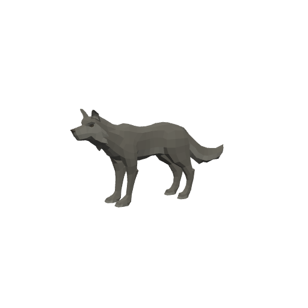

| Stat | Value |
|---|---|
| Level | 13–14 |
| Family | Beast |
| Health | 310–331 HP |
| Armor (physical mitigation) | 168–182 (~10% vs a same-level attacker) |
| Melee damage | 32–53 per hit @ 1.9s swing (~22–23 DPS) |
| Location | Thornpeak Heights · ~x:-50, z:590 · ~x:45, z:600 — [🗺️ show on map](#/map/-50/590) |

**Best way to kill:**

- **Rending Claws:** Physical bleed DoT — bandages won't work while it ticks; heal through it.

**Loot:**

- Coins: 60 copper (always drops)

| Item | Type | Drop chance | Notes |
|---|---|---:|---|
| 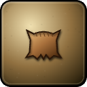  Ridge Stalker Pelt | Quest item | 60% | quest item — only drops while on _Winter Is Coming to Highwatch_ |

### Deeprock Tunneler

| Stat | Value |
|---|---|
| Level | 14–15 |
| Family | Kobold |
| Health | 346–368 HP |
| Armor (physical mitigation) | 234–252 (~13% vs a same-level attacker) |
| Melee damage | 34–56 per hit @ 2.1s swing (~21–22 DPS) |
| Location | Thornpeak Heights · ~x:75, z:625 · ~x:105, z:600 — [🗺️ show on map](#/map/75/625) |

**Best way to kill:**

- **Off-Balance:** Lowers your dodge on hit — tanks lose avoidance; rely on a healer.

**Loot:**

- Coins: 65 copper (always drops)

| Item | Type | Drop chance | Notes |
|---|---|---:|---|
|   Glowing Wax | Quest item | 50% | quest item — only drops while on _Strange Wax_ |
|  ⚫ Tallow Candle | Junk | 40% | sells for 5c |
|  ⚪ Healing Potion | Potion · restores 280 HP | 8% |  |

### Thornpeak Ogre

| Stat | Value |
|---|---|
| Level | 15–16 |
| Family | Ogre |
| Health | 388–411 HP |
| Armor (physical mitigation) | 308–330 (~16% vs a same-level attacker) |
| Melee damage | 38–63 per hit @ 2.6s swing (~19–20 DPS) |
| Location | Thornpeak Heights · ~x:-90, z:700 · ~x:-60, z:730 — [🗺️ show on map](#/map/-90/700) |

**Best way to kill:**

- **Concussive Blow:** Concusses (brief stun/daze) on hit — avoid multi-pulls.

**Loot:**

- Coins: 75 copper (always drops)

| Item | Type | Drop chance | Notes |
|---|---|---:|---|
|  ⚫ Ogre Toe Ring | Junk | 35% | sells for 25c |

### Stormcrag Elemental

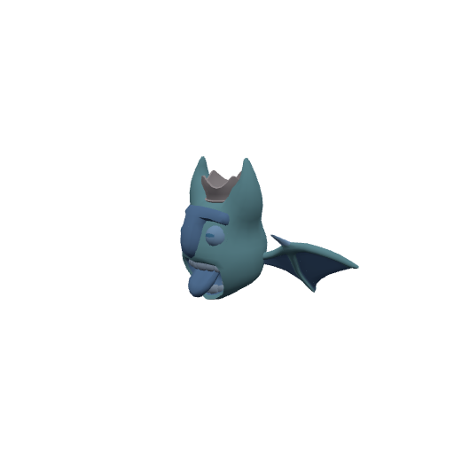

| Stat | Value |
|---|---|
| Level | 17–18 |
| Family | Elemental |
| Health | 414–436 HP |
| Armor (physical mitigation) | 320–340 (~15% vs a same-level attacker) |
| Melee damage | 44–72 per hit @ 2.2s swing (~26–27 DPS) |
| Location | Thornpeak Heights · ~x:110, z:760 · ~x:135, z:795 — [🗺️ show on map](#/map/110/760) |

**Best way to kill:**

- **Numbing Chill:** Chills/slows you on hit — don't rely on kiting once you're hit; just kill it.
- **Static Charge:** Raises your spell damage taken — don't face-tank casters alongside it.

**Loot:**

- Coins: 80 copper (always drops)

| Item | Type | Drop chance | Notes |
|---|---|---:|---|
|   Storm Core | Quest item | 55% | quest item — only drops while on _Cores of the Storm_ |
|   Blessed Embers | Quest item | 55% | quest item — only drops while on _Breaking the Seal_ |
|  ⚫ Inert Storm Shard | Junk | 40% | sells for 28c |

### Wyrmcult Zealot

| Stat | Value |
|---|---|
| Level | 17–19 |
| Family | Humanoid |
| Health | 414–458 HP |
| Armor (physical mitigation) | 320–360 (~15% vs a same-level attacker) |
| Melee damage | 44–76 per hit @ 2s swing (~28–31 DPS) |
| Location | Thornpeak Heights · ~x:55, z:820 · ~x:25, z:845 · ~x:80, z:845 — [🗺️ show on map](#/map/55/820) |

**Best way to kill:**

- **Wyrmward Sigil:** Locks out a spell school — swap schools or finish it fast.
- **Maddening Whisper:** Weakens you — keep the fight short.

**Loot:**

- Coins: 90 copper (always drops)

| Item | Type | Drop chance | Notes |
|---|---|---:|---|
|   Wyrmcult Orders | Quest item | 50% | quest item — only drops while on _Orders from Below_ |
|  ⚫ Frayed Prayer Beads | Junk | 35% | sells for 30c |

### Boneclad Revenant

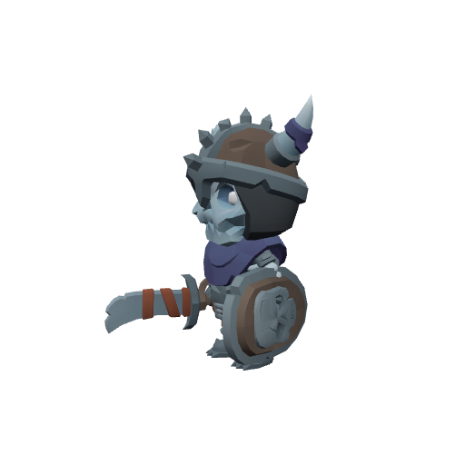

| Stat | Value |
|---|---|
| Level | 18–19 |
| Family | Undead |
| Health | 457–480 HP |
| Armor (physical mitigation) | 306–324 (~14% vs a same-level attacker) |
| Melee damage | 46–76 per hit @ 2.3s swing (~26–27 DPS) |
| Location | Thornpeak Heights · ~x:-40, z:830 · ~x:-15, z:860 — [🗺️ show on map](#/map/-40/830) |

**Best way to kill:**

- **Soul Siphon:** Drains your energy/mana — burst it down.

**Loot:**

- Coins: 100 copper (always drops)

| Item | Type | Drop chance | Notes |
|---|---|---:|---|
|   Runed Bone Shard | Quest item | 70% | quest item — only drops while on _Unrest in the Bonefields_ |
|  ⚫ Bone Fragments | Junk | 60% | sells for 7c |

### Shardlord Kazzix — _Rare_

| Stat | Value |
|---|---|
| Level | 18 |
| Family | Elemental |
| Health | 636 HP |
| Armor (physical mitigation) | 408 (~17% vs a same-level attacker) |
| Melee damage | 48–76 per hit @ 2.2s swing (~28 DPS) |
| Respawn | ~2 min (rare spawn) |
| Location | Thornpeak Heights · ~x:145, z:815 — [🗺️ show on map](#/map/145/815) |

**Best way to kill:**

- **Rare** — a tougher roaming spawn; worth killing for loot, but pull it solo.
- **Frostbite:** Frost DoT that slows — cleanse or push through quickly.

**Loot:**

- Coins: 500 copper (always drops)

| Item | Type | Drop chance | Notes |
|---|---|---:|---|
|   Kazzix's Heartshard | Quest item | 100% | quest item — only drops while on _The Shardlord_ |
|  ⚫ Inert Storm Shard | Junk | 100% | sells for 28c |

### Wyrmcult Necromancer

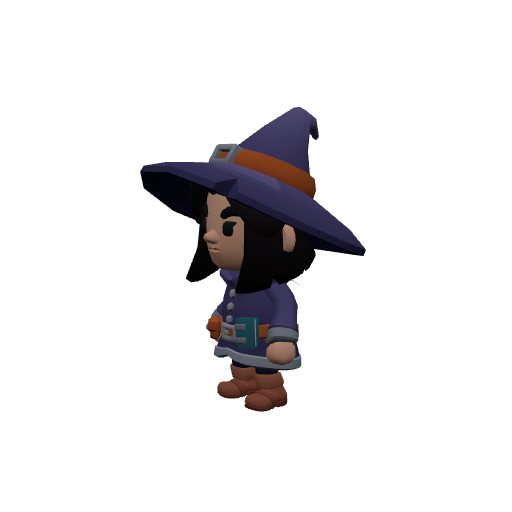

| Stat | Value |
|---|---|
| Level | 18–19 |
| Family | Humanoid |
| Health | 415–436 HP |
| Armor (physical mitigation) | 272–288 (~12–13% vs a same-level attacker) |
| Melee damage | 48–79 per hit @ 2s swing (~31–33 DPS) |
| Location | Thornpeak Heights · ~x:40, z:855 — [🗺️ show on map](#/map/40/855) |

**Best way to kill:**

- **Spectral Ward:** Reflects spells while active — stop casting until it drops.
- **Mana Sear:** Burns your mana — kill it quickly before casters run dry.

**Loot:**

- Coins: 100 copper (always drops)

| Item | Type | Drop chance | Notes |
|---|---|---:|---|
|   Ritual Phylactery | Quest item | 55% | quest item — only drops while on _The Phylactery Ring_ |
|  ⚫ Linen Scrap | Junk | 30% | sells for 3c |

## Elites

### Old Cragmaw — _Elite · Rare_

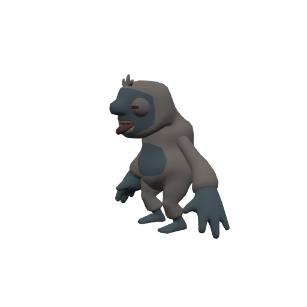

| Stat | Value |
|---|---|
| Level | 14 |
| Family | Beast |
| Health | 2410 HP |
| Armor (physical mitigation) | 312 (~16% vs a same-level attacker) |
| Melee damage | 82–128 per hit @ 1.7s swing (~62 DPS) |
| Crowd control | Immune |
| Respawn | ~3 min (rare spawn) |
| Location | Thornpeak Heights · ~x:-82, z:575 — [🗺️ show on map](#/map/-82/575) |

**Best way to kill:**

- **Elite** — ~2.3× the health and ~1.5× the damage of a normal mob; bring a group or out-level it.
- Immune to crowd control — it can't be stunned, feared, or polymorphed; just tank and burn.
- **Savage Pounce:** Pulses AoE damage around itself — healers expect steady raid damage; don't bring extra mobs into it.
- Enrages at low HP (hits much harder) — save burst/defensives for the execute, or kite while enraged.
- Will follow you into the water — no escaping by swimming.

**Loot:**

- Coins: 220 copper (always drops)

| Item | Type | Drop chance | Notes |
|---|---|---:|---|
| 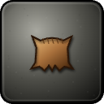 ⚪ Old Cragmaw's Pelt | Junk | 100% | sells for 300c |
|  🔵 Cragmaw Prowlboots | Leather armor — Feet · 58 armor, +5 Agi, +3 Sta | 30% |  |
|  🔵 Cragmaw's Huntcord | Leather armor — Waist · 44 armor, +5 Agi, +3 Sta | 25% |  |

### Ironvein Foreman — _Elite · Rare_

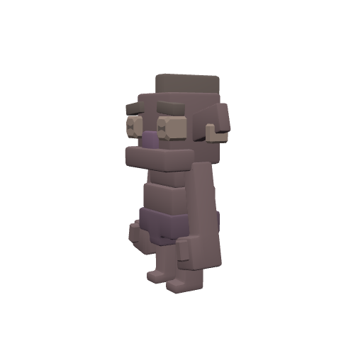

| Stat | Value |
|---|---|
| Level | 16 |
| Family | Kobold |
| Health | 3381 HP |
| Armor (physical mitigation) | 570 (~24% vs a same-level attacker) |
| Melee damage | 102–159 per hit @ 2s swing (~65 DPS) |
| Crowd control | Immune |
| Respawn | ~6 hours (rare spawn) |
| Location | Thornpeak Heights · ~x:100, z:617 — [🗺️ show on map](#/map/100/617) |

**Best way to kill:**

- **Elite** — ~2.3× the health and ~1.5× the damage of a normal mob; bring a group or out-level it.
- Immune to crowd control — it can't be stunned, feared, or polymorphed; just tank and burn.
- **Rallying Banner:** Buffs allies' attack power — kill this one first.
- Summons adds at HP thresholds — bring AoE or kill the adds fast; don't let them pile up.
- **Powder Keg:** Pulses AoE damage around itself — healers expect steady raid damage; don't bring extra mobs into it.
- Enrages at low HP (hits much harder) — save burst/defensives for the execute, or kite while enraged.
- Will follow you into the water — no escaping by swimming.

**Loot:**

- Coins: 420 copper (always drops)

| Item | Type | Drop chance | Notes |
|---|---|---:|---|
|   Glowing Wax | Quest item | 100% |  |
| 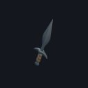 🟢 Ironvein Pickblade | Weapon — Main hand · 13–21 dmg @ 1.8s (~9 DPS), +7 Agi, +2 Sta | 25% |  |
| 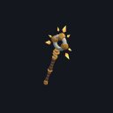 🟢 Ironvein Lantern Staff | Weapon — Main hand · 19–31 dmg @ 3s (~8 DPS), +7 Int, +3 Spi | 25% |  |
|  🔵 Gutripper Shiv | Weapon — Main hand · 14–22 dmg @ 1.7s (~11 DPS), +8 Agi, +3 Sta | 25% | exclusive set † |
|  🟣 Deathlord Sabatons | Mail armor — Feet · 205 armor, +7 Str, +8 Sta | 25% | exclusive set † |

† The exclusive set is rolled once — at most one of these items drops per kill.

### Thornpeak Crusher — _Elite_

| Stat | Value |
|---|---|
| Level | 16–17 |
| Family | Ogre |
| Health | 941–994 HP |
| Armor (physical mitigation) | 360–384 (~17% vs a same-level attacker) |
| Melee damage | 60–99 per hit @ 2.6s swing (~30–31 DPS) |
| Respawn | ~25s |
| Location | Thornpeak Heights · ~x:-125, z:740 — [🗺️ show on map](#/map/-125/740) |

**Best way to kill:**

- **Elite** — ~2.3× the health and ~1.5× the damage of a normal mob; bring a group or out-level it.
- **Disarming Smash:** Can disarm your weapon — casters are unaffected; melee just wait it out.

**Loot:**

- Coins: 200 copper (always drops)

| Item | Type | Drop chance | Notes |
|---|---|---:|---|
|  ⚫ Ogre Toe Ring | Junk | 50% | sells for 25c |

### Brutok Skullsmasher — _Elite · Rare_

| Stat | Value |
|---|---|
| Level | 17 |
| Family | Ogre |
| Health | 3036 HP |
| Armor (physical mitigation) | 480 (~21% vs a same-level attacker) |
| Melee damage | 88–138 per hit @ 2.7s swing (~42 DPS) |
| Crowd control | Immune |
| Respawn | ~3 hours (rare spawn) |
| Location | Thornpeak Heights · ~x:-45, z:768 — [🗺️ show on map](#/map/-45/768) |

**Best way to kill:**

- **Elite** — ~2.3× the health and ~1.5× the damage of a normal mob; bring a group or out-level it.
- Immune to crowd control — it can't be stunned, feared, or polymorphed; just tank and burn.
- **Skull Smash:** Pulses AoE damage around itself — healers expect steady raid damage; don't bring extra mobs into it.
- Enrages at low HP (hits much harder) — save burst/defensives for the execute, or kite while enraged.

**Loot:**

- Coins: 320 copper (always drops)

| Item | Type | Drop chance | Notes |
|---|---|---:|---|
| 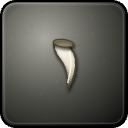 ⚫ Cracked Ogre Tusk | Junk | 100% | sells for 42c |
| 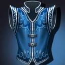 🟢 Skullsmasher's Warbelt | Mail armor — Chest · 96 armor, +3 Str, +5 Sta | 30% |  |
|  🔵 Brutok's Maul | Weapon — Main hand · 24–37 dmg @ 2.7s (~11 DPS), +8 Str, +3 Sta | 25% | exclusive set † |
| 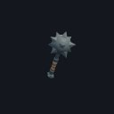 🔵 Crag Warden Cudgel | Weapon — Main hand · 23–36 dmg @ 3s (~10 DPS), +8 Int, +4 Spi | 25% | exclusive set † |
|  🔵 Skullsplitter Dirk | Weapon — Main hand · 15–23 dmg @ 1.7s (~11 DPS), +8 Agi, +3 Sta | 25% | exclusive set † |

† The exclusive set is rolled once — at most one of these items drops per kill.

### Marrowlord Varkas — _Elite · Rare_

| Stat | Value |
|---|---|
| Level | 19 |
| Family | Undead |
| Health | 4416 HP |
| Armor (physical mitigation) | 792 (~28% vs a same-level attacker) |
| Melee damage | 134–210 per hit @ 2.4s swing (~72 DPS) |
| Crowd control | Immune |
| Respawn | ~6 hours (rare spawn) |
| Location | Thornpeak Heights · ~x:-34, z:842 — [🗺️ show on map](#/map/-34/842) |

**Best way to kill:**

- **Elite** — ~2.3× the health and ~1.5× the damage of a normal mob; bring a group or out-level it.
- Immune to crowd control — it can't be stunned, feared, or polymorphed; just tank and burn.
- Summons adds at HP thresholds — bring AoE or kill the adds fast; don't let them pile up.
- **Marrow Rot:** Pulses AoE damage around itself — healers expect steady raid damage; don't bring extra mobs into it.
- **Crushing Sweep:** Knocks players back — never fight it near a ledge or more mobs.
- **Bone Carapace:** Periodically hardens against physical hits — time burst between windows or switch to spell damage.
- Will follow you into the water — no escaping by swimming.

**Loot:**

- Coins: 650 copper (always drops)

| Item | Type | Drop chance | Notes |
|---|---|---:|---|
|  ⚫ Bone Fragments | Junk | 100% | sells for 7c |
|  🟢 Marrowlord Boneboots | Mail armor — Feet · 90 armor, +2 Str, +5 Sta | 30% |  |
|  🟣 Necromancer's Legwraps | Cloth armor — Legs · 86 armor, +13 Int, +7 Spi | 25% | exclusive set † |

† The exclusive set is rolled once — at most one of these items drops per kill.

### Sanctum Boneguard — _Elite_

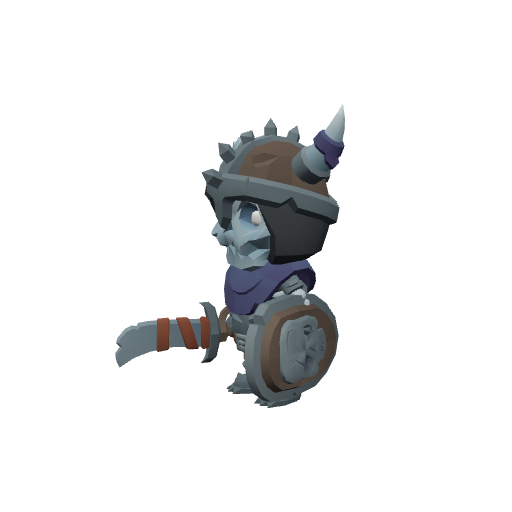

| Stat | Value |
|---|---|
| Level | 19 |
| Family | Undead |
| Health | 1099 HP |
| Armor (physical mitigation) | 396 (~16% vs a same-level attacker) |
| Melee damage | 73–114 per hit @ 2.3s swing (~41 DPS) |
| Respawn | ~25s |
| Location | Gravewyrm Sanctum (dungeon) — [🏰 view dungeon](#/doc/dungeons%2Fgravewyrm_sanctum.md) |

**Best way to kill:**

- **Elite** — ~2.3× the health and ~1.5× the damage of a normal mob; bring a group or out-level it.
- Straightforward melee attacker — tank it, heal as needed, and burn it down. No special tricks.

**Loot:**

- Coins: 300 copper (always drops)

| Item | Type | Drop chance | Notes |
|---|---|---:|---|
|  ⚫ Bone Fragments | Junk | 60% | sells for 7c |
|  🔵 Boundstone Helm | Mail armor — Head · 105 armor, +5 Str, +6 Sta | 4% | exclusive set † |
|  🔵 Boundstone Girdle | Mail armor — Waist · 60 armor, +3 Str, +6 Sta | 4% | exclusive set † |

† The exclusive set is rolled once — at most one of these items drops per kill.

### Sanctum Drakonid — _Elite_

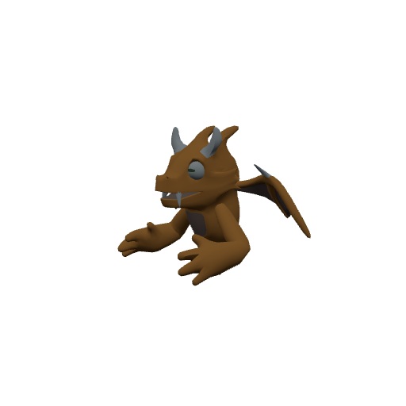

| Stat | Value |
|---|---|
| Level | 19–20 |
| Family | Dragonkin |
| Health | 1150–1205 HP |
| Armor (physical mitigation) | 468–494 (~19% vs a same-level attacker) |
| Melee damage | 76–124 per hit @ 2.2s swing (~44–46 DPS) |
| Respawn | ~25s |
| Location | Gravewyrm Sanctum (dungeon) — [🏰 view dungeon](#/doc/dungeons%2Fgravewyrm_sanctum.md) |

**Best way to kill:**

- **Elite** — ~2.3× the health and ~1.5× the damage of a normal mob; bring a group or out-level it.
- Straightforward melee attacker — tank it, heal as needed, and burn it down. No special tricks.

**Loot:**

- Coins: 350 copper (always drops)

| Item | Type | Drop chance | Notes |
|---|---|---:|---|
|  ⚫ Cracked Wyrm Scale | Junk | 50% | sells for 35c |
|  🔵 Gravewyrm Mantle | Mail armor — Shoulder · 82 armor, +7 Agi, +3 Sta | 5% | exclusive set † |
|  🔵 Gravewyrm Gauntlets | Mail armor — Hands · 72 armor, +5 Str, +4 Sta | 5% | exclusive set † |

† The exclusive set is rolled once — at most one of these items drops per kill.

### Voskar the Emberwing — _Elite · Rare_

| Stat | Value |
|---|---|
| Level | 19 |
| Family | Dragonkin |
| Health | 4310 HP |
| Armor (physical mitigation) | 756 (~27% vs a same-level attacker) |
| Melee damage | 132–207 per hit @ 2.5s swing (~68 DPS) |
| Crowd control | Immune |
| Respawn | ~6 hours (rare spawn) |
| Location | Thornpeak Heights · ~x:80, z:845 — [🗺️ show on map](#/map/80/845) |

**Best way to kill:**

- **Elite** — ~2.3× the health and ~1.5× the damage of a normal mob; bring a group or out-level it.
- Immune to crowd control — it can't be stunned, feared, or polymorphed; just tank and burn.
- **Ember Breath:** Pulses AoE damage around itself — healers expect steady raid damage; don't bring extra mobs into it.
- Enrages at low HP (hits much harder) — save burst/defensives for the execute, or kite while enraged.
- **Searing Maw:** Cuts the healing you receive — kill it before the debuff stacks matter.
- Will follow you into the water — no escaping by swimming.

**Loot:**

- Coins: 700 copper (always drops)

| Item | Type | Drop chance | Notes |
|---|---|---:|---|
|  ⚪ Emberwing Cinderscale | Junk | 100% | sells for 320c |
|  🔵 Emberwing Legguards | Mail armor — Legs · 120 armor, +4 Str, +6 Sta | 25% | exclusive set † |
| 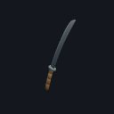 🔵 Emberfang Warblade | Weapon — Main hand · 26–41 dmg @ 2.5s (~13 DPS), +8 Str, +3 Sta | 25% | exclusive set † |

† The exclusive set is rolled once — at most one of these items drops per kill.

### Grand Necromancer Velkhar — _Elite_

| Stat | Value |
|---|---|
| Level | 20 |
| Family | Humanoid |
| Health | 1971 HP |
| Armor (physical mitigation) | 380 (~15% vs a same-level attacker) |
| Melee damage | 79–124 per hit @ 2s swing (~51 DPS) |
| Respawn | ~25s |
| Location | Gravewyrm Sanctum (dungeon) — [🏰 view dungeon](#/doc/dungeons%2Fgravewyrm_sanctum.md) |

**Best way to kill:**

- **Elite** — ~2.3× the health and ~1.5× the damage of a normal mob; bring a group or out-level it.
- Summons adds at HP thresholds — bring AoE or kill the adds fast; don't let them pile up.

**Loot:**

- Coins: 5000 copper (always drops)

| Item | Type | Drop chance | Notes |
|---|---|---:|---|
|  🟢 Boneplate Vest | Mail armor — Chest · 170 armor, +3 Str, +5 Sta | 34% | exclusive set 1 † |
|  🟢 Revenant Silk Robe | Cloth armor — Chest · 60 armor, +5 Int, +3 Spi | 33% | exclusive set 1 † |
|  🟢 Nightwalk Jerkin | Leather armor — Chest · 105 armor, +6 Agi, +2 Sta | 33% | exclusive set 1 † |
|  🟢 Emberwood Staff | Weapon — Main hand · 20–33 dmg @ 3s (~9 DPS), +6 Int, +2 Spi | 20% | exclusive set 2 † |
|  🔵 Boneguard Breastplate | Mail armor — Chest · 210 armor, +5 Str, +8 Sta | 10% | exclusive set 2 † |
|  🔵 Shadowmeld Tunic | Leather armor — Chest · 130 armor, +9 Agi, +4 Sta | 10% | exclusive set 2 † |
|  🔵 Staff of Velkhar | Weapon — Main hand · 27–43 dmg @ 3s (~12 DPS), +9 Int, +4 Spi | 10% | exclusive set 2 † |
|  🔵 Gravewyrm Stalker's Treads | Leather armor — Feet · 105 armor, +5 Agi, +3 Sta | 10% | exclusive set 2 † |
|  🟣 Deathlord Legguards | Mail armor — Legs · 240 armor, +8 Str, +8 Sta | 5% | exclusive set 2 † |
|  🟣 Necromancer's Soulsteps | Cloth armor — Feet · 80 armor, +8 Int, +4 Spi | 5% | exclusive set 2 † |
|  🟣 Wyrmshadow Legguards | Leather armor — Legs · 155 armor, +10 Agi, +6 Sta | 5% | exclusive set 2 † |

† Each exclusive set is rolled separately — at most one item from each set drops per kill.

### Korgath the Bound — _Elite_

| Stat | Value |
|---|---|
| Level | 20 |
| Family | Ogre |
| Health | 2171 HP |
| Armor (physical mitigation) | 570 (~21% vs a same-level attacker) |
| Melee damage | 83–130 per hit @ 2.8s swing (~38 DPS) |
| Respawn | ~25s |
| Location | Gravewyrm Sanctum (dungeon) — [🏰 view dungeon](#/doc/dungeons%2Fgravewyrm_sanctum.md) |

**Best way to kill:**

- **Elite** — ~2.3× the health and ~1.5× the damage of a normal mob; bring a group or out-level it.
- **War Stomp:** War Stomp stuns nearby players on a timer — spread out so it can't catch the whole group.
- Enrages at low HP (hits much harder) — save burst/defensives for the execute, or kite while enraged.

**Loot:**

- Coins: 5000 copper (always drops)

| Item | Type | Drop chance | Notes |
|---|---|---:|---|
|  🟢 Boneplate Vest | Mail armor — Chest · 170 armor, +3 Str, +5 Sta | 34% | exclusive set 1 † |
|  🟢 Revenant Silk Robe | Cloth armor — Chest · 60 armor, +5 Int, +3 Spi | 33% | exclusive set 1 † |
|  🟢 Nightwalk Jerkin | Leather armor — Chest · 105 armor, +6 Agi, +2 Sta | 33% | exclusive set 1 † |
|  🟢 Zealotsbane Blade | Weapon — Main hand · 18–29 dmg @ 2.3s (~10 DPS), +6 Str, +2 Sta | 19% | exclusive set 2 † |
|  🔵 Korgath's Chainwraps | Cloth armor — Legs · 125 armor, +12 Sta | 10% | exclusive set 2 † |
|  🔵 Staff of Velkhar | Weapon — Main hand · 27–43 dmg @ 3s (~12 DPS), +9 Int, +4 Spi | 10% | exclusive set 2 † |
|  🔵 Shadowmeld Tunic | Leather armor — Chest · 130 armor, +9 Agi, +4 Sta | 10% | exclusive set 2 † |
|  🔵 Wyrmcult Grand Robe | Cloth armor — Chest · 75 armor, +9 Int, +4 Spi | 10% | exclusive set 2 † |
| 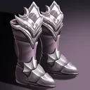 🔵 Gravewyrm Sabatons | Mail armor — Feet · 145 armor, +4 Str, +4 Sta | 10% | exclusive set 2 † |
| 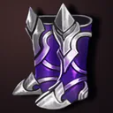 🔵 Wyrmcult Soulsteps | Cloth armor — Feet · 68 armor, +5 Int, +3 Spi | 10% | exclusive set 2 † |
|  🔵 Boundstone Helm | Mail armor — Head · 105 armor, +5 Str, +6 Sta | 8% | exclusive set 2 † |
|  🔵 Gravewyrm Mantle | Mail armor — Shoulder · 82 armor, +7 Agi, +3 Sta | 8% | exclusive set 2 † |
| 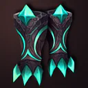 🟣 Wyrmshadow Treads | Leather armor — Feet · 145 armor, +7 Agi, +5 Sta | 5% | exclusive set 2 † |

† Each exclusive set is rolled separately — at most one item from each set drops per kill.

## Bosses

### Warlord Drogmar — _Boss · Elite_

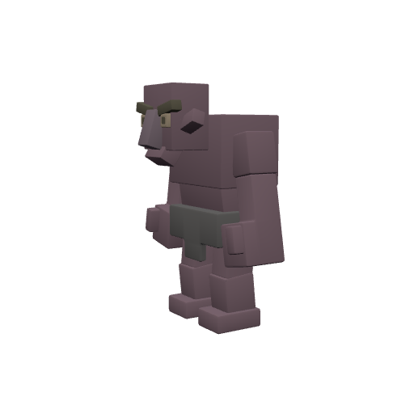

| Stat | Value |
|---|---|
| Level | 17 |
| Family | Ogre |
| Health | 1564 HP |
| Armor (physical mitigation) | 448 (~20% vs a same-level attacker) |
| Melee damage | 66–104 per hit @ 2.6s swing (~33 DPS) |
| Respawn | ~25s |
| Location | Thornpeak Heights · ~x:-132, z:748 — [🗺️ show on map](#/map/-132/748) |

**Best way to kill:**

- **Boss** — fight it as a group in its dungeon; assign a tank and watch its mechanics below.
- **Ground Slam:** Pulses AoE damage around itself — healers expect steady raid damage; don't bring extra mobs into it.
- **Battle Fury:** Builds escalating fury the longer it swings — burst it down, or break melee to drop the stacks.

**Loot:**

- Coins: 2000 copper (always drops)

| Item | Type | Drop chance | Notes |
|---|---|---:|---|
| 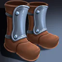 🟢 Drogmar's Warboots | Mail armor — Feet · 85 armor, +3 Str, +4 Sta | 30% |  |
|  🔵 Drogmar's Skullcleaver | Weapon — Main hand · 22–35 dmg @ 2.6s (~11 DPS), +7 Str, +4 Sta | 25% |  |

### Korzul the Gravewyrm — _Boss · Elite_

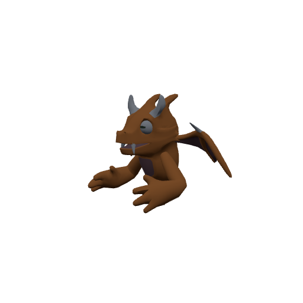

| Stat | Value |
|---|---|
| Level | 20 |
| Family | Dragonkin |
| Health | 3064 HP |
| Armor (physical mitigation) | 646 (~24% vs a same-level attacker) |
| Melee damage | 86–135 per hit @ 2.6s swing (~43 DPS) |
| Respawn | ~25s |
| Location | Gravewyrm Sanctum (dungeon) — [🏰 view dungeon](#/doc/dungeons%2Fgravewyrm_sanctum.md) |

**Best way to kill:**

- **Boss** — fight it as a group in its dungeon; assign a tank and watch its mechanics below.
- **Necrotic Shockwave:** Pulses AoE damage around itself — healers expect steady raid damage; don't bring extra mobs into it.
- Enrages at low HP (hits much harder) — save burst/defensives for the execute, or kite while enraged.

**Loot:**

- Coins: 50000 copper (always drops)

| Item | Type | Drop chance | Notes |
|---|---|---:|---|
|  🟢 Boneplate Vest | Mail armor — Chest · 170 armor, +3 Str, +5 Sta | 34% | exclusive set 1 † |
|  🟢 Revenant Silk Robe | Cloth armor — Chest · 60 armor, +5 Int, +3 Spi | 33% | exclusive set 1 † |
|  🟢 Nightwalk Jerkin | Leather armor — Chest · 105 armor, +6 Agi, +2 Sta | 33% | exclusive set 1 † |
| 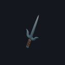 🟢 Cultist Flayer | Weapon — Main hand · 12–19 dmg @ 1.7s (~9 DPS), +8 Agi | 10% | exclusive set 2 † |
| 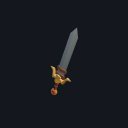 🟣 Wyrmfang Greatblade | Weapon — Main hand · 30–48 dmg @ 2.6s (~15 DPS), +11 Str, +7 Sta | 5% | exclusive set 2 † |
|  🟣 Staff of the Gravewyrm | Weapon — Main hand · 32–52 dmg @ 3s (~14 DPS), +12 Int, +6 Spi | 5% | exclusive set 2 † |
|  🟣 Fang of Korzul | Weapon — Main hand · 19–30 dmg @ 1.7s (~14 DPS), +12 Agi, +6 Sta | 5% | exclusive set 2 † |
|  🟣 Deathlord Warplate | Mail armor — Chest · 270 armor, +8 Str, +10 Sta | 5% | exclusive set 2 † |
| 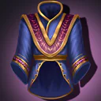 🟣 Necromancer's Starshroud | Cloth armor — Chest · 92 armor, +11 Int, +7 Spi | 5% | exclusive set 2 † |
| 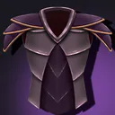 🟣 Wyrmshadow Harness | Leather armor — Chest · 170 armor, +12 Agi, +6 Sta | 5% | exclusive set 2 † |
|  🔵 Boundstone Girdle | Mail armor — Waist · 60 armor, +3 Str, +6 Sta | 5% | exclusive set 2 † |
|  🔵 Gravewyrm Gauntlets | Mail armor — Hands · 72 armor, +5 Str, +4 Sta | 5% | exclusive set 2 † |
|  🟣 Deathlord's Dread Visage | Mail armor — Head · 245 armor, +7 Str, +8 Sta | 4% | exclusive set 2 † |
|  🟣 Necromancer's Soulspire Mantle | Cloth armor — Shoulder · 70 armor, +9 Int, +5 Spi | 4% | exclusive set 2 † |
|  🟣 Wyrmshadow Talongrips | Leather armor — Hands · 110 armor, +9 Agi, +4 Sta | 4% | exclusive set 2 † |

† Each exclusive set is rolled separately — at most one item from each set drops per kill.

### Nythraxis, Scourge of Thornpeak — _Boss · Elite_

| Stat | Value |
|---|---|
| Level | 20 |
| Family | Undead |
| Health | 51239 HP |
| Armor (physical mitigation) | 798 (~28% vs a same-level attacker) |
| Melee damage | 325–507 per hit @ 2.6s swing (~160 DPS) |
| Crowd control | Immune |
| Respawn | ~25s |
| Location | Nythraxis Raid Arena (dungeon) — [🏰 view dungeon](#/doc/dungeons%2Fnythraxis_boss_arena.md) |

**Best way to kill:**

- **Boss** — fight it as a group in its dungeon; assign a tank and watch its mechanics below.
- Immune to crowd control — it can't be stunned, feared, or polymorphed; just tank and burn.

**Loot:**

- Coins: 150000 copper (always drops)

| Item | Type | Drop chance | Notes |
|---|---|---:|---|
|  🟣 Crownforged Dreadhelm | Mail armor — Head · 310 armor, +8 Str, +9 Sta | 17% | exclusive set 1 † |
|  🟣 Crownforged Warspaulders | Mail armor — Shoulder · 260 armor, +7 Str, +8 Sta | 17% | exclusive set 2 † |
|  🟣 Crownforged Dreadhelm | Mail armor — Head · 310 armor, +8 Str, +9 Sta | 17% | exclusive set 3 † |
|  🟣 Nighttalon Crown | Leather armor — Head · 190 armor, +10 Agi, +7 Sta | 17% | exclusive set 3 † |
|  🟣 Soulflame Cowl | Cloth armor — Head · 105 armor, +6 Sta, +11 Int | 17% | exclusive set 3 † |
|  🟣 Stormcaller's Crown | Mail armor — Head · 225 armor, +7 Sta, +10 Int | 17% | exclusive set 3 † |
|  🟣 Soulflame Mantle | Cloth armor — Shoulder · 92 armor, +6 Sta, +9 Int | 17% | exclusive set 4 † |
|  🟣 Crownforged Warspaulders | Mail armor — Shoulder · 260 armor, +7 Str, +8 Sta | 17% | exclusive set 4 † |
|  🟣 Nighttalon Shoulderguards | Leather armor — Shoulder · 165 armor, +9 Agi, +6 Sta | 17% | exclusive set 4 † |
|  🟣 Stormcaller's Spaulders | Mail armor — Shoulder · 190 armor, +7 Sta, +8 Int | 17% | exclusive set 4 † |
|  🟣 Nighttalon Crown | Leather armor — Head · 190 armor, +10 Agi, +7 Sta | 16% | exclusive set 1 † |
|  🟣 Soulflame Cowl | Cloth armor — Head · 105 armor, +6 Sta, +11 Int | 16% | exclusive set 1 † |
|  🟣 Stormcaller's Crown | Mail armor — Head · 225 armor, +7 Sta, +10 Int | 16% | exclusive set 1 † |
|  🟣 Nighttalon Shoulderguards | Leather armor — Shoulder · 165 armor, +9 Agi, +6 Sta | 16% | exclusive set 1 † |
|  🟣 Soulflame Mantle | Cloth armor — Shoulder · 92 armor, +6 Sta, +9 Int | 16% | exclusive set 1 † |
|  🟣 Nighttalon Shoulderguards | Leather armor — Shoulder · 165 armor, +9 Agi, +6 Sta | 16% | exclusive set 2 † |
|  🟣 Soulflame Mantle | Cloth armor — Shoulder · 92 armor, +6 Sta, +9 Int | 16% | exclusive set 2 † |
|  🟣 Crownforged Dreadhelm | Mail armor — Head · 310 armor, +8 Str, +9 Sta | 16% | exclusive set 2 † |
|  🟣 Nighttalon Crown | Leather armor — Head · 190 armor, +10 Agi, +7 Sta | 16% | exclusive set 2 † |
|  🟣 Stormcaller's Spaulders | Mail armor — Shoulder · 190 armor, +7 Sta, +8 Int | 16% | exclusive set 2 † |
|  🟣 Nighttalon Shoulderguards | Leather armor — Shoulder · 165 armor, +9 Agi, +6 Sta | 16% | exclusive set 3 † |
|  🟣 Soulflame Mantle | Cloth armor — Shoulder · 92 armor, +6 Sta, +9 Int | 16% | exclusive set 3 † |
|  🟣 Crownforged Dreadhelm | Mail armor — Head · 310 armor, +8 Str, +9 Sta | 16% | exclusive set 4 † |
|  🟣 Nighttalon Crown | Leather armor — Head · 190 armor, +10 Agi, +7 Sta | 16% | exclusive set 4 † |
|  🟠 Heartwood of the Deathless Crown | Weapon — Main hand · 42–68 dmg @ 3.2s (~17 DPS), +17 Agi, +13 Sta, +14 Int | 3% | exclusive set 1 † |
|  🟠 Kingsbane, Last Oath of Thornpeak | Weapon — Main hand · 46–74 dmg @ 2.8s (~21 DPS), +24 Str, +20 Sta | 3% | exclusive set 2 † |

† Each exclusive set is rolled separately — at most one item from each set drops per kill.

### The Bound Guardian — _Boss · Elite_

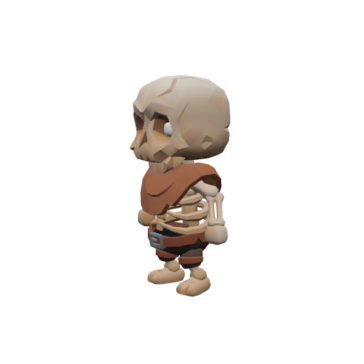

| Stat | Value |
|---|---|
| Level | 20 |
| Family | Undead |
| Health | 2811 HP |
| Armor (physical mitigation) | 798 (~28% vs a same-level attacker) |
| Melee damage | 97–151 per hit @ 2.4s swing (~52 DPS) |
| Crowd control | Immune |
| Respawn | ~6.9 hours |
| Location | Thornpeak Heights |

**Best way to kill:**

- **Boss** — fight it as a group in its dungeon; assign a tank and watch its mechanics below.
- Immune to crowd control — it can't be stunned, feared, or polymorphed; just tank and burn.
- Summons adds at HP thresholds — bring AoE or kill the adds fast; don't let them pile up.
- **Sealbreak Shockwave:** Pulses AoE damage around itself — healers expect steady raid damage; don't bring extra mobs into it.
- Enrages at low HP (hits much harder) — save burst/defensives for the execute, or kite while enraged.
- Will follow you into the water — no escaping by swimming.

**Loot:**

- Coins: 1200 copper (always drops)

| Item | Type | Drop chance | Notes |
|---|---|---:|---|
|  🔵 King's Signet | Quest item | 100% | quest item — only drops while on _The Bound Guardian_ |

---

[← Back to Thornpeak Heights quests](README.md) · [Zone map](map.svg)
