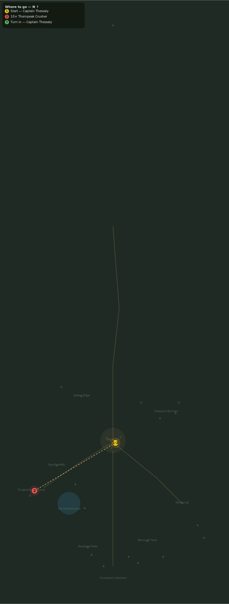

# Break the War-Camp

> Quest ID: `q_crushers` · Zone 3 — Thornpeak Heights

| | |
|---|---|
| **Recommended level** | 16+ |
| **Quest giver** | **Captain Thessaly**, Highwatch Captain _(at ~x:4, z:664)_ |
| **Turn in to** | **Captain Thessaly**, Highwatch Captain _(at ~x:4, z:664)_ |
| **Group quest** | 👥 Suggested players: 3 |

## Story

> Drogmar's war-camp squats in the eastern crags, and his crushers are the spine of it — each one worth three of my soldiers. Take companions; this is no errand for one blade. Break ten crushers and the warlord's muster breaks with them.

## How to complete

- **Kill 10× [Thornpeak Crusher](bestiary.md#mob-ogre_crusher)** (level 16–17, **Elite**)
  - Found in the open world at ~x:-125, z:740 (8 mobs, radius 18)
  - _Tracker: Thornpeak Crusher slain_

Then return to **Captain Thessaly**, Highwatch Captain _(at ~x:4, z:664)_ to turn in.

## Rewards

- **XP:** 3600
- **Money:** 2000 copper

## On completion

> Ten crushers down. The war-camp is a body without a spine — time to take the head.

## Leads to

- Warlord Drogmar (`q_drogmar`)

## Where to go

_Numbered route: ① start → objectives → 3 turn in. Faint dots are the rest of the zone for context — see the [full zone map](README.md). Mob names above link to the [bestiary](bestiary.md)._
