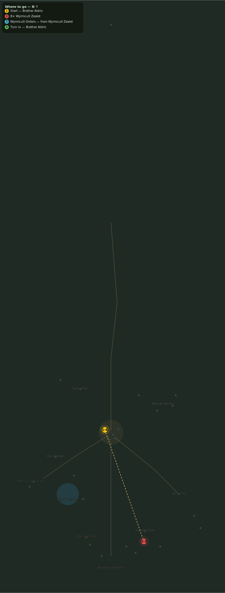

# Orders from Below

> Quest ID: `q_cult_orders` · Zone 3 — Thornpeak Heights

| | |
|---|---|
| **Recommended level** | 13+ (zone range 13–20) |
| **Quest giver** | **Brother Aldric**, Priest of the Vale _(at ~x:-10, z:656)_ |
| **Turn in to** | **Brother Aldric**, Priest of the Vale _(at ~x:-10, z:656)_ |
| **Requires** | Chants on the Wind (`q_zealots`) |

## Story

> The zealots move with purpose now — watches set, supplies counted, like soldiers before a siege. Cultists who organize are cultists taking orders, <your name>. Kill eight more and bring me four sets of their written orders. I would know the hand that commands them.

## How to complete

- **Kill 8× [Wyrmcult Zealot](bestiary.md#mob-wyrmcult_zealot)** (level 17–19)
  - Found in the open world at ~x:55, z:820 (8 mobs, radius 20)
  - Found in the open world at ~x:25, z:845 (6 mobs, radius 16)
  - Found in the open world at ~x:80, z:845 (2 mobs, radius 7)
  - _Tracker: Wyrmcult Zealot slain_
- **Collect 4× Wyrmcult Orders**
  - Drops from [**Wyrmcult Zealot**](bestiary.md#mob-wyrmcult_zealot) (50% chance) — Found in the open world at ~x:55, z:820 (8 mobs, radius 20); Found in the open world at ~x:25, z:845 (6 mobs, radius 16); Found in the open world at ~x:80, z:845 (2 mobs, radius 7)
  - _Tracker: Wyrmcult Orders_

Then return to **Brother Aldric**, Priest of the Vale _(at ~x:-10, z:656)_ to turn in.

## Rewards

- **XP:** 3800
- **Money:** 1800 copper

## On completion

> This script... I last saw its like in Morthen's grimoire, in Eastbrook. The same hand has guided every grave we have fought over, $N.

## Leads to

- The Phylactery Ring (`q_necromancers`)

## Where to go

**[🧭 Open this route in 3D →](#/questroute/q_cult_orders)**

_Numbered route: ① start → objectives → 4 turn in. Faint dots are the rest of the zone for context — see the [full zone map](README.md). Mob names above link to the [bestiary](bestiary.md)._
