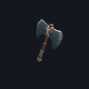
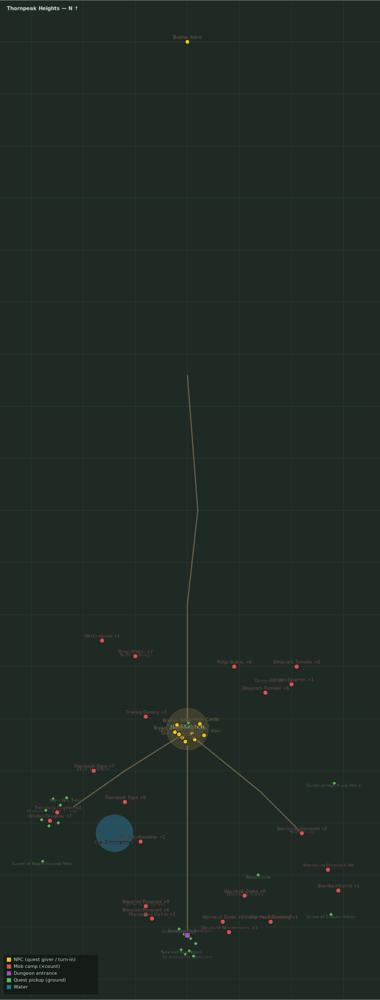

# Warlord Drogmar

> Quest ID: `q_drogmar` · Zone 3 — Thornpeak Heights

| | |
|---|---|
| **Recommended level** | 13+ (zone range 13–20) |
| **Quest giver** | **Captain Thessaly**, Highwatch Captain _(at ~x:4, z:664)_ |
| **Turn in to** | **Captain Thessaly**, Highwatch Captain _(at ~x:4, z:664)_ |
| **Requires** | Break the War-Camp (`q_crushers`) |
| **Group quest** | 👥 Suggested players: 3 |

## Story

> Warlord Drogmar took the Wyrmcult's coin and swore the clans to the mountain's waking. He is the hammer they mean to swing at my wall — and when he slams the ground, <your name>, do not be standing near him. Take your companions into the war-camp and end him, for Highwatch.

## How to complete

- **Kill 1× [Warlord Drogmar](bestiary.md#mob-warlord_drogmar)** (level 17–17, **Boss**, **Elite**)
  - Found in the open world at ~x:-132, z:748 (1 mob, radius 2)
  - _Tracker: Warlord Drogmar slain_

Then return to **Captain Thessaly**, Highwatch Captain _(at ~x:4, z:664)_ to turn in.

## Rewards

- **XP:** 4000
- **Money:** 2500 copper
- **Item reward (by class):**
  -  🔵 Drogmar's Skullcleaver — _warrior_ · 22–35 dmg @ 2.6s (~11 DPS), +7 Str, +4 Sta
  -  🔵 Ogre Bonecharm Staff — _mage_ · 24–38 dmg @ 3s (~10 DPS), +9 Int, +4 Spi
  -  🔵 Gutripper Shiv — _rogue_ · 14–22 dmg @ 1.7s (~11 DPS), +8 Agi, +3 Sta

## On completion

> Drogmar, dead in his own camp. The clans will scatter to the high passes — you have bought my wall a winter, $N.

## Zone map

_Gold = NPCs · red = mob camps · purple = dungeons · green = ground pickups. Match the names above to the markers._

See the **[zone bestiary](bestiary.md)** for the health, armor, and kill tactics of every mob named above.
