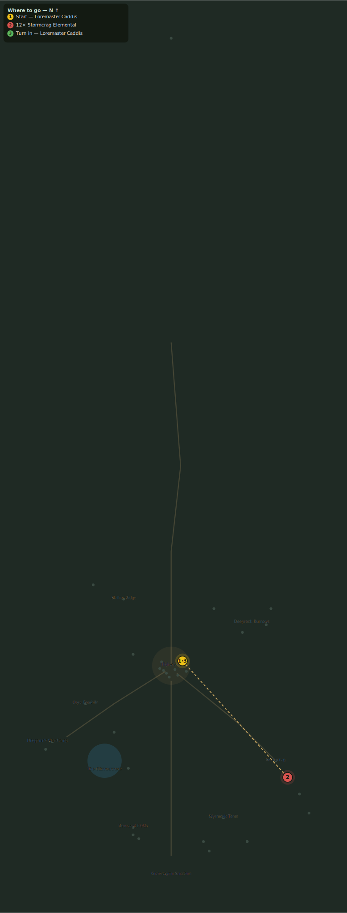

# The Mountain Wakes

> Quest ID: `q_elementals` · Zone 3 — Thornpeak Heights

| | |
|---|---|
| **Recommended level** | 16+ |
| **Quest giver** | **Loremaster Caddis**, Loremaster _(at ~x:12, z:655)_ |
| **Turn in to** | **Loremaster Caddis**, Loremaster _(at ~x:12, z:655)_ |

## Story

> Stormcrag has stood silent a thousand years, and now the very stones of it get up and walk. Elementals do not simply wake, <your name> — something beneath this mountain is turning in its sleep. Put twelve of them down so I may study what remains.

## How to complete

- **Kill 12× [Stormcrag Elemental](bestiary.md#mob-stormcrag_elemental)** (level 17–18)
  - Found in the open world at ~x:110, z:760 (8 mobs, radius 20)
  - Found in the open world at ~x:135, z:795 (6 mobs, radius 16)
  - _Tracker: Stormcrag Elemental slain_

Then return to **Loremaster Caddis**, Loremaster _(at ~x:12, z:655)_ to turn in.

## Rewards

- **XP:** 3600
- **Money:** 1800 copper

## On completion

> The fragments hum like struck bells. The mountain is not angry, $N... it is being disturbed.

## Leads to

- Cores of the Storm (`q_shard_cores`)

## Where to go

_Numbered route: ① start → objectives → 3 turn in. Faint dots are the rest of the zone for context — see the [full zone map](README.md). Mob names above link to the [bestiary](bestiary.md)._
